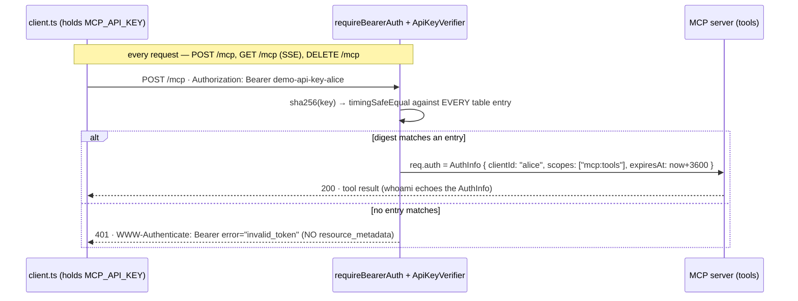

# 01 — API key: a static shared secret as Bearer credential

**Directory:** `examples/01-api-key` · **Port:** 4101 (`PORT_01`) · **Authorization server:** none ·
**Keycloak:** no · **Spec grade:** OUTSIDE-SPEC — only the RFC 6750 §2.1 *syntax*
(`Authorization: Bearer …`, `WWW-Authenticate` challenges) is exercised; there is no OAuth flow,
no discovery, no token issuance.

The simplest real authentication an MCP server can have: the operator hands each client a random
key out of band, the client sends it on every request as `Authorization: Bearer <key>`, and the
server maps it to a principal and a scope list. It is the baseline server of
[example 00](00-baseline-no-auth.md) plus one middleware and one table — and it already delivers
identity, least privilege (alice cannot call `admin_only`, bob can) and instant revocation.

## When to use / when not

**Use it** for machine-to-machine calls inside one trust domain: internal services, CI jobs, a
personal agent talking to your own server — anywhere a human can move a secret out of band and
TLS (or an equally trusted network) protects it in transit.

**Do not use it** when third-party MCP clients should connect on their own (they expect the
spec's OAuth discovery — an API key cannot participate in PRM/AS discovery, see below), when
humans must consent to delegated access (example 03/04), when you need short-lived credentials
with offline-verifiable claims (example 02), or when keys would sprawl across many parties —
a shared static secret has no consent, no expiry and no audience.

## Happy path



## How the code does it

**Server** (`examples/01-api-key/server.ts`). `MCP_API_KEYS` (`key:principal:scope scope;…`) is
parsed into a table of SHA-256 digests — the keys themselves are never stored, logged or echoed in
error messages. The lookup hashes the presented key once and compares the digest against **every**
entry:

```ts
export function lookupApiKey(keys: ApiKeyTable, presented: string): ApiKeyEntry | undefined {
  const digest = Buffer.from(hashApiKey(presented), 'hex');
  let found: ApiKeyEntry | undefined;
  for (const [hash, entry] of keys) {
    if (timingSafeEqual(digest, Buffer.from(hash, 'hex'))) found = entry;
  }
  return found;
}
```

No early exit and no `===`: response time reveals neither which entry matched nor how close a
guess was, and because both sides are 32-byte digests, `timingSafeEqual` never throws on length
and the length of the real keys stays private too. The verifier turns a hit into the SDK's
`AuthInfo` — with a **synthesised** expiry, because `requireBearerAuth` refuses an `AuthInfo`
without one (see [sdk-notes](sdk-notes.md)); it is meaningless for a static key, the table is
consulted again on every request:

```ts
const entry = lookupApiKey(keys, token);
if (!entry) throw new InvalidTokenError('unknown API key');            // static string → WWW-Authenticate
if (!entry.scopes.includes(SCOPE_TOOLS)) throw new InsufficientScopeError('missing scope: mcp:tools');
return {
  token,
  clientId: entry.principal,
  scopes: entry.scopes,
  expiresAt: Math.floor(Date.now() / 1000) + 3600,                     // synthesised: the SDK insists
  extra: { sub: entry.principal, kind: 'api-key' },
};
```

Wiring is one line on top of the baseline — **no** `resourceMetadataUrl` and **no**
`requiredScopes` on the middleware, so the 401 advertises neither a metadata URL nor a scope
(the scope check lives in the verifier, consistent with the OAuth examples):

```ts
mountMcp(app, {
  createServer: () => createDemoServer({ name: '01-api-key' }),
  auth: requireBearerAuth({ verifier: createApiKeyVerifier(keys) }),
});
```

**Client** (`examples/01-api-key/client.ts`). A static header, no `authProvider`:

```ts
const transport = new StreamableHTTPClientTransport(new URL(serverUrl), {
  requestInit: { headers: { Authorization: `Bearer ${apiKey}` } },
});
```

Without an `authProvider` the SDK does **not** start OAuth discovery on a 401 — it throws a plain
`StreamableHTTPError` (`error.code === 401`), *not* `UnauthorizedError`; the client catches exactly
that and exits 1 with "API key rejected". `whoami` then shows what the verifier derived:

```json
{"clientId":"alice","scopes":["mcp:tools"],"expiresAt":1787996308,
 "expiresAtIso":"2026-08-29T09:38:28.000Z","extra":{"sub":"alice","kind":"api-key"}}
```

Design notes baked into the above:

* **Keys are hashed at rest.** A leaked table (config repo, backup, `ps e`, log) yields no usable
  credential. Plain SHA-256 is enough *only because* the keys are high-entropy random strings
  (≥ 128 bits); for anything a human chose, use a slow KDF instead.
* **Rotation = two active keys.** Add `new-key:alice:mcp:tools` as a second entry, move the
  client, delete the old entry — deletion revokes it on the very next request (the table is
  consulted per request; nothing is cached, nothing has to expire).
* **Why `Authorization: Bearer` and not `X-API-Key` or `?api_key=`.** RFC 6750 §2.1 gives standard
  semantics for free: the SDK's `requireBearerAuth` parses the header and emits well-formed
  `WWW-Authenticate` challenges, proxies/tooling know to redact `Authorization`, and query strings
  end up in request logs and referrers (RFC 6750 §2.3 exists but is a "SHOULD NOT").
* **An API key cannot participate in discovery.** PRM/AS discovery answers "where do I *obtain* a
  credential?" — for a statically distributed secret there is no such place, so the 401
  deliberately omits `resource_metadata`. An SDK client with an `authProvider` would otherwise
  chase metadata that cannot exist.

## Run it

```bash
npm run ex:01:server        # terminal 1
npm run ex:01:client        # terminal 2 — or: npm run ex:01:client -- http://192.168.78.87:4101/mcp
```

Server (keys come from `MCP_API_KEYS` or the built-in DEMO table; only principals are logged):

```
[01-api-key] 2 API key(s) from built-in DEMO table: alice [mcp:tools], bob [mcp:tools mcp:admin] — keys are hashed, never logged
[01-api-key] listening on 0.0.0.0:4101
[01-api-key] MCP endpoint: http://192.168.78.87:4101/mcp   (PUBLIC_HOST 192.168.78.87 — env)
```

Client with the default key (`MCP_API_KEY=demo-api-key-alice`):

```
connecting to http://192.168.78.87:4101/mcp (API key sha256:09d763a6)
tools        -> whoami, add, admin_only
whoami       -> {"clientId":"alice","scopes":["mcp:tools"],…,"extra":{"sub":"alice","kind":"api-key"}}
add(2, 3)    -> 5
admin_only   -> ERROR insufficient_scope: admin_only requires scope mcp:admin
RESULT {"example":"01","tools":["add","admin_only","whoami"],"whoami":{…"extra":{"sub":"alice","kind":"api-key"}},"add":"5","adminOnly":"denied"}
```

`MCP_API_KEY=demo-api-key-bob EXPECT_ADMIN=ok npm run ex:01:client` ends in
`admin_only   -> admin ok: bob has mcp:admin` and `"adminOnly":"ok"`.

## Observe it

`curl` against Streamable HTTP needs `Accept: application/json, text/event-stream` **and**
`Content-Type: application/json` (406/415 otherwise — [sdk-notes](sdk-notes.md)). With a valid key,
`initialize` answers 200 and an `mcp-session-id` header:

```bash
BODY='{"jsonrpc":"2.0","id":1,"method":"initialize","params":{"protocolVersion":"2025-11-25","capabilities":{},"clientInfo":{"name":"curl","version":"0"}}}'
curl -si -X POST http://192.168.78.87:4101/mcp -H 'Authorization: Bearer demo-api-key-alice' \
  -H 'Accept: application/json, text/event-stream' -H 'Content-Type: application/json' -d "$BODY"
# HTTP/1.1 200 OK
# content-type: text/event-stream
# mcp-session-id: 58964a2f-6150-41d0-9c19-4f6da755f3d6
```

Without the header the challenge is a bare `invalid_token` — note what is **absent**: no
`resource_metadata`, no `scope`:

```
HTTP/1.1 401 Unauthorized
WWW-Authenticate: Bearer error="invalid_token", error_description="Missing Authorization header"

{"error":"invalid_token","error_description":"Missing Authorization header"}
```

A wrong key gets the static `unknown API key` (never a hint which entry was close), and a session
initialized by alice refuses bob's key — sessions are bound to the principal that opened them:

```
WWW-Authenticate: Bearer error="invalid_token", error_description="unknown API key"

HTTP/1.1 403 Forbidden
{"jsonrpc":"2.0","error":{"code":-32000,"message":"Forbidden: session belongs to a different principal"},"id":null}
```

## Break it

Every row is a test in `examples/01-api-key/server.test.ts` (`npx vitest run examples/01-api-key`);
observed responses are from the live server on 4101:

| Case | Response |
|---|---|
| no `Authorization` header | 401 `invalid_token` · "Missing Authorization header" · **no** `resource_metadata` |
| unknown key / one character changed | 401 `invalid_token` · "unknown API key" (constant work, see below) |
| `Bearer  key` (double space), empty token, `Basic …` | 401 · "Invalid Authorization header format, expected 'Bearer TOKEN'" — the SDK splits on a *single* space ([sdk-notes](sdk-notes.md)) |
| key whose scopes lack `mcp:tools` | **403** `insufficient_scope` · "missing scope: mcp:tools" — authenticated but not authorized |
| key removed from the table at runtime | next request 401; other keys unaffected (revocation is immediate) |
| bob's key on alice's session | 403 "session belongs to a different principal" (`mountMcp` binding) |
| GET (SSE stream) / DELETE without a key | 401 — the middleware guards all three methods |
| SDK client with a bad key | `StreamableHTTPError` with `code === 401`, message contains `unknown API key` |

The constant-time property is unit-tested by wrapping `crypto.timingSafeEqual` in a spy: a match on
the *first* entry, on a later entry and a miss all cost exactly one comparison per table entry
(no early exit), a spy forced to return `false` makes even the correct key fail (so no `===`
decides a match anywhere), and the lookup source contains no equality operator at all.

## Threat model notes

**What it protects against:** anonymous access; callers impersonating each other (distinct keys →
distinct principals and scopes); privilege escalation (scopes live server-side in the table — the
client cannot ask for more); disclosure of the key table at rest (digests only); timing attacks on
the comparison; key material in logs (only `sha256(key)[:8]` is ever printed); session hijacking
across principals (session↔subject binding); DNS rebinding (Host allow-list from example 00).

**What it does not protect against:** anyone who *has* the key — it is a bearer secret with no
proof of possession, so over plain HTTP (this demo) any on-path observer can replay it: run TLS in
production. No expiry and no forced rotation — a leak stays valid until an operator deletes the
entry. No user consent or delegation semantics, no audience binding (a key works from anywhere,
for as long as the table holds it), no per-key rate limiting or lockout (a demo omission), and
key distribution/storage on the client side (env files, CI secrets) is entirely out of band.

## Variations and links

* **Custom header (`X-API-Key`)** — same trust model, but you hand-roll parsing and challenges and
  lose the SDK middleware; there is rarely a reason to leave `Authorization: Bearer`.
* **Keys in the URL** — never: query strings leak into logs, history and referrers.
* Need claims, offline expiry, key rotation via JWKS? → [02 — self-issued JWT](02-jwt-local.md).
* Need consent, delegation, third-party clients? → [03 — embedded AS](03-oauth-embedded-as.md) /
  [04 — Keycloak resource server](04-keycloak-resource-server.md) (the spec-recommended shape).
* Credential bound to the transport instead of a header? → [08 — mutual TLS](08-mtls.md).
* SDK behaviours this page relies on (single-space header split, mandatory `expiresAt`,
  `StreamableHTTPError` vs `UnauthorizedError`, curl header strictness): [sdk-notes](sdk-notes.md).
* Transport, sessions, Host validation, the three demo tools: [00 — baseline](00-baseline-no-auth.md).
