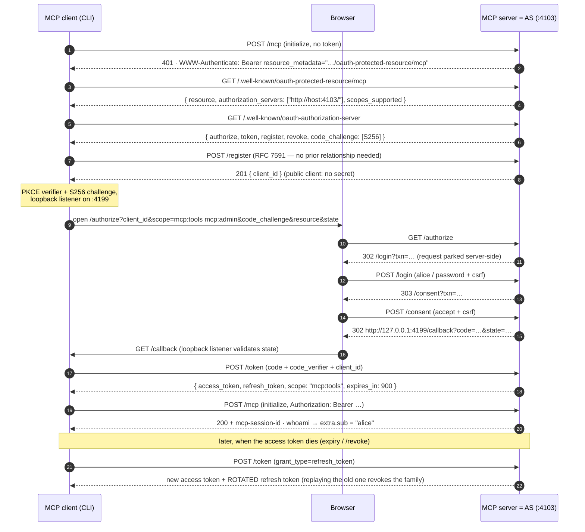

# 03 — OAuth 2.1 with an embedded authorization server

**Directory:** `examples/03-oauth-embedded-as` · **Port:** 4103 (`PORT_03`) · **Authorization
server:** the MCP server itself · **Keycloak:** no · **Spec grade: CONFORMANT** — MCP
authorization (2025-06-18 → 2025-11-25) with the AS co-located on the MCP origin: RFC 9728
protected-resource metadata, RFC 8414 AS metadata, RFC 7591 dynamic client registration, PKCE
S256 (RFC 7636), RFC 8707 resource indicators (validated!), RFC 7009 revocation,
`WWW-Authenticate` with `resource_metadata`, SEP-835 scope selection, refresh-token rotation and
authorization-code reuse revocation per OAuth 2.1 §4.1.2.

One process plays every server-side role of the spec: it issues the tokens **and** verifies them.
`mcpAuthRouter` (the SDK) contributes the endpoints and all request validation;
`provider.ts` contributes the state (clients, codes, tokens, users); `pages.ts` contributes the
two screens a browser sees — login and consent. Tokens are opaque random strings looked up in
memory; nothing here is a JWT, and no external identity provider exists.

## When to use it / when not

**Use this shape when** you want zero external dependencies (a self-contained dev/demo server, an
appliance, an internal tool with a handful of users) or when you need to *understand* the whole
protocol — every message of the flow is observable in one process's log.

**Do not use this shape when** anything real is at stake: it is one process (AS availability =
RS availability, no horizontal scale), all state is in memory (a restart logs everyone out and
forgets every registered client), the login is a demo user table, and the transport in this repo
is plain HTTP. The spec-recommended production shape is a *separate* authorization server —
that is [example 04](04-keycloak-resource-server.md) (Keycloak, MCP server = pure resource
server) and [example 06](06-oauth-proxy-keycloak.md) (facade). The SDK's own position is the
same: its embedded AS deliberately implements only `authorization_code` + `refresh_token`
(no `client_credentials` — see [SDK notes](sdk-notes.md)).

## The flow



Alice asked for `mcp:tools mcp:admin` (the PRM's list — SEP-835) but the token says
`scope: "mcp:tools"`: the consent page only grants what the *user* may grant, and the token
response reports the narrowed scope as RFC 6749 §5.1 requires.

## How the code does it

`server.ts` — the whole auth wiring (everything else is the 00-baseline):

```ts
app.use(authPagesRouter(provider)); // /login + /consent — the human-facing half of /authorize
app.use(mcpAuthRouter({
  provider,                                  // DemoAuthorizationServer (provider.ts)
  issuerUrl: new URL(`${origin}/`),          // http:// LAN issuer → MCP_DANGEROUSLY_ALLOW_INSECURE_ISSUER_URL (env.ts)
  resourceServerUrl: new URL(resourceUrl),   // → PRM at /.well-known/oauth-protected-resource/mcp
  scopesSupported: ['mcp:tools', 'mcp:admin'],
  clientRegistrationOptions: { clientSecretExpirySeconds: 0, rateLimit: rl },
  authorizationOptions: { rateLimit: rl }, tokenOptions: { rateLimit: rl }, revocationOptions: { rateLimit: rl },
}));
mountMcp(app, {
  createServer: () => createDemoServer({ name: '03-oauth-embedded-as' }),
  auth: requireBearerAuth({
    verifier: provider,                      // the same object is AS and RS verifier
    resourceMetadataUrl: getOAuthProtectedResourceMetadataUrl(new URL(resourceUrl)),
  }),                                        // NO requiredScopes — see below
});
```

**Why no `requiredScopes` (SEP-835):** the SDK client picks the scope it requests from, in order,
the 401's `scope=` → the PRM's `scopes_supported` → its own metadata. Pinning
`requiredScopes: ['mcp:tools']` would stamp `scope="mcp:tools"` into every 401 and bob could never
be granted `mcp:admin` through the browser. Instead the PRM advertises both scopes and the
provider enforces the floor itself (`provider.ts`):

```ts
async verifyAccessToken(token: string): Promise<AuthInfo> {
  const record = this.accessTokens.get(token);
  if (!record || record.expiresAt <= nowSec()) throw new InvalidTokenError('unknown or expired access token');
  if (!record.scopes.includes(SCOPE_TOOLS)) throw new InsufficientScopeError('token does not carry the mcp:tools scope');
  return { token, clientId: record.clientId, scopes: record.scopes, expiresAt: record.expiresAt,
           resource: new URL(record.resource ?? this.resource), extra: { sub: record.sub } };
}
```

The two OAuth 2.1 behaviours worth reading in full in `provider.ts`:

```ts
// challengeForAuthorizationCode(): code REUSE is detected before PKCE and burns the family
const used = this.usedCodes.get(authorizationCode);
if (used) { this.revokeFamily(used.family);
  throw new InvalidGrantError('authorization code was already used; all tokens issued from it are now revoked'); }

// exchangeRefreshToken(): rotation, and replay of a rotated token burns the family too
if (record.rotated) { this.revokeFamily(record.family);
  throw new InvalidGrantError('refresh token was already rotated; all tokens in its family are now revoked'); }
record.rotated = true;
```

The consent decision binds the code to everything that must match later —
`{ clientId, redirectUri, codeChallenge, scopes: granted, resource, sub }` — and `whoami` shows
what the verifier hands the tools:

```json
{"clientId":"07fa9d03-6912-4bb8-9017-c3199187959d","scopes":["mcp:tools"],
 "expiresAt":1787994180,"expiresAtIso":"2026-08-29T09:03:00.000Z",
 "resource":"http://192.168.78.87:4103/mcp","extra":{"sub":"alice"}}
```

`pages.ts` renders the forms with Keycloak's element ids (`#username`, `#password`, `#kc-login`,
`input[name=accept]`) so `scripts/browser-login.py` drives Keycloak and this AS with the same
selectors. Client metadata (name, redirect URI) is attacker-controlled via open DCR and therefore
HTML-escaped; the consent page shows the client, the user, each scope (with "not available for
this account" when the user may not grant it) and the exact redirect target.

## Run it

```bash
npm run ex:03:server          # terminal 1
npm run ex:03:client          # terminal 2 — a browser window opens; sign in: alice / password
```

Server startup:

```
[03-oauth-embedded-as] listening on 0.0.0.0:4103
[03-oauth-embedded-as] MCP endpoint: http://192.168.78.87:4103/mcp   (PUBLIC_HOST 192.168.78.87 — env)
[03-oauth-embedded-as] authorization server at http://192.168.78.87:4103: /authorize /token /register /revoke
[03-oauth-embedded-as] demo users (DEMO): alice / password (mcp:tools) · bob / password (mcp:tools + mcp:admin)
```

First client run (trimmed; the browser line is where the human — or the headless driver — acts):

```
connecting to http://192.168.78.87:4103/mcp (dynamic client registration)
[oauth] waiting for callback on http://127.0.0.1:4199/callback (redirect URI http://127.0.0.1:4199/callback)
==> Authorization required. Open this URL in a browser:
    http://192.168.78.87:4103/authorize?response_type=code&client_id=07fa9d03-…&code_challenge=…&code_challenge_method=S256&redirect_uri=http%3A%2F%2F127.0.0.1%3A4199%2Fcallback&state=…&scope=mcp%3Atools+mcp%3Aadmin&resource=http%3A%2F%2F192.168.78.87%3A4103%2Fmcp
tools        -> whoami, add, admin_only
whoami       -> {"clientId":"07fa9d03-…","scopes":["mcp:tools"],…,"extra":{"sub":"alice"}}
add(2, 3)    -> 5
admin_only   -> ERROR insufficient_scope: admin_only requires scope mcp:admin
RESULT {"example":"03",…,"adminOnly":"denied","extra":{"clientId":"07fa9d03-…"}}
```

A second run refreshes/reuses stored tokens and opens **no** browser. `--logout` wipes the
client-side store. `OAUTH_CLIENT_ID=mcp-cli` skips DCR and uses the pre-registered public client
(seeded with redirect URIs for callback ports 4199 and 4193 on 127.0.0.1, localhost and
`PUBLIC_HOST`). From another LAN machine: `npm run ex:03:client -- http://192.168.78.87:4103/mcp`
— and because the browser normally runs where the client runs, the loopback callback still works;
if the *browser* is on a third machine, set `OAUTH_REDIRECT_HOST=<client-host>`.

Headless (what `npm run smoke -- 03` does):
`MCP_BROWSER_CMD="python3 scripts/browser-login.py --user alice --password password" npm run ex:03:client`.

**In-memory caveat:** restarting the server forgets all registrations and tokens. The SDK client
usually self-heals (`invalid_client`/`invalid_grant` → re-register → new browser round), but a
stored registration without a refresh token can leave the browser on a 400 page — `--logout` first
is the clean reset.

## Observe it

All captured against the running example (see [SDK notes](sdk-notes.md) for why each field looks
the way it does). Discovery starts at the 401:

```bash
curl -si -X POST http://192.168.78.87:4103/mcp \
  -H 'Accept: application/json, text/event-stream' -H 'Content-Type: application/json' \
  -d '{"jsonrpc":"2.0","id":1,"method":"initialize","params":{"protocolVersion":"2025-11-25","capabilities":{},"clientInfo":{"name":"curl","version":"0"}}}'
```
```
HTTP/1.1 401 Unauthorized
WWW-Authenticate: Bearer error="invalid_token", error_description="Missing Authorization header", resource_metadata="http://192.168.78.87:4103/.well-known/oauth-protected-resource/mcp"

{"error":"invalid_token","error_description":"Missing Authorization header"}
```

Note what is **not** there: no `scope=` (SEP-835 — the PRM advertises the scopes instead). The two
metadata documents:

```bash
curl -s http://192.168.78.87:4103/.well-known/oauth-protected-resource/mcp
```
```json
{"resource":"http://192.168.78.87:4103/mcp",
 "authorization_servers":["http://192.168.78.87:4103/"],
 "scopes_supported":["mcp:tools","mcp:admin"],
 "resource_name":"03-oauth-embedded-as"}
```
```bash
curl -s http://192.168.78.87:4103/.well-known/oauth-authorization-server
```
```json
{"issuer":"http://192.168.78.87:4103/",
 "authorization_endpoint":"http://192.168.78.87:4103/authorize",
 "token_endpoint":"http://192.168.78.87:4103/token",
 "token_endpoint_auth_methods_supported":["client_secret_post","none"],
 "grant_types_supported":["authorization_code","refresh_token"],
 "code_challenge_methods_supported":["S256"],
 "scopes_supported":["mcp:tools","mcp:admin"],
 "revocation_endpoint":"http://192.168.78.87:4103/revoke",
 "registration_endpoint":"http://192.168.78.87:4103/register"}
```

Anonymous dynamic client registration (201, and no secret for a public client):

```bash
curl -si -X POST http://192.168.78.87:4103/register -H 'Content-Type: application/json' \
  -d '{"client_name":"curl demo","redirect_uris":["http://127.0.0.1:4199/callback"],"token_endpoint_auth_method":"none"}'
```
```
HTTP/1.1 201 Created
{"redirect_uris":["http://127.0.0.1:4199/callback"],"token_endpoint_auth_method":"none",
 "client_name":"curl demo","client_id":"85e2ec43-819a-41be-a7c7-ace94cc6e349","client_id_issued_at":1787993271}
```

`/token` speaks form encoding and answers RFC 6749 error objects (`client_secret_post`/`none`
only — HTTP Basic is ignored by the SDK's handler):

```bash
curl -si -X POST http://192.168.78.87:4103/token -H 'Content-Type: application/x-www-form-urlencoded' \
  -d 'grant_type=authorization_code&code=stolen&code_verifier=xxxx&client_id=mcp-cli'
```
```
HTTP/1.1 400 Bad Request
{"error":"invalid_grant","error_description":"unknown or expired authorization code"}
```

## Break it

Every bullet is a test in `examples/03-oauth-embedded-as/server.test.ts`
(`npx vitest run examples/03-oauth-embedded-as` — 42 tests, hermetic, no browser):

* **Reuse an authorization code** → `invalid_grant` **and** the tokens from the first exchange are
  revoked (the next `/mcp` call with them is a 401) — OAuth 2.1 §4.1.2.
* **Replay a rotated refresh token** → `invalid_grant` and the whole family dies, including the
  freshly issued access token.
* **Wrong `code_verifier`** → `invalid_grant` (PKCE S256 verified by the SDK token handler);
  `code_challenge_method=plain` never gets that far — `/authorize` bounces it as
  `error=invalid_request`.
* **Redirect URI games**: unregistered → 400 JSON, *never* a redirect (no open-redirector);
  loopback URIs relax only the **port** (RFC 8252) — `localhost` and `127.0.0.1` do not
  cross-match; the exchange also re-checks that `redirect_uri` equals the one authorized.
* **Cross-client theft**: a code or refresh token presented by another `client_id` →
  `invalid_grant` (the honest client's code stays usable — a thief cannot burn it).
* **Forged consent**: a wrong/missing `csrf` on `/login` or `/consent` → 400, no code; a wrong
  password re-renders with an error and issues nothing.
* **Scope games**: an unknown scope at `/authorize` → `error=invalid_scope`; widening on refresh →
  `invalid_scope`; a token *without* `mcp:tools` (bob can grant `mcp:admin` alone) → `/mcp` answers
  `403` with `WWW-Authenticate: Bearer error="insufficient_scope",
  error_description="token does not carry the mcp:tools scope", resource_metadata="…"`.
* **Foreign `resource`** (RFC 8707) at `/authorize` or `/token` → `invalid_target` — a token for
  this server cannot be minted for another resource's identifier.
* **`grant_type=client_credentials`** → `unsupported_grant_type` (embedded-AS limitation, by SDK
  design — M2M needs an external AS, see example 05).
* **Session swap**: bob's valid token on alice's `mcp-session-id` → 403 (subject binding in
  `mountMcp`).
* **Hammer `/token`**: with rate limits on (`MCP_RATE_LIMIT` unset), the 51st POST in 15 min →
  `429 too_many_requests` (`/authorize` 100, `/token` 50, `/register` 20/h, `/revoke` 50).
* **Revocation** (RFC 7009): revoking an access token 401s it immediately; revoking a refresh
  token kills its family; revoking *another client's* token answers 200 but does nothing.

## Threat-model notes

What this example **demonstrates well**: PKCE against code interception; single-use codes with
reuse-triggered family revocation; refresh rotation with replay detection; exact redirect-URI
matching (the loopback port being the only, spec-mandated, relaxation); consent that shows the
client name (escaped — DCR metadata is attacker input), the acting user, the grantable scopes and
the redirect target; per-transaction CSRF secrets on the login/consent forms (there is no cookie
session to ride — all ambient state is the unguessable `txn` + `csrf` pair); scrypt-hashed
passwords compared in constant time; immediate revocation (the verifier and the token store are
the same map — contrast with example 07's introspection lag and 04's until-`exp` JWTs); static
`WWW-Authenticate` messages (no header injection); per-IP rate limits on all four AS endpoints.

What it does **not** protect against: everything crosses the wire as **plain HTTP** in this LAN
demo — passwords, codes and bearer tokens are readable and replayable by anyone on the path (the
spec requires HTTPS; `MCP_DANGEROUSLY_ALLOW_INSECURE_ISSUER_URL` is what lets the SDK accept the
http:// issuer, set by `src/shared/env.ts` for the demo). Open anonymous DCR means anyone who can
reach the port can register a client and start phishing-shaped consent prompts — the consent page
is the only line of defence (a production AS gates registration or requires software statements).
Public clients are not authenticated at `/token` (that is the OAuth 2.1 public-client model —
PKCE is the binding). All state is in memory: no persistence, no horizontal scale, and a restart
is a mass logout. The demo user table is two well-known accounts. Sessions/tokens are not
sender-constrained (no DPoP/mTLS — `docs/patterns.md`).

## Variations and links

* [SDK notes](sdk-notes.md) — every embedded-AS fact this example leans on: root-mount rule,
  `client_secret_post`/`none` only, PKCE S256 literal, loopback redirect relaxation, DCR
  defaults, rate limits, the once-only insecure-issuer env read.
* The SDK ships a minimal seed of this idea
  (`@modelcontextprotocol/sdk/dist/esm/examples/server/demoInMemoryOAuthProvider.js` — no login,
  no consent, no refresh, no revocation); this example is that idea grown to spec-grade behaviour.
* [04 — Keycloak resource server](04-keycloak-resource-server.md): the recommended production
  split (external AS, RS verifies JWTs) — same client code, different `authorization_servers`.
* [06 — OAuth facade](06-oauth-proxy-keycloak.md): keep the AS-on-MCP-origin *interface* but
  delegate the actual authorization to Keycloak.
* [05 — client credentials](05-keycloak-client-credentials.md): the grant this embedded AS
  deliberately cannot serve.
* `docs/patterns.md`: CIMD instead of DCR, runtime step-up via 403 `insufficient_scope`,
  sender-constrained tokens.
