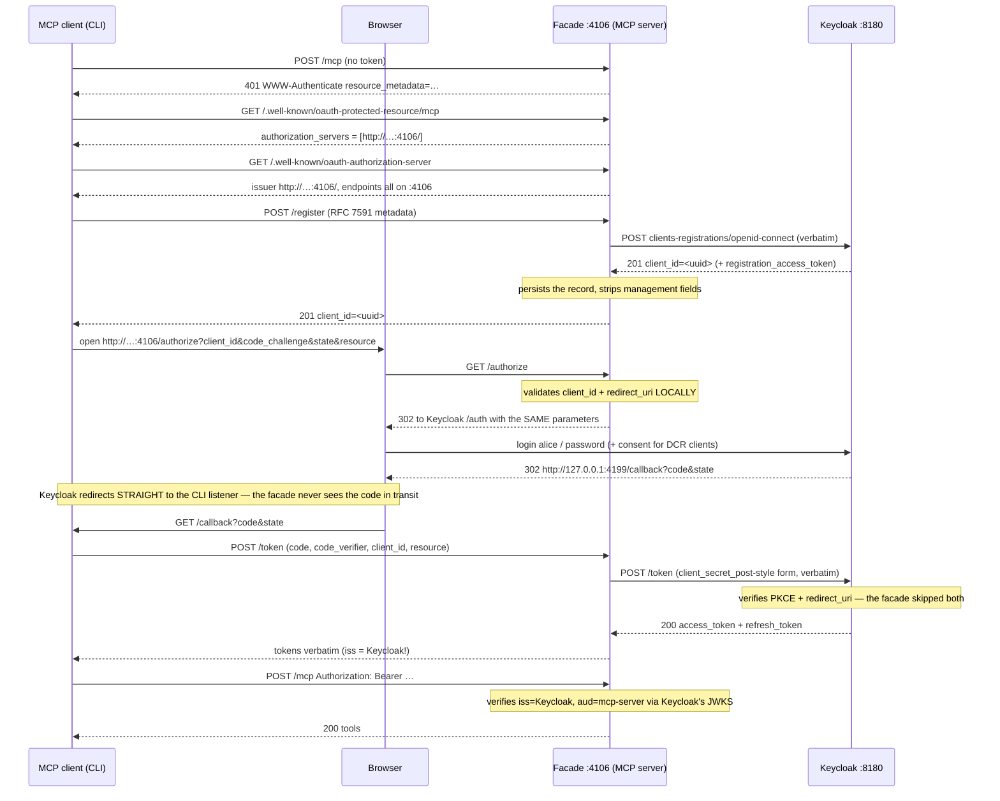

# 06 — OAuth facade: the MCP server proxies Keycloak

**Directory:** `examples/06-oauth-proxy-keycloak` · **Port:** 4106 · **Authorization server:**
the MCP origin itself — every OAuth endpoint proxied to Keycloak · **Keycloak:** yes ·
**Spec grade: TRANSITIONAL** — to MCP clients this is a fully CONFORMANT single-origin OAuth 2.1
server (RFC 8414 metadata, RFC 7591 DCR, PKCE S256, RFC 8707 `resource`, RFC 7009 revocation);
the proxying itself is a pattern the MCP spec neither requires nor forbids, with real trade-offs
listed below. The spec-recommended shape (separate AS, pure resource server) is example 04.

The server wires the SDK's `ProxyOAuthServerProvider` into `mcpAuthRouter`, so
`http://<host>:4106` serves AS metadata, `/register`, `/authorize`, `/token` and `/revoke` — and
behind each of them sits Keycloak. The client is **example 04's client, byte-for-byte the same
flow**, pointed at 4106: it discovers, registers, authorizes and exchanges codes without ever
learning that Keycloak exists. One asterisk: the *browser* does visit Keycloak (the facade 302s
it there), and Keycloak redirects it **straight back to the CLI's loopback callback** — the
facade is not in the callback path.

## When to use it — and when not

Use it when:

* clients must see **one origin** (firewall rules, an IdP on an internal network, an IdP you may
  swap later without breaking client configs),
* your IdP has **no anonymous DCR** but MCP clients expect `/register` to work — the facade can
  authenticate to the IdP's registration API on the clients' behalf (variation below), or
* you need somewhere to hang per-client policy (allow-lists, quotas) *in front of* the IdP:
  `/authorize` and `/token` validate the client locally before anything is forwarded.

Do not use it when:

* you can simply point clients at the IdP — that is example 04, with fewer moving parts, no
  extra hop on `/token`, and error bodies that survive (see limitations),
* you need the facade to *hide an upstream client secret* — the stock SDK class cannot
  (`getClient()` returning a secret forces the MCP client to present that same secret), or
* tokens must be *minted* by the MCP server rather than passed through — that is a
  token-issuing proxy (docs-only pattern; see `docs/patterns.md`), or the embedded AS of 03.

## The flow



## How the code does it

The interesting ~30 lines of [`server.ts`](../examples/06-oauth-proxy-keycloak/server.ts):

```ts
export class KeycloakFacade extends ProxyOAuthServerProvider {
  readonly clients: Map<string, OAuthClientInformationFull>;

  constructor({ metadata, verifier, fetch: fetchFn, clients = [seededCliClient()] }: KeycloakFacadeOptions) {
    const known = new Map(clients.map((client) => [client.client_id, client]));
    super({
      endpoints: {
        authorizationUrl: metadata.authorization_endpoint,
        tokenUrl: metadata.token_endpoint,
        revocationUrl: metadata.revocation_endpoint,
        registrationUrl: metadata.registration_endpoint,
      },
      verifyAccessToken: (token) => verifier.verifyAccessToken(token),
      getClient: async (clientId) => known.get(clientId),
      fetch: fetchFn,
    });
    this.clients = known;
  }

  override get clientsStore(): OAuthRegisteredClientsStore {
    const upstream = super.clientsStore;
    const registerUpstream = upstream.registerClient;
    return {
      getClient: upstream.getClient,
      ...(registerUpstream && {
        registerClient: async (client) => {
          const registered = await registerUpstream(client); // POST to Keycloak, response schema-stripped
          this.clients.set(registered.client_id, registered); // ← the line the stock class is missing
          return registered;
        },
      }),
    };
  }
}
```

Why each piece exists:

* **`getClient` must return `redirect_uris`** — the SDK's `/authorize` validates the client and
  its redirect URI locally *before* redirecting; an empty store means `invalid_client` for
  everyone. The facade seeds the realm's public `mcp-cli` record (same three redirect URIs on
  `OAUTH_CALLBACK_PORT`, `token_endpoint_auth_method: 'none'`).
* **The `registerClient` wrap** — the stock `ProxyOAuthServerProvider` forwards DCR to Keycloak
  and returns the answer *without persisting it*; the very next `/authorize` for the new
  `client_id` would 400 with `invalid_client`. The wrapper stores what Keycloak returned
  (in memory). The SDK parses Keycloak's response with a strip-schema, so Keycloak's
  `registration_access_token` never reaches the store or the MCP client.
* **`clientIdGeneration: false`** on the registration handler — otherwise the SDK invents a
  UUID client_id and sends it upstream; with the flag off the body is forwarded untouched and
  **Keycloak** assigns the id (a real passthrough).
* **`verifyAccessToken`** is example 04's verifier
  (`createKeycloakVerifier({ metadata, requiredScopes: ['mcp:tools'] })`): Keycloak's issuer +
  JWKS, `aud=mcp-server`, and the effective-scopes policy (`mcp:admin` only with the `mcp-admin`
  realm role). The facade object serves both roles — `mcpAuthRouter({ provider })` and
  `requireBearerAuth({ verifier: provider })`.
* **No `requiredScopes` on `requireBearerAuth`** — that would pin `scope="mcp:tools"` into the
  401 and, per SEP-835, the client would request exactly that; bob could never obtain
  `mcp:admin` through the browser. Instead the PRM advertises
  `scopes_supported: ['mcp:tools','mcp:admin']` and the verifier 403s tokens lacking
  `mcp:tools`. See "Scope selection" in `src/shared/README.md`.

`whoami` shows what the verifier derived — for the DCR run as alice (trimmed):

```json
{"clientId":"17d6e18e-cea7-4c16-b891-5d7dccbdc07a","scopes":["mcp:tools"],
 "extra":{"sub":"0c04e3c8-…","username":"alice","roles":["mcp-user"],
          "claims":{"iss":"http://192.168.78.87:8180/realms/mcp","aud":"mcp-server",
                    "azp":"17d6e18e-…","scope":"mcp:tools","preferred_username":"alice"}}}
```

Note `claims.iss`: **the token says Keycloak, not the facade.** More below.

## Run it

```bash
npm run kc:up             # once
npm run ex:06:server      # terminal 1
npm run ex:06:client      # terminal 2 (browser opens; alice / password, consent page for DCR)
```

Server startup:

```
[06-oauth-proxy-keycloak] facade issuer http://192.168.78.87:4106/ → upstream Keycloak http://192.168.78.87:8180/realms/mcp
[06-oauth-proxy-keycloak] clients talk ONLY to this origin; Keycloak redirects the browser straight to the CLI callback
[06-oauth-proxy-keycloak] listening on 0.0.0.0:4106
[06-oauth-proxy-keycloak] MCP endpoint: http://192.168.78.87:4106/mcp   (PUBLIC_HOST 192.168.78.87 — env)
```

Client, first run (captured, trimmed — headless via `MCP_BROWSER_CMD`):

```
connecting to http://192.168.78.87:4106/mcp (dynamic client registration via the facade)
[oauth] waiting for callback on http://127.0.0.1:4199/callback (redirect URI http://127.0.0.1:4199/callback)
==> Authorization required. Open this URL in a browser:
    http://192.168.78.87:4106/authorize?response_type=code&client_id=17d6e18e-cea7-4c16-b891-5d7dccbdc07a&code_challenge=5gT6wjALRv863WgL9cO3a93rJroPV8mBLVJRf04zFgg&code_challenge_method=S256&redirect_uri=http%3A%2F%2F127.0.0.1%3A4199%2Fcallback&state=…&scope=mcp%3Atools+mcp%3Aadmin&resource=http%3A%2F%2F192.168.78.87%3A4106%2Fmcp
browser-login: login form: user alice
browser-login: consent page: accepting
browser-login: done: http://127.0.0.1:4199/callback
tools        -> whoami, add, admin_only
whoami       -> {"clientId":"17d6e18e-…","scopes":["mcp:tools"],…"username":"alice"…}
add(2, 3)    -> 5
admin_only   -> ERROR insufficient_scope: admin_only requires scope mcp:admin
RESULT {"example":"06",…,"adminOnly":"denied"}
```

Everything the client dialled was `:4106`. The authorization URL it opened is the **facade's**
`/authorize`; only the browser then hops to Keycloak. Second run: stored tokens, no browser, no
listener. `OAUTH_CLIENT_ID=mcp-cli npm run ex:06:client` skips DCR *and* the consent page
(pre-registered client); as bob (`MCP_BROWSER_CMD="python3 scripts/browser-login.py --user bob
--password password" EXPECT_ADMIN=ok`) `admin_only` answers `admin ok: mcp-cli has mcp:admin` —
proof that the PRM-driven scope selection reached Keycloak intact through the proxy.

From another LAN machine: `npm run ex:06:client -- http://192.168.78.87:4106/mcp` (and
`OAUTH_REDIRECT_HOST=<that machine's IP>` if the browser runs elsewhere — the host must be one of
the three redirect URIs registered for `mcp-cli`).

The facade's request log during one DCR run (trimmed) is the whole story in six lines:

```
POST /mcp 401                                          ← discovery starts
GET /.well-known/oauth-protected-resource/mcp 200
GET /.well-known/oauth-authorization-server 200
[06-oauth-proxy-keycloak] DCR passthrough: Keycloak issued client_id 17d6e18e-…
POST /register 201
GET /authorize?…client_id=17d6e18e-…&code_challenge=…&scope=mcp:tools+mcp:admin&resource=… 302
POST /token 200                                        ← code+verifier forwarded to Keycloak
POST /mcp 200
```

## Observe it

The 401 that starts discovery — `resource_metadata`, and (deliberately) **no `scope`**:

```
$ curl -si -X POST http://192.168.78.87:4106/mcp -H 'Accept: application/json, text/event-stream' \
    -H 'Content-Type: application/json' -d '{"jsonrpc":"2.0","id":1,"method":"initialize","params":{…}}' | head -2
HTTP/1.1 401 Unauthorized
WWW-Authenticate: Bearer error="invalid_token", error_description="Missing Authorization header", resource_metadata="http://192.168.78.87:4106/.well-known/oauth-protected-resource/mcp"
```

The PRM names the **facade** as the authorization server:

```
$ curl -s http://192.168.78.87:4106/.well-known/oauth-protected-resource/mcp
{"resource":"http://192.168.78.87:4106/mcp","authorization_servers":["http://192.168.78.87:4106/"],
 "scopes_supported":["mcp:tools","mcp:admin"],"resource_name":"06-oauth-proxy-keycloak"}
```

The AS metadata: every endpoint on `:4106`, Keycloak nowhere to be seen (captured, trimmed):

```
$ curl -s http://192.168.78.87:4106/.well-known/oauth-authorization-server
{"issuer":"http://192.168.78.87:4106/",
 "authorization_endpoint":"http://192.168.78.87:4106/authorize",
 "token_endpoint":"http://192.168.78.87:4106/token",
 "token_endpoint_auth_methods_supported":["client_secret_post","none"],
 "grant_types_supported":["authorization_code","refresh_token"],
 "scopes_supported":["mcp:tools","mcp:admin"],
 "revocation_endpoint":"http://192.168.78.87:4106/revoke",
 "registration_endpoint":"http://192.168.78.87:4106/register", …}
```

DCR through the facade — Keycloak issues the id, the facade strips Keycloak's management fields
(`registration_access_token`, `registration_client_uri`) before answering:

```
$ curl -s http://192.168.78.87:4106/register -H 'Content-Type: application/json' -d '{
    "client_name":"curl-demo","redirect_uris":["http://127.0.0.1:4747/callback"],
    "grant_types":["authorization_code","refresh_token"],"response_types":["code"],
    "token_endpoint_auth_method":"none","scope":"mcp:tools"}'
{"redirect_uris":["http://127.0.0.1:4747/callback"],"token_endpoint_auth_method":"none",
 "grant_types":["authorization_code","refresh_token"],"response_types":["code","none"],
 "client_name":"curl-demo","scope":"mcp:tools",
 "client_id":"41522c48-b464-4967-8cb0-324bbd4335cc","client_id_issued_at":1787993161}
```

…and `/authorize` for that client relays the browser to Keycloak with identical parameters:

```
$ curl -si "http://192.168.78.87:4106/authorize?client_id=41522c48-…&response_type=code&code_challenge=E9Mel…&code_challenge_method=S256&state=s1&scope=mcp:tools&redirect_uri=http://127.0.0.1:4747/callback&resource=http://192.168.78.87:4106/mcp" | grep -E '^HTTP|^Location'
HTTP/1.1 302 Found
Location: http://192.168.78.87:8180/realms/mcp/protocol/openid-connect/auth?client_id=41522c48-…&response_type=code&redirect_uri=http%3A%2F%2F127.0.0.1%3A4747%2Fcallback&code_challenge=E9Mel…&code_challenge_method=S256&state=s1&scope=mcp%3Atools&resource=http%3A%2F%2F192.168.78.87%3A4106%2Fmcp
```

## Break it

Each of these is asserted in [`server.test.ts`](../examples/06-oauth-proxy-keycloak/server.test.ts)
(hermetically against a stub upstream with a fetch spy, and again against the real Keycloak):

| Attack / mistake | What happens | Where it is decided |
|---|---|---|
| `/authorize?client_id=unknown` | `400 {"error":"invalid_client"}` | facade, locally — **no request reaches Keycloak** (fetch spy stays silent) |
| `/authorize` with an unregistered `redirect_uri` | `400 {"error":"invalid_request"}` (`Unregistered redirect_uri`) | facade, locally |
| loopback `redirect_uri` on *another port* | **302 to Keycloak** — the SDK applies RFC 8252 loopback-port relaxation locally, but Keycloak matches exactly and shows "Invalid parameter: redirect_uri" | split between facade (lenient) and Keycloak (strict) — a documented sharp edge |
| `/authorize` without `code_challenge` | 302 error redirect `error=invalid_request` back to the redirect URI (no `state` — it was never parsed) | facade |
| `/token` with a bogus/expired code | `500 {"error":"server_error","error_description":"Token exchange failed: 400"}` — Keycloak's `invalid_grant` body is **swallowed** | Keycloak decides, facade obscures (see limitations) |
| `/token` for an unknown client | `400 invalid_client`, no upstream call | facade |
| `grant_type=client_credentials` at `/token` | `400 unsupported_grant_type` — the SDK token handler only proxies `authorization_code` and `refresh_token` | facade |
| token without `mcp:tools` (e.g. `scope=profile email`) | `403 insufficient_scope`, `error_description="missing scope: mcp:tools"` (static string, no `scope=` parameter) | facade verifier |
| token with `aud=account` / wrong `iss` / expired / tampered | `401 invalid_token`, `JWT rejected: <fixed reason>` | facade verifier against Keycloak's JWKS |
| bob's valid token on alice's session id | `403` — session bound to the initializing subject | shared `mountMcp` |
| replay `/register` after a facade restart, then `/authorize` with the old id | `400 invalid_client` — the DCR map is in-memory; the SDK client auto-recovers by re-registering | facade |

## Honest limitations (read before copying this pattern)

1. **Upstream errors become opaque 500s.** The SDK proxy maps any non-2xx from Keycloak's token
   endpoint to `ServerError('Token exchange failed: <status>')` → HTTP 500 `server_error`. The
   client never sees `invalid_grant` vs `invalid_client`; worse, on the *refresh* path the SDK
   client treats `ServerError` as retriable-by-redirect, so a genuinely revoked refresh token
   silently degrades into a fresh browser round-trip instead of a crisp error. The test suite
   pins the exact behaviour so an SDK change is noticed.
2. **PKCE is verified upstream only.** `skipLocalPkceValidation` is hard-set to `true` and
   `challengeForAuthorizationCode()` returns `''` — the facade forwards `code_verifier` and
   *trusts Keycloak* to enforce S256. Front an IdP that does not enforce PKCE and this pattern
   silently drops PKCE altogether.
3. **The facade's `issuer` is not the token's `iss`.** Metadata says `http://…:4106/`; the JWTs
   say `http://…:8180/realms/mcp`. MCP clients never validate access-token claims, and the
   facade's own verifier pins Keycloak's issuer, so the demo is consistent — but any *other*
   resource server that "validates tokens from the AS in the PRM" would reject them, and an
   OIDC-style client comparing `iss` would balk. Passthrough tokens ≠ facade-issued tokens.
4. **Redirect URIs must be registered at Keycloak, not just at the facade.** Keycloak redirects
   the browser straight to the CLI callback and validates the URI **exactly** (no loopback-port
   relaxation), while the facade's local check is RFC 8252-lenient. DCR'd clients register their
   real URI upstream automatically; the seeded `mcp-cli` works only with the callback port the
   realm was rendered with (4199).
5. **The confidential-upstream variant is described, not enabled.** If Keycloak's client were
   confidential, `getClient()` returning the secret would make the SDK demand that same secret
   from the *MCP* client (`client_secret_post`) — the facade cannot hide it that way. The working
   shape is to keep `getClient()` secret-free and inject the secret server-side:

   ```ts
   override async exchangeAuthorizationCode(client, code, verifier, redirectUri, resource) {
     return super.exchangeAuthorizationCode({ ...client, client_secret: UPSTREAM_SECRET }, code, verifier, redirectUri, resource);
   }
   // …and the same for exchangeRefreshToken(); revokeToken() reads client.client_secret too.
   ```

   Not enabled here because the realm's `mcp-cli` is public — enabling it would demonstrate
   secret-injection without anything observable changing.
6. **Consent rule for static-client proxies.** Every MCP client that uses the seeded `mcp-cli`
   record looks like *the same client* to Keycloak. Combine that with an SSO session and a
   consent-free client and any local process could complete an authorization flow silently — the
   classic confused-deputy setup the MCP spec warns proxy operators about. This demo keeps DCR as
   the default (per-client identity + Keycloak's consent-required policy for registered clients)
   and uses `mcp-cli` only as an explicit opt-in. If you operate a facade with one static
   upstream client, you must show your **own** consent screen per downstream client.
7. Demo-grade transport and state: plain HTTP on a LAN (tokens and codes are sniffable — see
   `docs/lan-testing.md`), and the DCR map is in-memory (restart forgets it; clients re-register).

## Threat model notes

* The facade **narrows the attack surface to one origin**: Keycloak can sit on an internal
  network; local client/redirect validation rejects junk before it is forwarded; the SDK's
  per-IP rate limits cover `/authorize`, `/token`, `/register`, `/revoke` (`MCP_RATE_LIMIT=0`
  only in tests).
* The facade **never sees the user's password** (typed at Keycloak) and — unlike a
  token-issuing proxy — holds **no signing keys**; a compromised facade can, however, read every
  access/refresh token that passes `/token`, so treat it as in-scope for token-leak reviews.
* Keycloak's `registration_access_token` for DCR'd clients is schema-stripped before storage and
  response — the facade cannot manage (or leak control of) upstream registrations, and clients
  cannot either.
* Everything from example 04 still applies at `/mcp`: `aud=mcp-server` binding, effective-scope
  policy (roles gate `mcp:admin`), session ↔ subject binding, Host-header validation, static
  `WWW-Authenticate` messages.

## Variations and links

* **Confidential upstream client** — limitation 5 above (secret injection in the exchange
  methods). **Token-issuing proxies** (facade mints its own tokens, full control over `iss`/
  claims/revocation, at the price of being a real AS) and **enterprise gateways** are in
  [`docs/patterns.md`](patterns.md).
* Example [04](04-keycloak-resource-server.md) is the same client experience without the proxy —
  diff the two `server.ts` files to see exactly what the facade buys and costs.
* Example [03](03-oauth-embedded-as.md) is the other extreme: the MCP server as a *real* AS.
* SDK facts this page leans on (proxy provider internals, router mount rules, SEP-835 scope
  selection, DCR handler options): [`docs/sdk-notes.md`](sdk-notes.md).
