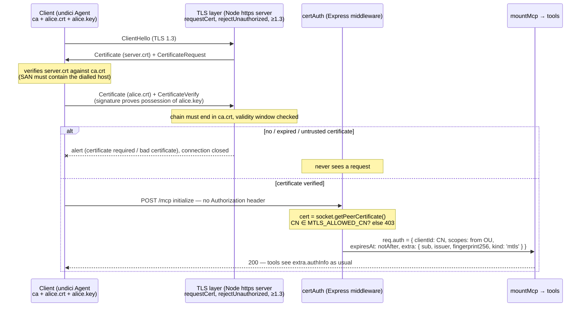

# 08 — Mutual TLS: the certificate is the credential

**Directory:** `examples/08-mtls` · **Port:** 4108 (**https**) · **Authorization server:** none ·
**Keycloak:** no · **Spec grade:** OUTSIDE-SPEC — authentication happens at the *transport*
layer; the MCP authorization specification is about OAuth 2.1 bearer tokens and has nothing to
say about mTLS. The two are complementary, not competing: OAuth's sender-constrained variant
(certificate-bound access tokens, RFC 8705) *combines* them — see `docs/patterns.md`.

In every other example the server decides who is calling by inspecting something inside the HTTP
request (a key, a JWT, an introspection result). Here the decision falls earlier: the TLS
handshake itself demands a client certificate signed by a CA the server trusts
(`requestCert: true, rejectUnauthorized: true`), and a caller without one never gets to speak
HTTP at all. What is left for the application is *mapping* the already-verified identity onto the
same `AuthInfo` every other example produces — and an authorization decision (a CN allow-list),
because "has a certificate from our CA" is authentication, not authorization. There are no bearer
tokens anywhere; `Authorization` headers are ignored.

## When to use it — and when not

**Use it when** both ends are machines you (or your platform) provision: service-to-service
calls, sidecars and service meshes (Istio/Linkerd do exactly this transparently, usually with
SPIFFE identities), device fleets with per-device certificates, zero-trust internal networks, or
as the channel-security layer *underneath* OAuth (RFC 8705). It shines where "no valid cert → no
TCP conversation" is the property you want: the listener is invisible to scanners without a cert.

**Avoid it when** the caller is a human with a browser-based identity: there is no login page, no
consent, no delegation, no scopes chosen per grant — the certificate says *what the machine is*,
never *which user asked and what they allowed*. Certificate issuance, rotation and revocation are
an operational burden (this demo has **no revocation at all**), and any TLS-terminating proxy /
load balancer between client and server breaks the scheme unless it passes the client certificate
through (or you move to the gateway-trust pattern of example 09).

## The handshake, then the mapping



The demo PKI (`npm run ex:08:certs` → `scripts/gen-certs.sh`, output git-ignored) is one
throw-away CA plus: `server` (SAN `IP:<PUBLIC_HOST>, IP:127.0.0.1, DNS:localhost`), `alice`
(`OU=mcp-user`), `bob` (`OU=mcp-admin`), `expired-alice` (validity window entirely in the past),
and a second CA `rogue-ca` with a `rogue-client` certificate the server does *not* trust.

## How the code does it

**Server** (`examples/08-mtls/server.ts`) — the auth middleware replaces `requireBearerAuth`;
everything else is the baseline server. Node has already verified chain, signature and validity
window before this runs (`rejectUnauthorized`), so the middleware is pure mapping plus one policy
check:

```ts
export function certAuth(allowedCn: string[] = allowedCnFromEnv()): RequestHandler {
  return (req, res, next) => {
    const socket = req.socket as TLSSocket;
    const cert = typeof socket.getPeerCertificate === 'function' ? socket.getPeerCertificate() : undefined;
    const cn = first(cert?.subject?.CN);
    if (!socket.authorized || !cert || !cn) {
      // Unreachable in hard-fail mode (the handshake already failed); this is the MTLS_SOFT_FAIL path.
      deny(res, 401, 'Unauthorized: a valid client certificate is required'); // static string
      return;
    }
    if (!allowedCn.includes(cn)) {
      deny(res, 403, 'Forbidden: certificate CN is not in MTLS_ALLOWED_CN'); // static string
      return;
    }
    const ou = ([] as string[]).concat(cert.subject.OU ?? []);
    (req as Request & { auth?: AuthInfo }).auth = {
      token: cert.fingerprint256, // no bearer token exists; the fingerprint is the stable stand-in
      clientId: cn,
      scopes: ou.includes('mcp-admin') ? [SCOPE_TOOLS, SCOPE_ADMIN] : [SCOPE_TOOLS],
      expiresAt: Date.parse(cert.valid_to) / 1000, // certificate notAfter, in seconds
      extra: { sub: cn, issuer: first(cert.issuer.CN), fingerprint256: cert.fingerprint256, kind: 'mtls' },
    };
    next();
  };
}
```

`mountMcp(app, { auth: certAuth() })` guards POST, GET and DELETE alike, and the session ↔
subject binding of `mountMcp` keeps working because `extra.sub` is set — a session initialized
with alice's certificate answers 403 to bob's. `AuthInfo.expiresAt` is mandatory repo-wide; a
certificate has a natural one (notAfter). The https listener is the shared `listen()` fed a
pre-built server (`examples/08-mtls/tls.ts`):

```ts
const server = createHttpsServer({
  key, cert,                      // server.key / server.crt
  ca,                             // the ONLY CA client certificates may chain to
  requestCert: true,              // ask every client for a certificate
  rejectUnauthorized: true,       // kill the handshake otherwise (MTLS_SOFT_FAIL=1 flips this)
  minVersion: 'TLSv1.3',
}, app);
return listen(app, { port, name, server });
```

**Client** (`client.ts` + `tls.ts`): Node's built-in `fetch` cannot carry TLS client options, but
it *is* undici, and undici's own `fetch` accepts a `dispatcher`. The SDK transport takes any
WHATWG-compatible `fetch`, so:

```ts
const dispatcher = new Agent({ connect: { ca, cert, key } });   // + servername for DNS hosts
const transport = new StreamableHTTPClientTransport(new URL(serverUrl), {
  fetch: (url, init) => undiciFetch(url, { ...init, dispatcher }),
});
```

Verified on Node 22.22 / undici 7.29: the initialize POST (SSE-framed response), tool calls, the
standalone GET notification stream (`GET /mcp 200` in the server log) and `DELETE` on
`terminateSession()` all flow through the mTLS agent. (`servername` is only set for DNS
hostnames — RFC 6066 forbids IP literals in SNI; IP SANs are verified from the dialled host.)

`whoami` then reports, for `MTLS_CLIENT=bob`:

```json
{"clientId":"bob","scopes":["mcp:tools","mcp:admin"],"expiresAt":2103352697,
 "expiresAtIso":"2036-08-26T08:38:17.000Z",
 "extra":{"sub":"bob","issuer":"mcp-auth-demo CA",
          "fingerprint256":"48:B8:F6:1A:…:3C:E8","kind":"mtls"}}
```

## Run it

```bash
npm run ex:08:certs      # once — prints the PKI it wrote to examples/08-mtls/certs/
npm run ex:08:server     # terminal 1
npm run ex:08:client     # terminal 2 (alice); MTLS_CLIENT=bob for the admin
```

Server:

```
[08-mtls] listening on 0.0.0.0:4108
[08-mtls] MCP endpoint: https://192.168.78.87:4108/mcp   (PUBLIC_HOST 192.168.78.87 — env)
```

Client (alice — trimmed):

```
connecting to https://192.168.78.87:4108/mcp presenting client certificate "alice"
tools        -> whoami, add, admin_only
whoami       -> {"clientId":"alice","scopes":["mcp:tools"],…,"extra":{"sub":"alice","issuer":"mcp-auth-demo CA","fingerprint256":"87:6D:…:09:09","kind":"mtls"}}
add(2, 3)    -> 5
admin_only   -> ERROR insufficient_scope: admin_only requires scope mcp:admin
RESULT {"example":"08",…,"adminOnly":"denied","extra":{"client":"alice"}}
```

`MTLS_CLIENT=bob` ends in `admin_only -> admin ok: bob has mcp:admin` / `"adminOnly":"ok"`.

**LAN variant:** run the client on another machine against
`https://192.168.78.87:4108/mcp` (argument or `MCP_SERVER_URL`) after copying
`certs/{ca.crt,alice.crt,alice.key}` over — the server certificate's SAN contains
`IP:<PUBLIC_HOST>`, so verification needs no `--insecure` tricks. If you change `PUBLIC_HOST`,
regenerate with `bash scripts/gen-certs.sh --force`.

## Observe it

The MCP endpoint needs the mandatory Streamable-HTTP headers *and* the certificate triple:

```bash
cd examples/08-mtls/certs
curl -sS --cacert ca.crt --cert alice.crt --key alice.key -D - \
  -X POST https://192.168.78.87:4108/mcp \
  -H 'Accept: application/json, text/event-stream' -H 'Content-Type: application/json' \
  -d '{"jsonrpc":"2.0","id":1,"method":"initialize","params":{"protocolVersion":"2025-11-25","capabilities":{},"clientInfo":{"name":"curl","version":"0"}}}'
```

```
HTTP/1.1 200 OK
content-type: text/event-stream
mcp-session-id: 50110249-2564-43e6-81c3-ef86bae48b8c

event: message
data: {"result":{"protocolVersion":"2025-11-25",…,"serverInfo":{"name":"08-mtls","version":"0.1.0"}},"jsonrpc":"2.0","id":1}
```

No `WWW-Authenticate` header exists anywhere in this example — there is no bearer scheme to
challenge for. The failure you *can* observe over HTTP is the allow-list (server started with
`MTLS_ALLOWED_CN=bob`, request made with alice's certificate):

```
HTTP 403  {"jsonrpc":"2.0","error":{"code":-32000,"message":"Forbidden: certificate CN is not in MTLS_ALLOWED_CN"},"id":null}
```

Everything else fails *below* HTTP. `curl` shows the TLS alerts nicely:

```bash
curl -sS --cacert ca.crt https://192.168.78.87:4108/healthz
# curl: (56) OpenSSL SSL_read: … tlsv13 alert certificate required
curl -sS --tls-max 1.2 --cacert ca.crt --cert alice.crt --key alice.key https://192.168.78.87:4108/healthz
# curl: (35) TLS connect error: … tlsv1 alert protocol version
```

(That first one also explains a smoke-test quirk: under hard-fail even `/healthz` requires a
certificate, so `scripts/smoke.ts` waits a fixed moment instead of polling it.)

## Break it

Each row is a test in `server.test.ts` (hermetic: own PKI in a temp dir via
`OUT_DIR=… gen-certs.sh`, https servers on port 0, and a request-spy that proves rejected
handshakes never produce an HTTP request):

| Attempt | Where it dies | What the client sees |
|---|---|---|
| no client certificate (`MTLS_CLIENT=none`) | handshake (server alert `certificate required`) | undici: `fetch failed ← UND_ERR_SOCKET: other side closed`; curl: alert text — Express spy stays at 0 |
| certificate from an untrusted CA (`rogue-client`) | handshake (unknown CA) | same socket-closed error; never reaches Express |
| expired certificate (`expired-alice`) | handshake (validity window) | same — openssl 3.5's `-not_before/-not_after` made the cert genuinely expired |
| valid CA, CN not in `MTLS_ALLOWED_CN` | `certAuth` | **HTTP 403**, static JSON error (authenticated but not authorized) |
| plain `http://` to port 4108 | TLS record layer | connection error (`curl: (52) Empty reply`, fetch: `UND_ERR_SOCKET`) |
| client trusts the wrong CA (`--cacert rogue-ca.crt`) | client-side verification | `SELF_SIGNED_CERT_IN_CHAIN` — the *client* refuses the server |
| TLS 1.2-only client (`--tls-max 1.2`) | version negotiation | `ERR_SSL_TLSV1_ALERT_PROTOCOL_VERSION` (server pins `minVersion: TLSv1.3`) |
| stolen bearer token in `Authorization` | nowhere — header ignored | works, but *as the certificate's identity*; the header changes nothing |

`MTLS_SOFT_FAIL=1` moves the first row up into HTTP: `rejectUnauthorized: false` lets anyone
finish the handshake and `certAuth` answers `401 {"…"a valid client certificate is required"}`.
Trade-off: friendlier, debuggable errors (and a reachable `/healthz`) in exchange for losing the
"strangers cannot even speak HTTP to us" property — the TLS layer no longer filters, your
application code and its error paths are exposed to anyone. Keep hard-fail for anything real.

## Threat-model notes

* **What it gives you.** No bearer token exists, so nothing can leak into logs, histories or
  `Authorization`-forwarding bugs and nothing can be replayed elsewhere: the credential is a
  *private key* that never crosses the wire, and every connection proves possession afresh
  (`CertificateVerify`). Identity is channel-bound — exactly the property plain bearer tokens
  lack (their OAuth retrofit is RFC 8705 / DPoP, `docs/patterns.md`). Both peers authenticate,
  so a MITM needs the CA, not just a hostname. TLS 1.3-only removes renegotiation tricks and
  downgrade paths.
* **CA trust is the whole ballgame.** Anyone who can sign with `ca.key` *is* anyone. The demo CA
  has no intermediates, no name constraints, and its key sits unencrypted next to the certs —
  fine for a demo, unacceptable anywhere else. Never trust the system store for *client* certs
  (`ca:` here is exactly one CA).
* **No revocation.** The demo checks no CRL and no OCSP (Node offers no turnkey CRL fetching) —
  a leaked `alice.key` stays valid until 2036. Real deployments compensate with short-lived
  certificates and automated rotation (SPIFFE SVIDs live minutes-to-hours), or push per-request
  revocation back to the application layer — which is introspection, example 07's shape.
* **Authentication ≠ authorization.** The handshake proves membership of the CA, nothing more;
  the CN allow-list (and the OU → scope mapping) is the authorization layer. A certificate also
  carries no user consent, no audience, no downscoping — one blob, all or nothing, until expiry.
* **Topology fragility.** Any TLS-terminating hop (LB, CDN, ingress) eats the client
  certificate. Options: TCP passthrough, or terminate at the edge and forward the identity in a
  signed header — at which point you have rebuilt example 09's gateway trust boundary,
  with the same "the backend must verify the gateway, not the header" rules.

## Variations and links

* **Certificate-bound OAuth tokens (RFC 8705)** — mTLS *plus* bearer semantics: tokens usable
  only over a connection presenting the bound certificate → `docs/patterns.md`
  (sender-constrained tokens, next to DPoP RFC 9449).
* **Workload identity / service mesh** — SPIFFE/SPIRE issue exactly these certificates
  automatically, with rotation; Istio/Linkerd do the handshake in the sidecar → `docs/patterns.md`.
* **Gateway trust boundary** — what to do when TLS terminates before your server: example
  `09-auth-gateway`.
* **Per-request revocation semantics** — the introspection pattern: example `07-token-introspection`.
* PKI details: `scripts/gen-certs.sh` (EC P-256, `-not_before/-not_after` for the expired cert);
  the negative matrix: `examples/08-mtls/server.test.ts`.
