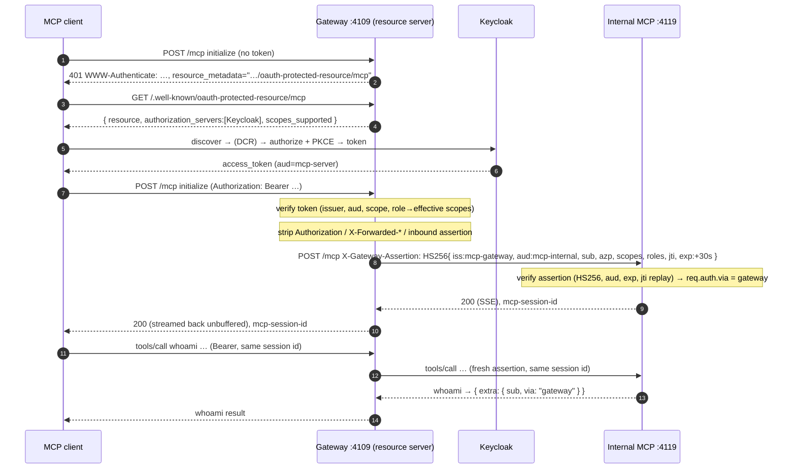

# 09 — Auth gateway / sidecar

**Directory:** `examples/09-auth-gateway` · **Ports:** 4109 (gateway, public), 4119 (internal) ·
**Authorization server:** Keycloak · **Keycloak?** yes ·
**Spec grade:** infrastructure trust boundary — the **gateway** is a CONFORMANT OAuth 2.1 resource
server (RFC 9728 PRM, RFC 6750 bearer, RFC 8414/OIDC discovery, audience + scope checks); the
internal server is out of the spec by design.

A gateway (also called a sidecar or a policy-enforcement point) sits in front of an MCP server that
does **no** authentication of its own. The gateway validates the caller's Keycloak access token
exactly like [example 04](04-keycloak-resource-server.md), serves the Protected Resource Metadata,
and then reverse-proxies the request to the internal server — replacing the bearer token with a
**short-lived signed identity assertion**. The access token never reaches the backend; the backend
trusts only "did *my* gateway send this, and recently?". This is how you put OAuth in front of a
legacy service, a service in another language, or a fleet of small internal tools without teaching
each of them the whole authorization spec — and it is the shape Envoy, Traefik, NGINX and
oauth2-proxy implement in production.

## When to use it

- You have an MCP server you cannot or do not want to make OAuth-aware (legacy code, a different
  language, a third-party binary), and you want a single conformant front door.
- You want to centralize token validation, PRM, logging and rate-limiting in one place and keep the
  backends tiny.
- You already run a mesh/ingress (Envoy `ext_authz`, Traefik `forwardAuth`, NGINX `auth_request`,
  Kong, oauth2-proxy) and want the MCP server to slot behind it. This example is the hand-rolled
  version of exactly that pattern (see [Variations](#variations-and-links)).

## When **not** to use it

- A single MCP server you fully control — just make it the resource server ([04](04-keycloak-resource-server.md)).
  A gateway is an extra hop and an extra secret to rotate.
- You need the backend to see the *original* token to call further APIs on the user's behalf — that
  is delegation, use token exchange ([10](10-token-exchange-downstream.md)). Here the token stops at
  the gateway on purpose.
- You cannot guarantee the backend is unreachable except through the gateway. The whole model rests
  on network isolation **plus** the assertion; a backend that trusts plain headers on an open port
  is forgeable (this example ships that failure mode as `INTERNAL_TRUST_MODE=network` to prove it).

## Happy path



## How the code does it

Two small servers and one assertion module.

**The gateway** (`gateway.ts`) is example 04's resource server up to the proxy line. It mounts the
PRM (`mountProtectedResourceMetadata`, resource = the gateway URL, AS = Keycloak), builds the same
Keycloak JWT verifier (`createJwtVerifier` with `keycloakEffectiveScopes`), and guards **every**
method on `/mcp` with `requireBearerAuth`. Per SEP-835 the required scope lives in the *verifier*
(`requiredScopes: ['mcp:tools']`), so `requireBearerAuth` carries no `scope=` and the 401 advertises
only the PRM. Once the token is valid, instead of running an `McpServer` it proxies:

```ts
const assertion = await signAssertion(
  { sub: String(auth.extra?.sub ?? auth.clientId), azp: auth.clientId, scopes: auth.scopes, roles: auth.extra?.roles },
  secret,
);
const headers: Record<string, string> = {};
for (const name of ['mcp-session-id', 'mcp-protocol-version', 'accept', 'content-type', 'last-event-id'])
  if (typeof req.headers[name] === 'string') headers[name] = req.headers[name];
headers['x-gateway-assertion'] = assertion;           // set AFTER the copy — an inbound one cannot win
const upstream = httpRequest({ …target, method: req.method, headers }, (upstreamRes) => {
  res.writeHead(upstreamRes.statusCode ?? 502, filterResponseHeaders(upstreamRes.headers));
  res.flushHeaders();                                  // SSE head out now, not 15 s later
  upstreamRes.pipe(res);                               // stream, never buffer
});
upstream.on('error', () => res.headersSent ? res.destroy() : res.status(502).json(badGateway));
```

Three deliberate choices:

- **Header allow-list = the strip.** Only five transport headers are forwarded. Everything else —
  the caller's `Authorization`, any `X-Forwarded-User`/`X-Forwarded-Scopes` they tried to inject,
  and any `X-Gateway-Assertion` they tried to forge — is dropped by omission (default-deny). The
  gateway's own assertion is written *after* the copy so a client cannot pre-seed it.
- **Nothing is buffered.** The response is piped as it arrives so an SSE notification stream flows in
  real time. `res.flushHeaders()` is needed because, once `transfer-encoding` is stripped, Node
  defers the response head until the first body byte — which for an idle SSE stream is a keep-alive
  ~15 s away. Flushing sends `200 text/event-stream` immediately.
- **Upstream failures are 502**, a JSON-RPC error, never a stack trace or a 5xx that would make the
  client restart OAuth discovery.

**The assertion** (`assertion.ts`) is a 30-second HS256 JWT signed with `GATEWAY_INTERNAL_SECRET`:

```json
{ "iss": "mcp-gateway", "aud": "mcp-internal", "sub": "<user>", "azp": "<client>",
  "scopes": ["mcp:tools"], "roles": ["mcp-user"], "jti": "<uuid>", "iat": …, "exp": … }
```

It carries the *effective* scopes the gateway already computed (role policy applied), so the backend
does no policy of its own — it just trusts the list. A fresh `jti` per request lets the backend
reject replays.

**The internal server** (`server.ts`) is the ordinary shared MCP server (`createApp` + `mountMcp`
with the three demo tools) whose auth middleware verifies the assertion instead of a token:

```ts
const { payload } = await jwtVerify(token, key, { issuer: 'mcp-gateway', audience: 'mcp-internal', algorithms: ['HS256'], clockTolerance: 5 });
if (seen.has(jti)) throw new Error('replayed');        // 60 s jti cache
seen.set(jti, now + 60_000);
req.auth = { token: jti, clientId: azp, scopes, expiresAt: exp, extra: { sub, roles, via: 'gateway' } };
```

`algorithms: ['HS256']` blocks algorithm-confusion (including `alg:none`); the audience pins the
assertion to *this* backend; the `jti` cache blocks replay of a captured assertion within its short
life. A missing or invalid assertion is a **plain 401 with no `WWW-Authenticate`/PRM** — the backend
is not a public resource and must not invite a client to start OAuth against it. In `whoami` the
caller sees `extra.via: "gateway"` and the asserted `sub` — the proof the request crossed the trust
boundary, with the same `AuthInfo` shape as every other example.

**Why the backend must not trust plain headers.** The obvious cheap alternative — "we're on a
private network, the proxy sets `X-Forwarded-User`, just trust it" — has no signature: anyone who can
reach the port sets any identity. `INTERNAL_TRUST_MODE=network` ships that anti-pattern (and binds
`127.0.0.1` as its only defence) so a test can prove the forgery works. Network isolation is a layer,
not the mechanism; the signed, audience-bound, replay-checked assertion is.

The SDK facts this relies on (bearer error mapping, PRM path rules, SSE framing) are in
[`docs/sdk-notes.md`](sdk-notes.md).

## Run it

```bash
npm run kc:up                                   # Keycloak (shared; skip if already running)

# one process — gateway (4109) + internal (4119):
npm run ex:09:all
# …or two, to see the boundary as two deployments:
npm run ex:09:server                            # internal MCP server on 4119
npm run ex:09:gateway                           # gateway on 4109

# client: headless login as alice with the pre-registered public client
MCP_BROWSER_CMD="python3 scripts/browser-login.py --user alice --password password" \
  OAUTH_CLIENT_ID=mcp-cli OAUTH_CALLBACK_PORT=4189 npm run ex:09:client
```

Expected last line (the machine-readable summary):

```
RESULT {"example":"09","tools":["add","admin_only","whoami"],"whoami":{"clientId":"mcp-cli","scopes":["mcp:tools"],…,"extra":{"sub":"…","roles":["mcp-user"],"via":"gateway"}},"add":"5","adminOnly":"denied"}
```

`extra.via` is `gateway` and `admin_only` is `denied` (alice lacks the `mcp-admin` role; the gateway
requests only `mcp:tools`). **LAN:** point the client at another machine with
`npm run ex:09:client -- http://192.168.78.87:4109/mcp` (or `MCP_SERVER_URL=…`); set
`OAUTH_REDIRECT_HOST=$PUBLIC_HOST` when the browser runs on a third machine.

## Observe it

Streamable HTTP is strict: a POST needs `Accept: application/json, text/event-stream` **and**
`Content-Type: application/json`.

```bash
# PRM at the gateway — the gateway is the resource server:
curl -s http://192.168.78.87:4109/.well-known/oauth-protected-resource/mcp
# {"resource":"http://192.168.78.87:4109/mcp","authorization_servers":["http://192.168.78.87:8180/realms/mcp"],
#  "scopes_supported":["mcp:tools","mcp:admin"],"resource_name":"09-auth-gateway","bearer_methods_supported":["header"]}

# no token → 401 at the gateway, pointing at that PRM (no scope= — the verifier owns the scope check):
curl -si -X POST http://192.168.78.87:4109/mcp \
  -H 'Accept: application/json, text/event-stream' -H 'Content-Type: application/json' \
  -d '{"jsonrpc":"2.0","id":1,"method":"initialize","params":{"protocolVersion":"2025-11-25","capabilities":{},"clientInfo":{"name":"curl","version":"0"}}}' \
  | grep -i www-authenticate
# WWW-Authenticate: Bearer error="invalid_token", error_description="Missing Authorization header",
#                   resource_metadata="http://192.168.78.87:4109/.well-known/oauth-protected-resource/mcp"

# the internal server refuses everyone directly — even with a forged identity header, and with NO PRM:
curl -si -X POST http://192.168.78.87:4119/mcp \
  -H 'Accept: application/json, text/event-stream' -H 'Content-Type: application/json' \
  -H 'X-Forwarded-User: bob' \
  -d '{"jsonrpc":"2.0","id":1,"method":"initialize","params":{"protocolVersion":"2025-11-25","capabilities":{},"clientInfo":{"name":"curl","version":"0"}}}'
# HTTP/1.1 401 Unauthorized
# {"jsonrpc":"2.0","error":{"code":-32001,"message":"Unauthorized: gateway assertion required"},"id":null}
# (no WWW-Authenticate header — the backend is not a public resource)

curl -s -o /dev/null -w '%{http_code}\n' http://192.168.78.87:4119/.well-known/oauth-protected-resource/mcp
# 404  — the internal server serves no PRM
```

## Break it

`npx vitest run examples/09-auth-gateway` (hermetic + one Keycloak-backed case) mirrors §6.9:

| Attempt | Result |
|---|---|
| No token at the gateway | 401, `resource_metadata` = the gateway PRM |
| Token with wrong `aud` | 401 `invalid_token` ("wrong audience") |
| Token without `mcp:tools` | 403 `insufficient_scope`, static `"missing scope: mcp:tools"` |
| Direct to :4119 with `X-Forwarded-User` and **no** assertion | 401 (assertion mode does not trust headers) |
| Forged assertion (wrong secret) | 401 |
| Expired assertion | 401 |
| Assertion for a different `aud` / `iss` | 401 |
| Replayed assertion (same `jti`) | 401 (accepted once, rejected the second time) |
| Client sends its own `Authorization` / `X-Forwarded-*` / `X-Gateway-Assertion` | stripped — the backend sees only the gateway's assertion |
| SSE GET stream + DELETE through the proxy | 200, session id preserved, streamed unbuffered |
| Internal server unreachable | 502 JSON-RPC error |
| `INTERNAL_TRUST_MODE=network` + forged `X-Forwarded-User: bob` | **accepted** (admin included) — the documented failure |

## Threat model notes

- **Token termination.** The Keycloak access token never leaves the gateway, so a compromised
  backend cannot replay the user's token elsewhere. The flip side: the backend cannot act as the
  user downstream — that is [token exchange (10)](10-token-exchange-downstream.md).
- **Header trust is not authentication.** `X-Forwarded-User`-style trust is forgeable by anyone who
  reaches the port. Use the signed assertion; treat network isolation as defence in depth, not the
  control. The `network` mode exists only to demonstrate the difference and is asserted in a test so
  the warning cannot be silently deleted.
- **Network isolation.** In production the internal listener must be unreachable except from the
  gateway (a private network / namespace / mesh mTLS / `127.0.0.1` on the same host). This demo
  binds it to `0.0.0.0` so you can `curl` its 401 from another machine; that is a demo affordance,
  called out in the code and the banner.
- **Replay.** Assertions are single-hop: 30-second `exp` plus a 60-second `jti` cache. A captured
  assertion is useless after its short life and cannot be reused even within it. The cache is
  in-memory per backend process — a horizontally scaled backend needs a shared cache (Redis) or can
  accept the small residual replay window bounded by `exp`.
- **Assertion secret rotation.** `GATEWAY_INTERNAL_SECRET` is the entire trust relationship (a
  shared HMAC secret). Rotate it like any credential; support two valid secrets during a rollover
  (verify against old+new, sign with new), or move to asymmetric signing (the gateway signs with a
  private key, the backend verifies with the public key) so the backend never holds signing
  material. This demo uses one symmetric secret for clarity.
- **Inherited from the resource-server pattern:** audience binding (`aud=mcp-server` at the gateway),
  DNS-rebinding Host validation on both listeners, static bearer error messages (no header
  injection), and never logging tokens or assertions — see [04](04-keycloak-resource-server.md) and
  [`docs/threat-model.md`](threat-model.md).

## Variations and links

- **Off-the-shelf gateways** implement exactly this shape; swap the hand-rolled proxy for one and
  keep the internal server as-is (see [`docs/patterns.md`](patterns.md)):
  - **Envoy `ext_authz`** — an external authorization filter validates the token and injects headers.
  - **Traefik `forwardAuth`** — Traefik calls an auth service; its response headers are forwarded.
  - **NGINX `auth_request`** — a subrequest authorizes, then variables become upstream headers.
  - **oauth2-proxy** — terminates OIDC and forwards `X-Forwarded-User`/`-Email` (header trust — pair
    with network isolation, exactly the caveat above).
  - **Kong / APISIX** — an OIDC/JWT plugin validates and enriches the request.
  Most of these forward *headers*; a signed, audience-bound assertion (JWT, or mesh mTLS SPIFFE
  identity) is the hardening this example demonstrates.
- **Asymmetric assertions / mTLS between hops** for zero shared secrets — noted under rotation above.
- **Related:** [04 resource server](04-keycloak-resource-server.md) (the gateway's other half),
  [06 OAuth proxy](06-oauth-proxy-keycloak.md) (proxies the *authorization* endpoints, not the MCP
  traffic), [10 token exchange](10-token-exchange-downstream.md) (when the backend must call onward
  as the user). SDK behaviour: [`docs/sdk-notes.md`](sdk-notes.md).
