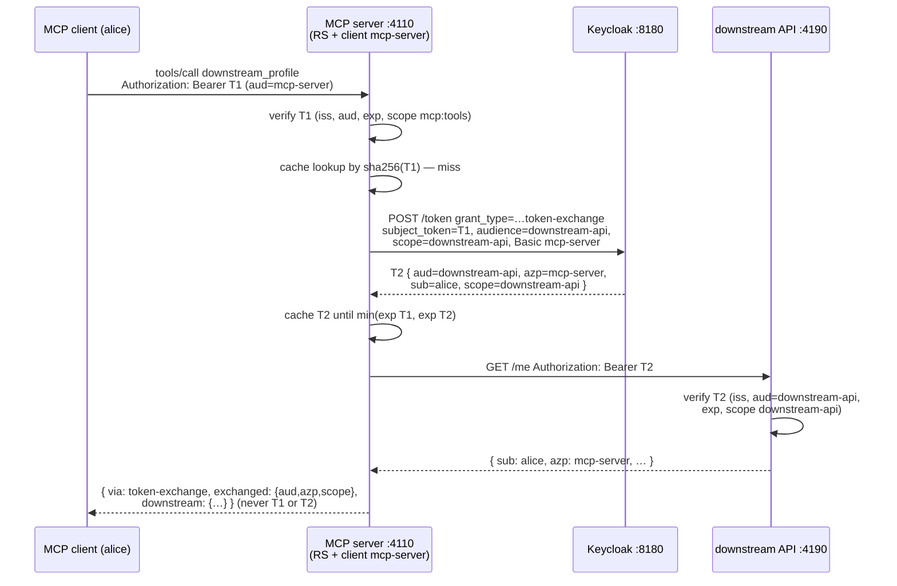

# 10 — Token exchange: acting on the user's behalf downstream (RFC 8693)

**Directory:** `examples/10-token-exchange-downstream` · **Ports:** 4110 (`PORT_10`, MCP server) +
4190 (`PORT_10_DOWNSTREAM`, downstream API) · **Authorization server:** Keycloak
(`http://<PUBLIC_HOST>:8180/realms/mcp`) · **Keycloak:** yes ·
**Spec grade: CONFORMANT** delegation — the MCP side is exactly example 04's spec-recommended
resource server (MCP authorization 2025-06-18 → 2025-11-25, RFC 9728 PRM, SEP-835), and the
downstream call uses RFC 8693 OAuth 2.0 Token Exchange (`grant_type=urn:ietf:params:oauth:grant-type:token-exchange`)
as Keycloak 26 implements it ("standard token exchange", per-client opt-in).
**PARTIAL** on one point: RFC 8693's `audience` is "the logical name of the target service" and
RFC 8707 would use a resource *URI* — Keycloak's `audience` parameter takes a **client id**
(`downstream-api`), and it additionally requires the matching `scope` in the request.

An MCP tool often has to call *another* service: a profile store, a ticket system, an internal
REST API. The wrong way is to forward the caller's token (see the anti-pattern below). The right
way, when both services trust the same AS, is **token exchange**: the MCP server — authenticating
as itself, confidential client `mcp-server` — presents the caller's token as `subject_token` and
receives a *different* token whose

* `sub` is still **the user** (delegation, not impersonation — the downstream can authorize and
  audit per user),
* `azp` is **`mcp-server`** (the downstream sees *who* is acting on the user's behalf),
* `aud` is **`downstream-api`** only — useless at the MCP server, at Keycloak's admin API, or
  anywhere else, and
* `scope` is **`downstream-api`** only — no `mcp:tools`, no `mcp:admin`, nothing the downstream
  does not need.

## When to use it

* A tool must call downstream APIs **as the user**: per-user authorization decisions, per-user
  rate limits, audit trails that name the human, data the user (not the server) is entitled to.
* You want **least privilege per hop**: every service gets a token that works only there
  (audience isolation), so one compromised hop cannot replay tokens across the system.
* Both the MCP server and the downstream API trust the same AS (here: one Keycloak realm), and
  the AS supports RFC 8693 (Keycloak 26+, Okta, Auth0, Microsoft Entra's OBO flow, …).

## When not

* The downstream call is made **as the server**, not as any user (nightly sync, telemetry,
  shared cache warm-up): that is the client-credentials grant — example
  [05](05-keycloak-client-credentials.md) — with `mcp-server`'s own service account.
* There is no common AS: exchange cannot bridge trust domains by itself (see the
  enterprise-managed-authorization / ID-JAG pattern in [patterns](patterns.md) for the
  cross-domain story).
* You are tempted to just **forward the caller's token** ("token passthrough"). Don't. The MCP
  spec forbids it, and it is the classic **confused deputy** setup: the downstream sees a token
  minted for the MCP server (`aud=mcp-server`) and cannot tell the legitimate MCP server acting
  for alice from *anything else that ever obtained such a token* — every scope the token carries
  travels with it, and the audit trail lies. A downstream that validates `aud` (as it must)
  simply rejects it — which is exactly what this example's `downstream_passthrough` tool
  demonstrates.

## Happy path



## How the code does it

The MCP server (`server.ts`) is example 04's resource server — PRM +
`createKeycloakVerifier({ requiredScopes: ['mcp:tools'] })` + `requireBearerAuth({ verifier, resourceMetadataUrl })`
without `requiredScopes` (SEP-835; the wiring is *copied*, not imported — examples stay
self-contained, see [04](04-keycloak-resource-server.md) for the discovery trace) — plus one tool.
The auth-specific ~30 lines:

```ts
// examples/10-token-exchange-downstream/server.ts
const cache = new Map<string, CacheEntry>(); // per subject token; key = sha256, never the token

async function exchangedTokenFor(authInfo: AuthInfo): Promise<string> {
  const key = createHash('sha256').update(authInfo.token).digest('hex');
  const hit = cache.get(key);
  if (hit && hit.expiresAt > now()) return hit.accessToken;
  cache.delete(key);
  const tokens = await exchangeToken({          // src/shared/keycloak.ts — RFC 8693 form POST
    subjectToken: authInfo.token,
    audience: KC.clients.downstream,            // 'downstream-api' — in Keycloak: a CLIENT id
    scope: KC.scopes.downstream,                // required too, otherwise invalid_request
    clientId: KC.clients.server,                // Basic mcp-server:<MCP_SERVER_CLIENT_SECRET>
    clientSecret, metadata, fetchFn: exchangeFetch,
  });
  const exchangedExp = /* exp of tokens.access_token */;
  cache.set(key, { accessToken: tokens.access_token,
                   expiresAt: Math.min(authInfo.expiresAt, exchangedExp) });
  return tokens.access_token;
}

server.registerTool('downstream_profile', { … }, async (extra) => {
  const accessToken = await exchangedTokenFor(extra.authInfo!);
  const me = await callMe(accessToken);         // GET <downstream>/me, Bearer <exchanged>
  return json({ via: 'token-exchange',
                exchanged: { aud, azp, scope }, // decoded for DISPLAY; downstream verifies
                downstream: me.body });
});
```

`exchangeToken()` (`src/shared/keycloak.ts`) sends the verified request shape:
`grant_type=urn:ietf:params:oauth:grant-type:token-exchange`,
`subject_token_type=urn:ietf:params:oauth:token-type:access_token`,
`requested_token_type=…:access_token`, `audience=downstream-api`, `scope=downstream-api`, client
authentication `Basic mcp-server`. A Keycloak error surfaces in the tool result as
`{ error, error_description }` — **tokens never appear in tool results or logs** (the cache key is
a hash). The cache lives until the *earlier* of the two expiries, so neither an expired subject
token nor an expired exchanged token is ever served from it.

The downstream API (`downstream.ts`) is a plain Express service, no MCP, guarded by the same
shared verifier with the roles reversed:

```ts
// examples/10-token-exchange-downstream/downstream.ts
const verifier = createJwtVerifier({ issuer, audience: ['downstream-api'],
                                     jwks, requiredScopes: ['downstream-api'] });
app.get('/me', requireBearerAuth({ verifier }), (req, res) => {
  const claims = req.auth!.extra!.claims;
  res.json({ sub: claims.sub, azp: claims.azp, aud: claims.aud,
             scope: claims.scope, roles: req.auth!.extra!.roles });
});
```

With `DEMO_PASSTHROUGH=1` the server additionally registers **`downstream_passthrough`** — the
anti-pattern, kept so you can watch it fail: it forwards `extra.authInfo.token` (the caller's MCP
token) to `/me` unchanged and returns the downstream's 401.

`whoami` looks exactly as in example 04 (`extra.sub`, `extra.username`, `extra.roles`,
`claims.aud === "mcp-server"`); what is new is the `downstream_profile` result above.

> One LAN-testing footnote: port **4190 is on the WHATWG fetch "bad ports" list** (ManageSieve),
> so Node's global `fetch` refuses to dial the downstream (`TypeError: fetch failed`, cause
> `bad port`) while `curl` happily connects. The server therefore performs the downstream GET with
> `node:http` (`httpGetJson` in `server.ts`). If you repoint `PORT_10_DOWNSTREAM`, any port off
> that list also works with plain `fetch`.

## Run it

```bash
npm run kc:up                                  # once — Keycloak with the mcp realm
DEMO_PASSTHROUGH=1 npm run ex:10:all           # terminal 1: downstream :4190 + MCP server :4110
npm run ex:10:client                           # terminal 2: DCR + browser login (alice / password)
```

(Two-terminal variant: `ex:10:downstream` + `ex:10:server`. From another LAN machine:
`npm run ex:10:client -- http://192.168.78.87:4110/mcp`; the browser login and callback work as in
[04](04-keycloak-resource-server.md), see [lan-testing](lan-testing.md).)

Client output (trimmed, real run — DCR client, alice):

```
tools        -> whoami, add, admin_only, downstream_profile, downstream_passthrough
whoami       -> {"clientId":"8758e265-…","scopes":["mcp:tools"],…,"extra":{"sub":"0c04e3c8-…","username":"alice","roles":["mcp-user"],…}}
add(2, 3)    -> 5
admin_only   -> ERROR insufficient_scope: admin_only requires scope mcp:admin
downstream   -> {
  "via": "token-exchange",
  "exchanged": { "aud": "downstream-api", "azp": "mcp-server", "scope": "downstream-api" },
  "downstream": { "sub": "0c04e3c8-…", "azp": "mcp-server", "aud": "downstream-api",
                  "scope": "downstream-api", "roles": ["mcp-user"] }
}
RESULT {"example":"10",…,"adminOnly":"denied","extra":{"exchanged":{…},"downstream":{"sub":"0c04e3c8-…","azp":"mcp-server",…}}}
```

`downstream.sub` is alice's Keycloak id — the same value as in `whoami.extra.sub`. Same user, new
audience, different acting party.

## Observe it with curl

Get a user token (test client, password grant — test-only), then run the exchange yourself:

```bash
TOKEN=$(curl -s http://192.168.78.87:8180/realms/mcp/protocol/openid-connect/token \
  -d 'grant_type=password&client_id=mcp-test&username=alice&password=password&scope=mcp:tools' \
  | jq -r .access_token)

curl -s http://192.168.78.87:8180/realms/mcp/protocol/openid-connect/token \
  -u mcp-server:mcp-server-secret-demo \
  -d grant_type=urn:ietf:params:oauth:grant-type:token-exchange \
  -d subject_token="$TOKEN" \
  -d subject_token_type=urn:ietf:params:oauth:token-type:access_token \
  -d requested_token_type=urn:ietf:params:oauth:token-type:access_token \
  -d audience=downstream-api -d scope=downstream-api | jq
```

```json
{
  "access_token": "eyJhbGciOiJSUzI…",
  "expires_in": 900,
  "token_type": "Bearer",
  "scope": "downstream-api",
  "issued_token_type": "urn:ietf:params:oauth:token-type:access_token"
}
```

The exchanged token's payload (decode the middle JWT segment):

```json
{ "iss": "http://192.168.78.87:8180/realms/mcp", "aud": "downstream-api",
  "sub": "0c04e3c8-dc79-4428-b649-a224a21be629", "azp": "mcp-server",
  "scope": "downstream-api", "realm_access": { "roles": ["mcp-user"] }, "typ": "Bearer" }
```

**Rejection 1 — the exchanged token is useless at the MCP server** (its `aud` lacks `mcp-server`).
Note the mandatory Streamable HTTP headers:

```bash
EXCHANGED=…   # access_token from above
curl -si -X POST http://192.168.78.87:4110/mcp \
  -H 'Accept: application/json, text/event-stream' -H 'Content-Type: application/json' \
  -H "Authorization: Bearer $EXCHANGED" \
  -d '{"jsonrpc":"2.0","id":1,"method":"initialize","params":{"protocolVersion":"2025-11-25","capabilities":{},"clientInfo":{"name":"curl","version":"0"}}}'
```

```
HTTP/1.1 401 Unauthorized
WWW-Authenticate: Bearer error="invalid_token", error_description="JWT rejected: wrong audience", resource_metadata="http://192.168.78.87:4110/.well-known/oauth-protected-resource/mcp"

{"error":"invalid_token","error_description":"JWT rejected: wrong audience"}
```

**Rejection 2 — the MCP token is useless at the downstream** (its `aud` lacks `downstream-api`):

```bash
curl -si http://192.168.78.87:4190/me -H "Authorization: Bearer $TOKEN"
```

```
HTTP/1.1 401 Unauthorized
WWW-Authenticate: Bearer error="invalid_token", error_description="JWT rejected: wrong audience"

{"error":"invalid_token","error_description":"JWT rejected: wrong audience"}
```

And the pair that *does* work — the exchanged token at the downstream:

```bash
curl -s http://192.168.78.87:4190/me -H "Authorization: Bearer $EXCHANGED"
# {"sub":"0c04e3c8-…","azp":"mcp-server","aud":"downstream-api","scope":"downstream-api","roles":["mcp-user"]}
```

The MCP endpoint's own discovery surface is 04's, unchanged
(`WWW-Authenticate … resource_metadata="…"` on the 401, PRM at
`/.well-known/oauth-protected-resource/mcp` advertising Keycloak) — trace in
[04](04-keycloak-resource-server.md), SDK behaviour in [sdk-notes](sdk-notes.md).

## Break it

Each of these is a test in `server.test.ts`:

* **Forward the caller's token** (`DEMO_PASSTHROUGH=1`, call `downstream_passthrough`): the
  downstream answers 401 `JWT rejected: wrong audience` and the tool returns it as an error —
  the confused deputy is refused by audience validation (captured tool result):

  ```json
  { "error": "downstream_error", "status": 401,
    "www_authenticate": "Bearer error=\"invalid_token\", error_description=\"JWT rejected: wrong audience\"",
    "downstream": { "error": "invalid_token", "error_description": "JWT rejected: wrong audience" } }
  ```
* **Replay the exchanged token at `/mcp`** → 401 (rejection 1 above); **send the MCP token to
  `/me`** → 401 (rejection 2 above).
* **Leave out `scope=downstream-api`** in the exchange → Keycloak
  `400 {"error":"invalid_request","error_description":"Requested audience not available: downstream-api"}` —
  the audience mapper lives on the `downstream-api` client *scope*, so the scope must be requested.
* **Exchange as a client without the opt-in** (`mcp-service` instead of `mcp-server`) →
  `400 {"error":"invalid_request","error_description":"Standard token exchange is not enabled for the requested client"}`.
  Exchange is per-client opt-in (`standard.token.exchange.enabled=true` on `mcp-server` only).
* **Subject token not addressed to the requester**: Keycloak refuses to exchange a subject token
  whose `aud` does not include the requesting client (`mcp-server`). This rule is documented
  rather than asserted: every `mcp-test` token carries `aud=mcp-server` because `mcp:tools` (whose
  audience mapper adds it) is one of that client's *default* scopes — even `scope=email` requests
  come back with `scope="profile mcp:tools email"` (the test pins this precondition).
* **Cache behaviour**: a second `downstream_profile` call with the same subject token performs no
  second exchange (asserted with a fetch spy); once `min(subject exp, exchanged exp)` passes, the
  entry is dropped and the next call exchanges again (asserted with an injected clock).
* Everything from example 04 still applies to `/mcp` (expired / wrong issuer / wrong audience /
  missing scope / foreign session → 401/403/403).

## Threat model notes

What this adds on top of example 04's stateless resource server:

* **Audience isolation per hop.** A token is only ever valid at exactly one service: the MCP
  token at the MCP server, the exchanged token at the downstream API — both directions of replay
  fail with 401 (proven above). Stealing a token from one hop no longer compromises the next.
* **Delegation is visible.** The downstream sees `sub=<user>` **and** `azp=mcp-server`: "the MCP
  server, acting for alice". It can authorize per user, rate-limit per user, and write an honest
  audit line — none of which passthrough allows.
* **Narrowed scope.** The exchanged token carries `scope=downstream-api` only; the user's
  `mcp:tools`/`mcp:admin` grants do not travel downstream.
* **The exchange secret is a real credential.** `MCP_SERVER_CLIENT_SECRET` (DEMO value in this
  repo) lets its holder turn *any* token addressed to `mcp-server` into a downstream token —
  server-side only, rotate it, and keep the exchange opt-in
  (`standard.token.exchange.enabled`) limited to clients that need it. The realm's other
  safeguard: only subject tokens addressed **to** `mcp-server` are exchangeable, so the server
  cannot launder arbitrary third-party tokens.
* **Cache lifetime is bound to both tokens** and keyed by `sha256(subject token)`: no exchanged
  token outlives the login that produced it (inside the same MCP token lifetime, revocation at
  Keycloak is *not* seen — the JWT trade-off of example 04; combine with
  [07](07-token-introspection.md) if that matters), and the cache never stores or logs raw tokens.
* **Unchanged from 04:** plain-HTTP demo transport (tokens visible on the wire — TLS in any real
  deployment), DEMO credentials throughout, and the MCP-side session/subject binding.

## Variations and links

* **Enterprise-managed authorization / cross-domain**: ID-JAG (identity-assertion JWT
  authorization grants) and the `jwt-bearer` grant generalize "trade one credential for another"
  across trust domains — see [patterns](patterns.md), which also covers strict RFC 8707 resource
  indicators (the URI-shaped alternative to Keycloak's client-id `audience=`).
* **As-the-server instead of as-the-user**: example [05](05-keycloak-client-credentials.md)
  (client credentials).
* **Faster revocation on either hop**: example [07](07-token-introspection.md) (introspect
  instead of, or on top of, local JWT validation).
* **Other IdPs**: Microsoft Entra "on-behalf-of" flow, Okta and Auth0 token exchange are the same
  RFC 8693 shape with URI-valued audiences; only the opt-in mechanics differ.
* SDK specifics (401 handling, discovery, why the SDK ships no exchange helper — it is plain
  OAuth, hand-rolled in `src/shared/keycloak.ts`): [sdk-notes](sdk-notes.md).
