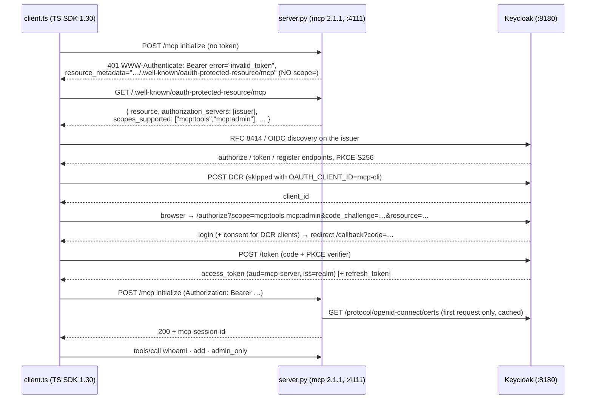

# 11 — The Python twin: Keycloak resource server on the `mcp` Python SDK

**Directory:** `examples/11-python-mcp-keycloak` · **Port:** 4111 · **Authorization server:**
Keycloak (realm `mcp`, issuer `http://<PUBLIC_HOST>:8180/realms/mcp`) · **Keycloak:** yes ·
**Spec grade:** **CONFORMANT** on the MCP side — RFC 9728 Protected Resource Metadata,
`WWW-Authenticate` with `resource_metadata`, RFC 8414/OIDC AS discovery, RFC 7591 DCR, PKCE S256,
RFC 8707 `resource` sent, SEP-835 scope selection — implemented this time by `mcp` (Python)
2.1.1 instead of Express + `@modelcontextprotocol/sdk`; **PARTIAL** overall for the same two
reasons as example 04: Keycloak ignores the `resource` parameter, and the lab runs plain HTTP.

Architecturally this **is** [example 04](04-keycloak-resource-server.md): Keycloak issues the
tokens, the MCP server only verifies them and points clients at the issuer. What is new is the
proof that the contract is *language-independent*: the server is ~300 lines of Python on the
official `mcp` SDK (`MCPServer` + a custom `TokenVerifier`), and the **unchanged TypeScript
client** — the same `CliOAuthProvider`/`connectWithOAuth` code every TS example uses — walks the
full discovery dance against it without knowing or caring. A bonus `client.py` shows the same
dance from the Python SDK's `OAuthClientProvider`, so every pairing (TS↔TS in 04, TS↔Py and
Py↔Py here) runs against the identical realm.

## When to use it

* Your MCP server is Python (data/ML tooling, an existing FastAPI/Starlette service) but the rest
  of your fleet — clients, gateways, other servers — is TypeScript or anything else. The PRM +
  JWT contract is the interface; this example is the proof it holds across SDKs.
* You want the spec-recommended AS/RS split (see 04's "when to use it") in a Python codebase.

**When not to.** Everything in 04's "when not to" applies unchanged. Additionally: if you are on
`fastmcp` 3.x today, it pins `mcp<2` — see [Variations](#variations-and-links). And if you need
the TS twin's exact edge-status behaviour (403 on foreign `Host`, 500 on JWKS outage), note the
[deliberate deltas](#behavioural-deltas-vs-the-typescript-twin) below before putting a
load balancer's health checks on them.

## The happy path



The wire bytes of the middle section (discovery, DCR, authorize, token) are byte-for-byte the
trace captured in [04's "The wire"](04-keycloak-resource-server.md#the-wire-one-complete-authorization-as-captured) —
same realm, same client code. This page only documents what the Python side does differently.

## How the code does it

**The verifier** (`server.py`) is `src/shared/jwt.ts` re-spoken in PyJWT. The SDK contract is a
single method: return an `AccessToken` for a good token, `None` for anything else — the
`RequireAuthMiddleware` turns `None` into the 401 challenge:

```python
class JwksTokenVerifier:                      # implements mcp.server.auth.provider.TokenVerifier
    async def verify_token(self, token: str) -> AccessToken | None:
        try:
            key = (await asyncio.to_thread(self._jwk_client.get_signing_key_from_jwt, token)).key
            payload = jwt.decode(
                token, key,
                algorithms=["RS256"],                # allow-list: alg:none / HS256 confusion rejected
                issuer=self._issuer,                 # exact string match with keycloak().issuer
                audience=self._audiences,            # ["mcp-server"] — RFC 8707 audience binding
                leeway=self._leeway,                 # 5 s clock skew, like clockToleranceSec
                options={"require": ["exp", "iss", "aud"]},
            )
        except Exception:                            # expired / iss / aud / signature / not a JWT
            return None
        return AccessToken(
            token=token,
            client_id=str(payload.get("azp") or payload.get("client_id") or payload["sub"]),
            scopes=effective_scopes(payload),        # ← the policy hook, see below
            expires_at=int(payload["exp"]),
            subject=payload.get("sub"),
            claims=payload,
        )
```

**Effective scopes** are the same rule as `keycloakEffectiveScopes` in `src/shared/jwt.ts` — the
scope says what the *client* was granted, the realm role says what the *user* may do:

```python
def effective_scopes(payload):
    roles = realm_roles(payload)                     # payload["realm_access"]["roles"]
    return [s for s in token_scopes(payload) if s != "mcp:admin" or "mcp-admin" in roles]
```

**The wiring** — `MCPServer` with a `token_verifier` and `AuthSettings` is the whole resource
server; `streamable_http_app()` assembles Starlette with the bearer middleware, the guarded
`/mcp` route and the PRM route:

```python
server = MCPServer(
    "11-python-mcp-keycloak",
    token_verifier=JwksTokenVerifier(issuer=ISSUER, audiences=["mcp-server"],
                                     jwks_url=f"{ISSUER}/protocol/openid-connect/certs"),
    auth=AuthSettings(
        issuer_url=AnyHttpUrl(ISSUER),
        resource_server_url=AnyHttpUrl(MCP_URL),     # drives resource_metadata in the 401
        required_scopes=["mcp:tools"],               # missing → 403 insufficient_scope
    ),
)
app = server.streamable_http_app(transport_security=TransportSecuritySettings(
    enable_dns_rebinding_protection=True,
    allowed_hosts=[f"{PUBLIC_HOST}:*", PUBLIC_HOST, "localhost:*", "127.0.0.1:*", …],
))
```

Two SDK facts (verified against the installed 2.1.1 sources) make this wiring line up with 04's
SEP-835 behaviour:

1. **The 401 challenge never carries `scope=`** — `RequireAuthMiddleware` emits only `error`,
   `error_description` and `resource_metadata`. So `required_scopes=["mcp:tools"]` is safe here:
   nothing pins the client to `mcp:tools`, the PRM's `scopes_supported` drives the request, the
   client asks for `mcp:tools mcp:admin`, and bob can reach `admin_only`. (In the TS SDK the
   equivalent — `requireBearerAuth({ requiredScopes })` — *does* pin the 401, which is why 04 puts
   its required scopes on the verifier instead. Same outcome, opposite mechanism.)
2. **The auto-mounted PRM is too small.** `streamable_http_app()` publishes a PRM with
   `scopes_supported = required_scopes` and no `resource_name`, which would collapse the scope
   selection to `mcp:tools` only. `server.py` therefore replaces that route with its own
   `create_protected_resource_routes(..., scopes_supported=["mcp:tools", "mcp:admin"],
   resource_name="11-python-mcp-keycloak")` — making the document field-by-field identical to
   04's (asserted in `server.test.ts`).

**Tools** read the verified identity from a contextvar — the Python SDK's version of
`extra.authInfo`:

```python
from mcp.server.auth.middleware.auth_context import get_access_token

@server.tool(structured_output=False)
def admin_only() -> str:
    at = get_access_token()                          # AccessToken(scopes=effective_scopes(...))
    if at is not None and "mcp:admin" in at.scopes:
        return f"admin ok: {at.client_id} has mcp:admin"
    raise ToolError("insufficient_scope: admin_only requires scope mcp:admin")
```

`whoami` for a DCR'd client logged in as alice — the same fields the TS twin prints, plus
top-level `subject`/`username` (captured):

```json
{
  "clientId": "425cdfb3-b843-4129-b51e-ea7d6b7c5e30",
  "scopes": ["mcp:tools"],
  "expiresAt": 1787994028,
  "expiresAtIso": "2026-08-29T09:00:28.000Z",
  "subject": "0c04e3c8-dc79-4428-b649-a224a21be629",
  "username": "alice",
  "extra": { "sub": "…", "username": "alice", "roles": ["mcp-user"],
             "claims": { "iss": "http://192.168.78.87:8180/realms/mcp", "aud": "mcp-server",
                         "azp": "425cdfb3-…", "scope": "mcp:tools", "preferred_username": "alice", … } }
}
```

**The Python client** (`client.py`, bonus) hands the SDK's `OAuthClientProvider` — an httpx auth
hook that runs the whole 401 → PRM → AS metadata → DCR → PKCE → browser → token flow inline —
three CLI concerns: a JSON `TokenStorage` under `.mcp-auth/`, a loopback callback listener on
`OAUTH_CALLBACK_PORT` (started *before* the browser opens, EADDRINUSE → wait and retry), and
`MCP_BROWSER_CMD`/`MCP_NO_BROWSER` handling. `OAUTH_CLIENT_ID=mcp-cli` short-circuits DCR by
pre-seeding the storage with the pre-registered client. One realm-specific wrinkle: it declares
`grant_types=["authorization_code"]` only — with `refresh_token` declared, the Python SDK
(SEP-2207) appends `offline_access` to the requested scope and Keycloak refuses the exchange
(`Offline tokens not allowed for the user or client`; this realm's users don't hold the
`offline_access` role). Keycloak issues a session-bound refresh token regardless, which the SDK
uses on later runs.

## Run it

```bash
npm run kc:up                                        # once — Keycloak + realm import
uv sync --project examples/11-python-mcp-keycloak    # once — creates .venv from the committed uv.lock

npm run ex:11:server                                 # terminal 1
npm run ex:11:client                                 # terminal 2 — TS client (interop proof), DCR + browser
OAUTH_CLIENT_ID=mcp-cli npm run ex:11:client         #   pre-registered client — no DCR, no consent page
EXPECT_ADMIN=ok OAUTH_CLIENT_ID=mcp-cli npm run ex:11:client   # log in as bob → admin ok, else exit 2
npm run ex:11:client:py                              # bonus — the Python client, same dance
```

Server banner (terminal 1):

```
[11-python-mcp-keycloak] listening on 0.0.0.0:4111
[11-python-mcp-keycloak] MCP endpoint: http://192.168.78.87:4111/mcp   (PUBLIC_HOST 192.168.78.87)
[11-python-mcp-keycloak] PRM:          http://192.168.78.87:4111/.well-known/oauth-protected-resource/mcp
[11-python-mcp-keycloak] issuer:       http://192.168.78.87:8180/realms/mcp
```

TS client, first run (trimmed; log in as `alice`/`password`, approve the consent page):

```
==> Authorization required. Open this URL in a browser:
    http://192.168.78.87:8180/realms/mcp/protocol/openid-connect/auth?response_type=code&client_id=425cdfb3-…
      &code_challenge=…&code_challenge_method=S256&redirect_uri=http%3A%2F%2F127.0.0.1%3A4199%2Fcallback
      &state=…&scope=mcp%3Atools+mcp%3Aadmin&resource=http%3A%2F%2F192.168.78.87%3A4111%2Fmcp
tools        -> whoami, add, admin_only
whoami       -> {"clientId":"425cdfb3-…","scopes":["mcp:tools"],…,"username":"alice",…}
add(2, 3)    -> 5
admin_only   -> ERROR Error executing tool admin_only: insufficient_scope: admin_only requires scope mcp:admin
RESULT {"example":"11","tools":["add","admin_only","whoami"],…,"add":"5","adminOnly":"denied"}
```

Note `scope=mcp:tools mcp:admin` in the authorize URL: the 401 named no scope, so the PRM's
`scopes_supported` drove the request (SEP-835) — exactly like 04. The second run uses the stored
(refresh) tokens and opens nothing. LAN variants are identical to
[04's](04-keycloak-resource-server.md#run-it): `MCP_SERVER_URL`/argv to dial from another
machine, `OAUTH_REDIRECT_HOST=<PUBLIC_HOST>` when the browser is remote (see
[lan-testing](lan-testing.md)); headless login via
`MCP_BROWSER_CMD="python3 scripts/browser-login.py --user alice --password password"`.

## Observe it with curl

```bash
# The PRM — field-by-field the document 04 serves (captured):
curl -s http://192.168.78.87:4111/.well-known/oauth-protected-resource/mcp
# {"resource":"http://192.168.78.87:4111/mcp",
#  "authorization_servers":["http://192.168.78.87:8180/realms/mcp"],
#  "scopes_supported":["mcp:tools","mcp:admin"],
#  "bearer_methods_supported":["header"],"resource_name":"11-python-mcp-keycloak"}

# The 401 challenge — Streamable HTTP is strict: BOTH Accept values + JSON Content-Type:
curl -si -X POST http://192.168.78.87:4111/mcp \
  -H 'Accept: application/json, text/event-stream' -H 'Content-Type: application/json' \
  -d '{"jsonrpc":"2.0","id":1,"method":"initialize","params":{"protocolVersion":"2025-11-25","capabilities":{},"clientInfo":{"name":"curl","version":"0"}}}'
# HTTP/1.1 401 Unauthorized
# www-authenticate: Bearer error="invalid_token", error_description="Authentication required",
#                   resource_metadata="http://192.168.78.87:4111/.well-known/oauth-protected-resource/mcp"
# {"error": "invalid_token", "error_description": "Authentication required"}

# A real user token without a browser (mcp-test is the TEST-ONLY password-grant client), then call:
TOKEN=$(curl -s -X POST http://192.168.78.87:8180/realms/mcp/protocol/openid-connect/token \
  -d 'grant_type=password&client_id=mcp-test&username=alice&password=password&scope=mcp:tools' \
  | python3 -c 'import json,sys; print(json.load(sys.stdin)["access_token"])')
curl -si -X POST http://192.168.78.87:4111/mcp -H "Authorization: Bearer $TOKEN" \
  -H 'Accept: application/json, text/event-stream' -H 'Content-Type: application/json' \
  -d '{"jsonrpc":"2.0","id":1,"method":"initialize","params":{"protocolVersion":"2025-11-25","capabilities":{},"clientInfo":{"name":"curl","version":"0"}}}' \
  | grep -i mcp-session-id
# mcp-session-id: 8d084d6cc0b14df090daff73a6c1d101      ← use it for tools/call POSTs
```

## Break it

Every row is a vitest case (`server.test.ts` — spawns the real `uv run … server.py` process; the
hermetic half stubs the JWKS so it runs without Keycloak) or a pytest case
(`tests/test_verifier.py` — the verifier alone, in-process RSA keys):

| Attack / mistake | Where | Result (captured) |
|---|---|---|
| No / garbage / `alg:none` / HS256-confused token | vitest + pytest | **401** `error="invalid_token"` + `resource_metadata`, **no `scope=`** |
| Expired token (and: −2 s is inside the 5 s leeway) | pytest + vitest | **401** / accepted |
| Wrong issuer, wrong audience (`aud:"account"`), missing `exp`/`iss`/`aud` | pytest + vitest | **401** (`verify_token` → `None`) |
| Tampered payload, signature from an unknown key (against the real JWKS too) | vitest | **401** |
| Valid token, `scope=email` only | vitest | **403** `Bearer error="insufficient_scope", error_description="Required scope: mcp:tools", resource_metadata="…"` |
| Alice's token calling `admin_only` (client granted `mcp:admin`, user lacks the role) | vitest | tool error `insufficient_scope: …` — the scope was dropped by `effective_scopes` |
| Bob's token on alice's session id | vitest | **404** `Session not found` (Python hides foreign sessions; TS twin answers 403) |
| Forged `Host: evil.example` (DNS rebinding) | vitest | **421** `Invalid Host header` (TS twin: 403) |
| `/.well-known/oauth-authorization-server` on the RS origin | vitest | **404** — a resource server must not impersonate the AS |

## Threat model notes

Inherits [04's threat model](04-keycloak-resource-server.md#threat-model-notes) — audience
binding, issuer pinning, offline signature checks, role-gated admin scope, and the same demo-only
holes (plain HTTP, well-known demo credentials, open anonymous DCR at the realm). Python-specific
deltas worth knowing:

* **JWKS outage → 401, not 500.** `verify_token` has only two answers, so an unreachable Keycloak
  makes clients re-run OAuth discovery instead of backing off (the TS `jwt.ts` deliberately maps
  key-retrieval failures to a 500 `ServerError` without `WWW-Authenticate`). Fine for a demo,
  noisy in production — an SDK-level gap to keep in mind.
* **Middleware order:** authentication runs *before* the transport's Host validation, so an
  unauthenticated rebinding probe sees 401 (with the challenge) rather than 421; only
  authenticated requests reach the Host check. The PRM and `/healthz` routes are outside the
  Host check entirely (they are public, constant documents). The TS twin validates `Host` first
  on every route.
* **Session ↔ principal binding is built in**: the session manager stores
  `(client_id, iss, sub)` at initialize and answers 404 for any other principal — same control as
  `mountMcp`'s 403, deliberately indistinguishable from "no such session".
* **Tokens are never logged**: the access log is uvicorn's (method + path + status), `whoami`
  omits `AccessToken.token`, and the 401/403 descriptions are static SDK strings — nothing
  request-derived is interpolated into `WWW-Authenticate` (the header-injection trap the TS
  examples guard with `headerSafe()` does not arise here).

## Variations and links

* **fastmcp 3.x** — the popular high-level framework currently pins `mcp<2`, so it cannot sit on
  this SDK version yet; its own `fastmcp.server.auth` providers (`JWTVerifier`, `RemoteAuthProvider`)
  implement the same PRM + JWKS pattern as this example. When it moves to `mcp` 2.x, this server
  collapses to a `FastMCP(auth=…)` one-liner; until then this example is the dependency-light way.
* **Introspection instead of local validation** — the Python SDK ships an
  `IntrospectionTokenVerifier` example pattern; swap `JwksTokenVerifier` for an RFC 7662 call to
  get revocation latency like [07](07-token-introspection.md).
* **Enterprise IdP hand-off** — `mcp` 2.1.1 carries server-side SEP-990 (ID-JAG / RFC 7523
  jwt-bearer) hooks (`AuthSettings.identity_assertion_enabled`, `exchange_identity_assertion`);
  that grant profile is docs-only in this repo (see `docs/patterns.md`).
* **Same realm, other pairings** — [04](04-keycloak-resource-server.md) (TS↔TS twin, plus the
  full captured wire trace), [05](05-keycloak-client-credentials.md) (M2M), `docs/keycloak.md`
  (realm walk-through), [`docs/sdk-notes.md`](sdk-notes.md) (the TS SDK facts the client side of
  this example runs on), [`docs/lan-testing.md`](lan-testing.md).
