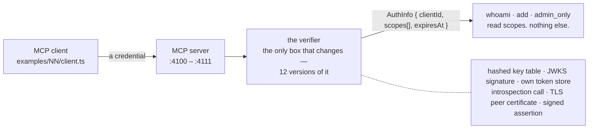
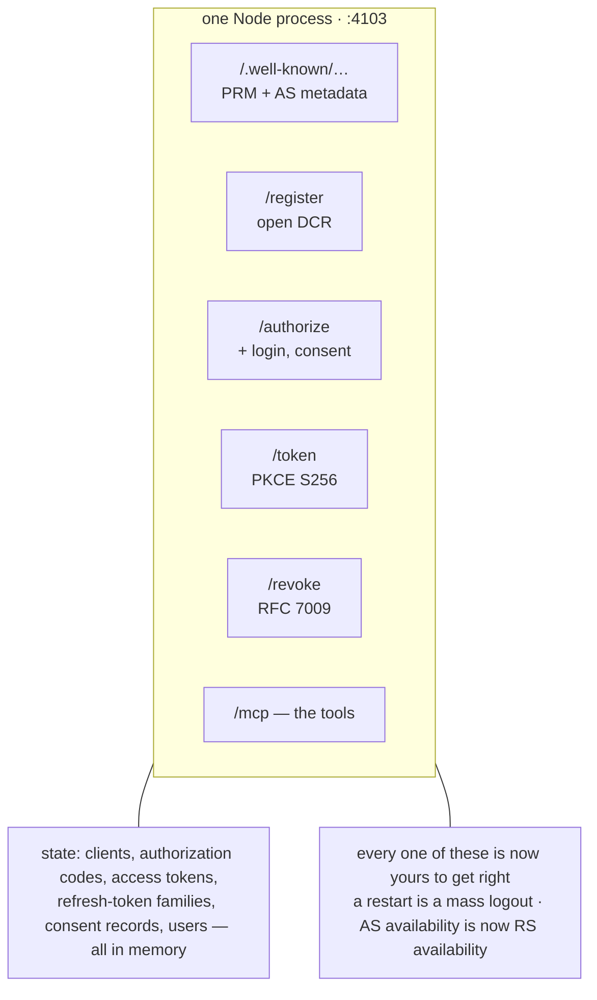
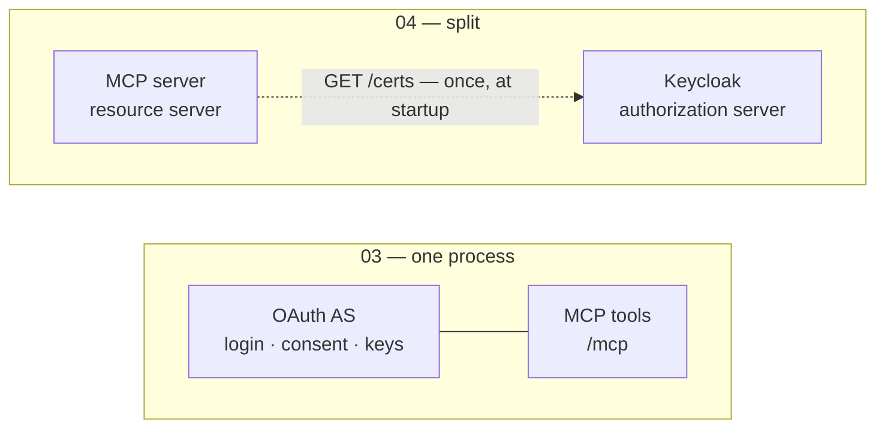
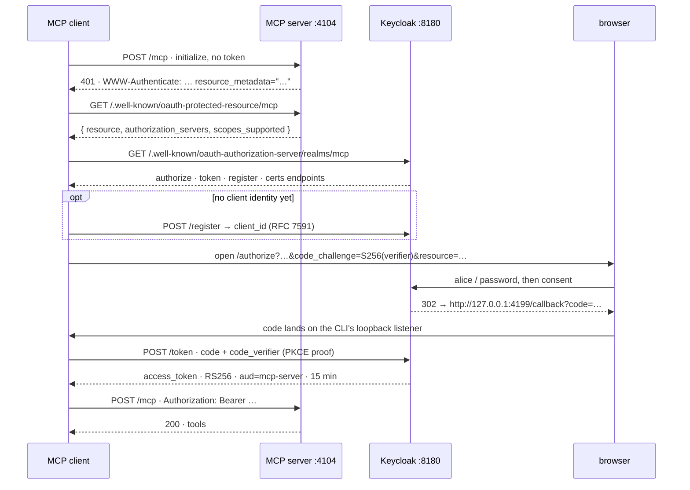
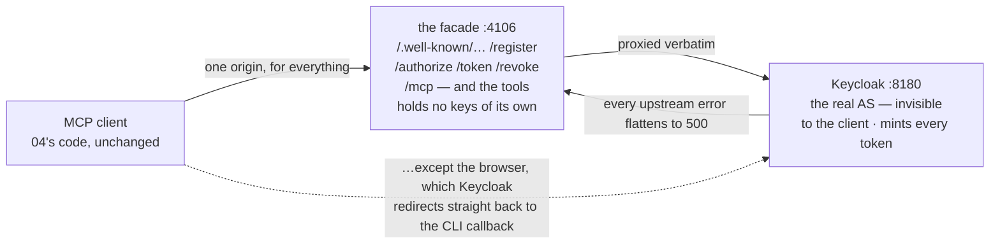
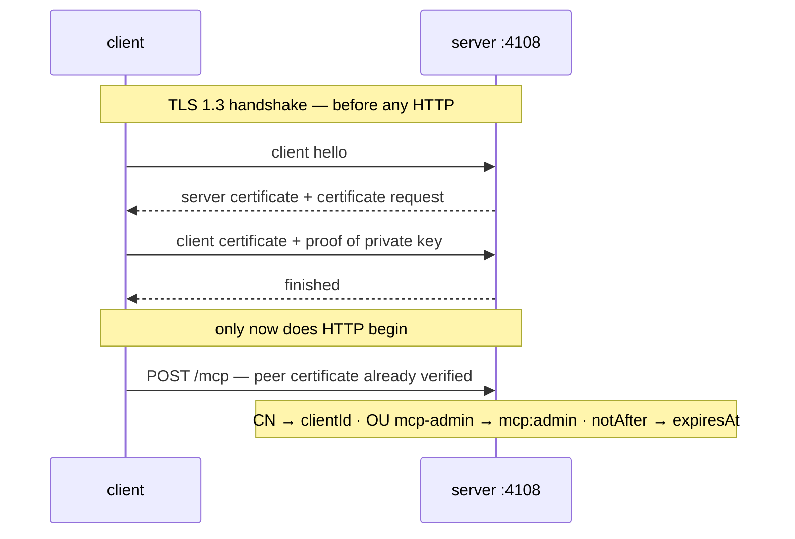
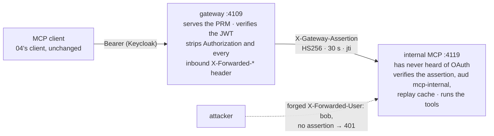
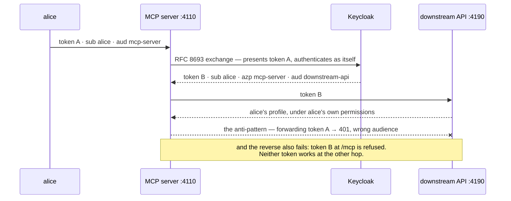

# Who is calling this server?

A fourteen-episode course on MCP authentication, built on the twelve runnable examples in this
repository. Roughly **9,000 words of read-aloud script (~60 minutes)** plus the commands to run
every example yourself.

> Two versions, same course. This page is the one you can read in a terminal, grep, or feed to a
> text-to-speech tool. [`course.html`](course.html) is the same material as a self-contained lesson
> page with hand-drawn diagrams, progress tracking and a scripts-only "recording view" — open it in
> a browser. **`course.html` is the source of truth**; this page tracks it.
>
> There are no audio recordings. The scripts are written to be *read* aloud, by you or by a TTS tool.

**Who this is for:** developers who can read TypeScript but treat PKCE, JWKS, audience and
introspection as things to learn from scratch. If you already know OAuth and just want to choose an
approach, read [`comparison.md`](comparison.md) instead — it is the decision aid, this is the lesson.

## Contents

| | Episode | Script |
|---|---|---|
| — | [Before you start](#before-you-start) | ~4 min |
| | [The map](#the-map) | — |
| 00 | [No authentication](#00--no-authentication) | ~3 min |
| 01 | [The static API key](#01--the-static-api-key) | ~4 min |
| 02 | [The self-issued JWT](#02--the-self-issued-jwt) | ~5 min |
| 03 | [The MCP server *is* the authorization server](#03--the-mcp-server-is-the-authorization-server) | ~4 min |
| 04 | [Keycloak issues, your server only verifies](#04--keycloak-issues-your-server-only-verifies) | ~7 min |
| 05 | [Client credentials: when there is no human](#05--client-credentials-when-there-is-no-human) | ~5 min |
| 06 | [The OAuth facade](#06--the-oauth-facade) | ~4 min |
| 07 | [Introspection: revocation you can actually see](#07--introspection-revocation-you-can-actually-see) | ~4 min |
| 08 | [Mutual TLS: the certificate *is* the credential](#08--mutual-tls-the-certificate-is-the-credential) | ~4 min |
| 09 | [The auth gateway](#09--the-auth-gateway) | ~4 min |
| 10 | [Token exchange: acting on the user's behalf](#10--token-exchange-acting-on-the-users-behalf) | ~4 min |
| 11 | [The Python twin — and why it proves something](#11--the-python-twin--and-why-it-proves-something) | ~3 min |
| — | [Choosing, and what comes next](#choosing-and-what-comes-next) | ~4 min |

---

## Before you start

*The question every episode answers, the vocabulary you need, and the one architectural rule that
makes twelve examples comparable.*

Every episode is the same MCP server with one thing changed. The server exposes three tools and
nothing else ([`src/shared/tools.ts`](../src/shared/tools.ts)):

| Tool | What it does |
|---|---|
| `whoami` | echoes the identity the server derived from your credentials |
| `add` | `a + b`. Any authenticated caller. Proof the session works. |
| `admin_only` | succeeds only for a caller holding the scope `mcp:admin` |

Because the tools never change, the diff between any two episodes *is* the authentication.

### The one rule: the verifier decides, the tools only read

A **verifier** turns whatever credential arrived — an API key, a JWT, a certificate, an introspection
response — into a single object the SDK calls `AuthInfo`, carrying a client id, a list of *effective*
scopes and an expiry. Tools look at exactly one field: `authInfo.scopes`. They never inspect roles,
claims, headers or client ids.



Swapping the authentication approach never touches a tool.

### Vocabulary, in the order you will meet it

- **Bearer token** — a string in an `Authorization: Bearer …` header. "Bearer" means exactly what it
  sounds like: whoever holds it, is it. No proof of possession.
- **Scope** — what the *client* was granted permission to attempt (`mcp:tools`, `mcp:admin`).
  **Role** — what the *user* is actually allowed to do (`mcp-user`, `mcp-admin`). These are different
  axes, and confusing them is the bug this course keeps returning to.
- **JWT** — a signed, self-describing token. Anyone with the public key can verify it offline.
  **JWKS** — the JSON document where the issuer publishes those public keys.
- **Audience** (`aud`) — who the token was minted *for*. Checking it is what stops a token issued for
  another service from working on yours.
- **AS / RS** — the authorization server issues tokens; the resource server (your MCP server)
  validates them. Keeping them apart is the whole point of episode 04.
- **PKCE** — the proof that the client which redeems an authorization code is the same one that
  started the flow. Mandatory in OAuth 2.1.
- **PRM** (RFC 9728 Protected Resource Metadata) — a small JSON document at
  `/.well-known/oauth-protected-resource/…` where your server says "tokens for me come from *there*".
  It is what lets a client that knows only your URL bootstrap itself.
- **DCR** (RFC 7591 Dynamic Client Registration) — a client that has never met your authorization
  server asking it for a `client_id`, on the spot.

### Set up once

```bash
git clone https://github.com/c0de-ch/mcp-auth-demo && cd mcp-auth-demo
npm install
cp .env.example .env      # then set PUBLIC_HOST=192.168.x.x

# episodes 00–03 need nothing else. From 04 on, start the identity provider:
npm run kc:up             # Keycloak 26 on :8180, realm "mcp" imported
```

> **Why `PUBLIC_HOST` and not localhost.** Every server binds `0.0.0.0` and builds every URL it
> advertises from one variable. That is deliberate: the interesting authentication failures — issuer
> mismatches, audience mismatches, callback URLs that only work on loopback — are invisible when
> everything is `localhost`. Two demo users live in the realm: `alice` (role `mcp-user`) and `bob`
> (also `mcp-admin`), both with the password `password`. They are published on purpose; nothing here
> is a secret. See [`lan-testing.md`](lan-testing.md).

<details>
<summary><b>Script — before you start</b> · 637 words · ≈ 4 min read-aloud</summary>

Let's start with the thing that makes this course work, because if you get this one idea, the other
twelve episodes are variations rather than twelve separate things to learn.

An MCP server exposes tools. In this repository it exposes exactly three, and they never change.
*whoami* tells you what the server thinks of you. *add* adds two numbers, which is just proof the
connection works. And *admin_only* succeeds if — and only if — you hold a scope called *mcp colon
admin*. That's it. Same three tools in all twelve examples.

So if the tools never change, and the client is more or less the same script every time, then the
difference between any two examples is *only* the authentication. You can literally diff two files
and read the entire lesson.

Here's the architectural rule that makes that possible. In between the request arriving and the tool
running, there is one piece of code called a *verifier*. Its job is to take whatever credential
showed up — a shared secret, a signed token, a TLS certificate, anything — and turn it into one small
object: a client id, a list of scopes, an expiry. The SDK calls that object *AuthInfo*. And the tools
read exactly one field of it: the list of scopes. They never look at roles. They never look at
headers. They never look at who your identity provider is.

That sounds like a small design decision and it is actually the whole game. It means the policy —
*should this person be allowed to do that* — lives in one place, the verifier. And it means you can
rip out one authentication mechanism and drop in a completely different one without touching a single
line of tool code.

**Beat — the vocabulary**

Two words to separate before we go further, because almost every authorization bug I've seen in the
wild lives in the gap between them. A *scope* is what the client application was granted permission to
attempt. A *role* is what the human being is actually allowed to do. They are different axes. A client
can perfectly legitimately ask for admin scope; that doesn't mean the person driving it is an admin.
In this repo, alice and bob use the same client, request the same scopes, and get different answers —
because bob holds a realm role called *mcp-admin* and alice doesn't. Watch for that difference. It
shows up in episodes two, four, five and ten.

The other word worth pinning down now is *audience*. When an identity provider mints a token, it
stamps it with who the token is *for*. If your server checks the signature but not the audience, then
any well-signed token from that provider works on your server — including one that some completely
unrelated application handed out. That's called audience confusion, and checking one field prevents it.

**Beat — setup**

Practically: clone the repo, npm install, copy the example environment file, and set *PUBLIC_HOST* to
this machine's LAN address. Not localhost. I want to be firm about that, because it's the single
highest-value setup decision in the whole course. When everything runs on localhost, a whole category
of authentication bug is invisible — issuer mismatches, audience mismatches, redirect URIs that only
work on loopback. Point it at a real address on your network and those failures show up where you can
learn from them.

The first four episodes need nothing but Node. From episode four onward you'll want Keycloak, which is
one command: *npm run kc up*. Two users get imported: alice, an ordinary user, and bob, an admin. Both
have the password "password", and yes, those credentials are published on purpose — the whole point is
that you can run every flow unattended.

Okay. Episode zero. Let's build a server with no authentication at all, and be precise about what's
wrong with it.

</details>

---

## The map

All twelve at a glance. Come back to this when you are choosing, rather than learning — and see
[`comparison.md`](comparison.md) for the full matrix with audience binding, revocation latency and
registration columns.

| # | Approach | Caller | Browser | IdP | Credential | Validated by | Revocation | Spec |
|---|---|---|---|---|---|---|---|---|
| 00 | [No authentication](#00--no-authentication) | anyone | – | – | none | nothing | n/a | baseline |
| 01 | [Static API key](#01--the-static-api-key) | workload | no | no | shared secret | hashed table lookup | immediate | outside |
| 02 | [Self-issued JWT](#02--the-self-issued-jwt) | user / workload | no | no | JWT (RS256, 300 s) | signature + JWKS | none — until `exp` | outside |
| 03 | [MCP server is the OAuth AS](#03--the-mcp-server-is-the-authorization-server) | user | yes | built in | opaque token | own store | immediate | conformant |
| 04 | **[Keycloak AS, MCP as pure RS](#04--keycloak-issues-your-server-only-verifies)** | user | yes | yes | JWT | signature + JWKS | until `exp` (15 min) | conformant |
| 05 | [Client credentials](#05--client-credentials-when-there-is-no-human) | workload | no | yes | JWT | signature + JWKS | disable the client | conformant |
| 06 | [OAuth facade over Keycloak](#06--the-oauth-facade) | user | yes | hidden | JWT, passed through | signature + JWKS | until `exp` | transitional |
| 07 | [Token introspection](#07--introspection-revocation-you-can-actually-see) | user | yes | yes | opaque to the server | asks the AS, cached | one cache TTL | conformant |
| 08 | [Mutual TLS](#08--mutual-tls-the-certificate-is-the-credential) | machine | no | no | X.509 key pair | TLS 1.3 handshake | until `notAfter` | outside |
| 09 | [Auth gateway / sidecar](#09--the-auth-gateway) | user | yes | yes | JWT → signed assertion | gateway, then assertion | until `exp` at the edge | infrastructure |
| 10 | [Token exchange (RFC 8693)](#10--token-exchange-acting-on-the-users-behalf) | user | yes | yes | JWT → exchanged JWT | JWKS, both hops | until `exp`, both hops | conformant |
| 11 | [Python twin of 04](#11--the-python-twin--and-why-it-proves-something) | user | yes | yes | JWT | signature + JWKS | until `exp` | conformant |

**Reading the last column.** *Conformant* implements the MCP authorization specification.
*Transitional* is a shape the spec tolerates. *Outside* is a legitimate approach the spec simply does
not describe — an MCP client cannot discover it from your URL alone, which is a real cost but not a
verdict. *Infrastructure* solves the problem one layer down. None of them is wrong. They answer
different questions.

---

## 00 — No authentication

*The reference every other episode is a diff against — and an honest look at the only security an
anonymous server can offer.*

`:4100` · caller **anyone** · browser **no** · IdP **no** · **baseline** ·
[example](../examples/00-baseline-no-auth/) · [deep dive](00-baseline-no-auth.md)

Authentication is *optional* in the MCP specification, and for a server your editor spawns as a
subprocess that is the right answer — the process boundary is the security boundary. The moment the
transport is HTTP, it stops being the right answer. This episode builds that server anyway, so you
know exactly what the following eleven are buying you.

```bash
npm run ex:00:server      # terminal 1
npm run ex:00:client      # terminal 2
```

```
tools        -> whoami, add, admin_only
whoami       -> {"anonymous":true}
add(2, 3)    -> 5
admin_only   -> ERROR insufficient_scope: admin_only requires scope mcp:admin
```

Read those four lines carefully, because they are the shape of every episode. `whoami` has nothing to
report. And `admin_only` can *never* succeed here — not because the server is protecting anything, but
because nobody has any scopes at all. An anonymous caller is not a caller with reduced rights; it is a
caller with no identity to attach rights to.

### The one thing this server can still defend

There is exactly one attack an unauthenticated HTTP server can meaningfully resist: **DNS rebinding**.
A malicious web page tells the browser that its own domain resolves to your machine, then makes
requests that the browser considers same-origin. The defence is to check the `Host` header against an
allow-list, before the body parser runs.

```bash
curl -s -X POST http://192.168.78.87:4100/mcp -H 'Host: evil.example' ...
# → 403 {"error":{"code":-32000,"message":"Invalid Host: evil.example"}}
```

> **What you are actually shipping.** Anyone who can reach the port can call every tool. The server
> cannot tell two callers apart, cannot rate-limit one of them, cannot audit who did what, and cannot
> give some callers more rights than others. Every episode from here adds *one* thing to this exact
> server — usually a single middleware.

<details>
<summary><b>Script — 00</b> · 470 words · ≈ 3 min read-aloud</summary>

Episode zero is the server with nothing on it, and I want to spend a couple of minutes here rather
than rushing past, because "no auth" is not a strawman. It's a legitimate configuration and the MCP
spec says so out loud: authorization is optional.

Here's when it's right. If your MCP server is launched by a desktop app as a subprocess and talks over
standard input and output, then the process boundary *is* the security boundary. The operating system
already decided who's allowed to start that process. Bolting OAuth onto it adds attack surface and
buys you nothing. The spec actually says stdio servers should *not* implement HTTP authorization.

What changes everything is the transport. The moment your server is listening on a TCP port, anyone
who can route a packet to that port is a caller.

**Beat — run it**

So run it. Two terminals: server, then client. And look at the four lines the client prints, because
these same four lines come back in every single episode. Tools listed. Whoami. Add two and three. And
admin_only.

Whoami says *anonymous true*. That's the honest answer — the server genuinely has nothing to report
about you. And admin_only fails. Now, here's a subtlety worth sitting with: it doesn't fail because
the server is protecting something. It fails because an anonymous caller has no scopes, and admin_only
asks for a scope. An anonymous caller isn't a user with fewer permissions. It's a request with no
identity to hang permissions on at all.

**Beat — the one defence**

There is exactly one attack this server can still resist, and it's a good one to know about because it
bites local development servers constantly. It's called DNS rebinding.

It works like this. You visit some website. That site's DNS says its domain points at an address the
attacker controls — and then, a moment later, the DNS answer changes to point at
one-two-seven-dot-oh-dot-oh-dot-one, or at your LAN address. Your browser now believes that the
attacker's page and your MCP server are the same origin, and it will happily let that page make
requests to your server, with your network position.

The defence costs one line: check the *Host* header on every request and reject anything that isn't a
hostname you expect. In this repo that check runs before the JSON body parser, and a forged Host gets a
403 with the message "Invalid Host: evil dot example". Try it with curl. It's a satisfying little
failure to watch.

But be clear about what that is: it's protection against a browser being tricked into talking to you.
It is not authentication. It cannot tell two callers apart, can't rate-limit one of them, can't write
an audit line that means anything, and can't give bob more rights than alice.

That's the gap. Everything from here fills it — usually with a single middleware.

</details>

---

## 01 — The static API key

*One middleware and one table. The fastest honest answer to "who is calling", and a precise inventory
of what it does not give you.*

`:4101` · caller **workload** · browser **no** · IdP **no** · **outside spec** ·
[example](../examples/01-api-key/) · [deep dive](01-api-key.md)

The client sends a shared secret in the standard bearer header. The server keeps only SHA-256 digests
of the keys it accepts, each mapped to a principal and a scope list. That is the entire mechanism, and
it already gives you three things episode 00 could not: distinct callers, per-caller scopes, and
revocation that takes effect on the next request.

```ts
// examples/01-api-key/server.ts — the whole diff against episode 00
mountMcp(app, {
  createServer: () => createDemoServer({ name: '01-api-key' }),
  // the one line that differs from 00-baseline
  auth: requireBearerAuth({ verifier: createApiKeyVerifier(keys) }),
});
```

### Two details worth copying

**The keys are never stored.** The table holds `sha256(key)` → principal. A dump of the server's
memory or config does not hand an attacker a working credential.

**The lookup does constant work.** The presented key is hashed, then compared against *every* entry
with `timingSafeEqual` — no early exit, no `===`. Response time therefore reveals neither which entry
matched nor how close a guess was.

```bash
npm run ex:01:server
npm run ex:01:client                                       # alice → admin_only denied
MCP_API_KEY=demo-api-key-bob EXPECT_ADMIN=ok npm run ex:01:client  # bob → admin_only ok

# and the failure:
MCP_API_KEY=nope npm run ex:01:client                      # "API key rejected (401)", exit 1
```

> **Notice what the 401 does not say.** It carries `WWW-Authenticate: Bearer error="invalid_token"`
> and deliberately *no* `resource_metadata` parameter. That is not an oversight — there is no
> authorization server to discover. A generic MCP client meeting this server can learn nothing from
> the challenge except "you need a credential I cannot help you obtain". That single missing parameter
> is the practical meaning of "outside the spec".

> **The bill.** No expiry — a key is valid until an operator edits a table. No user identity and no
> consent. No audience, so the same key works anywhere you have reused it. And it is a bearer secret
> with no proof of possession: it is exactly as strong as the transport carrying it.

<details>
<summary><b>Script — 01</b> · 593 words · ≈ 4 min read-aloud</summary>

Episode one is the API key, and I want to defend it a little before we take it apart, because
developers who've learned OAuth tend to sneer at API keys, and that's a mistake.

Here's what an API key gets you, tonight, with about thirty lines of code. Distinct callers — alice
and bob are now different principals, not "some request". Per-caller scopes — bob's key carries
*mcp:admin*, alice's doesn't, and admin_only behaves differently for each. And revocation that takes
effect on the very next request, because the table is consulted every time; delete the row and the key
is dead.

That's three genuine security properties that episode zero didn't have, for one middleware. If you are
inside one trust domain and a human can hand a secret over some other channel, this is a real answer,
not a placeholder.

**Beat — two details worth stealing**

Now, two implementation details in this example that I'd copy into any codebase.

First: the server never stores the keys. It stores SHA-256 digests of them. So the presented key gets
hashed, and the hash is what's looked up. Which means if someone dumps your config, your memory, or
your logs, they get hashes — not working credentials. Same reason you don't store passwords in
plaintext, and people forget it constantly for API keys.

Second, and this one's subtler: the lookup does *constant work*. It doesn't loop and break on match. It
hashes the presented key once, then compares that digest against every single entry in the table using
a constant-time comparison, with no early exit. Because if you compare byte by byte and return as soon
as you find a mismatch, the time your server takes to say no is a function of how much of the key the
attacker got right. That's a timing side channel, and it's how you get keys guessed one character at a
time. Since all the digests are exactly thirty-two bytes, the length of your real keys isn't observable
either.

**Beat — the missing parameter**

Now run it and get it wrong on purpose. Set the API key to "nope" and watch the 401.

And here's the thing I want you to notice — not what the 401 says, but what it *doesn't* say. It comes
back with a *WWW-Authenticate* header saying "Bearer, invalid token". And that's all. There's no
*resource_metadata* parameter pointing anywhere.

That absence is the entire reason this example is labelled "outside the spec". Imagine a third-party
MCP client — some tool your users already have — that knows nothing but your URL. It connects, it gets
a 401, and it reads that header hoping to be told where to go get a token. Here, there's nowhere to go.
The client is stuck. It can only tell the user: this server wants a credential, and I can't help you
get one.

Keep that image in your head, because in episode four that exact same 401 is going to carry one extra
parameter, and that one parameter is what turns a locked door into a door with a sign on it.

**Beat — the bill**

What you're paying. No expiry, so a leaked key is valid until a human notices and edits a table. No
user identity — the key is the identity, and if three people share it, your audit log is fiction. No
consent. No audience, so if you reused that key across two services, a compromise of either one
compromises both. And it's a bearer secret with no proof of possession, which means it is exactly as
strong as the channel carrying it. Over plain HTTP, that's not very strong.

</details>

---

## 02 — The self-issued JWT

*Claims, expiry and offline verification — without an identity provider. The honest way to learn JWT
validation before you add one.*

`:4102` + issuer `:4192` · caller **user or workload** · browser **no** · IdP **no** ·
**outside spec** · [example](../examples/02-jwt-local/) · [deep dive](02-jwt-local.md)

A tiny local issuer owns an RSA key pair, signs RS256 tokens and publishes its public key as a JWKS
document. The MCP server verifies every token *offline* against that key — it never calls the issuer
during a request. This is the first example that carries a real identity with claims: `whoami` now
shows a subject, a username, roles and scopes.

### What "verifying a JWT" actually means

A JWT is three dot-separated segments: `header.payload.signature`. Five checks, all offline:

| # | Check | What it means here |
|---|---|---|
| 1 | **signature** | public key fetched from the JWKS URL, matched by `kid` |
| 2 | **`iss`** | exactly the issuer this server was configured to trust — not "an issuer" |
| 3 | **`aud`** | here, the exact MCP URL, `…:4102/mcp`. Nothing else fits. |
| 4 | **`exp`** | 300 seconds here. Clock skew is a real LAN problem. |
| 5 | **`scope`** | must contain `mcp:tools`, else **403**, not 401 |

Skipping check 3 is audience confusion; skipping check 2 lets any issuer in. The server never calls
the issuer during a request — that is the feature, and the reason it cannot see a revocation.

```bash
npm run ex:02:issuer      # terminal 1 — JWKS + /token on :4192
npm run ex:02:server      # terminal 2 — the MCP server on :4102
npm run ex:02:client      # terminal 3 — alice
DEMO_USER=bob EXPECT_ADMIN=ok npm run ex:02:client   # bob's token carries mcp:admin
```

### Break it — this is the good part

The example ships a token minting CLI whose whole purpose is producing tokens that *should* be
rejected. Run each one and read the 401 you get back.

```bash
npm run ex:02:mint -- --sub alice --ttl -60          # expired        → 401 "token expired"
npm run ex:02:mint -- --sub alice --alg none         # unsigned       → 401
npm run ex:02:mint -- --sub alice --alg HS256        # alg confusion  → 401
npm run ex:02:mint -- --sub alice --tamper           # bad signature  → 401
npm run ex:02:mint -- --sub alice --aud http://x/mcp # wrong audience → 401
npm run ex:02:mint -- --sub alice --scope email      # no mcp:tools   → 403 insufficient_scope
```

> **`alg: none` and `alg: HS256` are not curiosities.** They are the two classic JWT library bugs. The
> first is a token that says "I am unsigned, please trust me". The second is *algorithm confusion*: the
> attacker re-signs the token with HMAC, using your *public* key as the shared secret — which works
> against any library that decides the algorithm by reading the token's own header. A correct verifier
> pins the algorithm from configuration, never from the token.

> **The cost of offline verification.** There is no revocation at all. A token is valid until it
> expires, full stop — nothing you can do at the issuer reaches a server that never calls you. And
> there is a rotation subtlety: the JWKS cache in this stack holds keys for about ten minutes, so a
> retired signing key keeps being accepted until the cache expires. Only an *unknown* key id forces an
> immediate refetch.

<details>
<summary><b>Script — 02</b> · 759 words · ≈ 5 min read-aloud</summary>

Episode two is where tokens start being interesting, because this is the first credential in the
course that *says something about itself*.

An API key is an opaque string. It means whatever your table says it means. A JWT is different: it's a
small signed document. It carries a subject, an issuer, an audience, an expiry, a scope list — and a
signature over all of it. Anybody holding the right public key can check that document without asking
anyone's permission and without a network call.

So in this example we stand up a tiny issuer. It owns an RSA key pair. It hands out tokens on request,
and it publishes its public key at a URL as something called a JWKS — a JSON Web Key Set. The MCP
server fetches that key once, caches it, and from then on verifies every token locally.

**Beat — the five checks**

Now, "verify a JWT" sounds like one operation. It's five, and four of them are the ones people skip.

One: the signature. Does this token's signature match, using a key from the JWKS that the token's
key-id points at.

Two: the issuer. Is the *iss* claim exactly the issuer this server was configured to trust. Not "an
issuer". Not "one we've seen before". The one.

Three: the audience. Was this token minted *for me*. And in this particular example the audience is the
exact MCP URL — including the port and the path. A token minted for anything else is refused even
though the signature is perfect.

Four: expiry. Three hundred seconds here, which is aggressively short on purpose. And by the way — if
you're testing across two machines on a LAN, clock skew is a real thing that will bite you and look
like a mysterious auth failure.

Five: scope. Does the token carry *mcp:tools*. And notice the status code changes here. Missing scope
is a 403, not a 401. Four-oh-one means "I don't know who you are". Four-oh-three means "I know exactly
who you are and the answer is still no." Getting those two the right way round matters, because a
client that sees a 401 will go try to get a new token — and if the real problem was a missing scope,
it'll loop forever.

**Beat — break it, six ways**

Now, the best part of this example is that it ships a little tool whose entire job is minting tokens
that *should* fail. Expired. Tampered. Wrong audience. Wrong scope. Run each one and read the error.

Two of them deserve a proper explanation, because they're the two classic JWT library vulnerabilities
and they show up in real CVEs.

The first is *alg none*. That's a token whose header says: my algorithm is "none", I have no signature,
please trust me. Which sounds absurd, except that the JWT spec defines that value, and plenty of
libraries used to honour it. Anyone can mint an admin token in about four seconds.

The second is more elegant and more dangerous. It's called *algorithm confusion*. Your issuer signs
with RSA — private key signs, public key verifies. The public key is, by definition, public. So the
attacker takes your public key, and re-signs a token they wrote themselves using HMAC — a symmetric
algorithm — with your public key as the shared secret. Then they set the header to HS256.

Now: if your verifier reads the algorithm *out of the token* and does what it's told, it will
dutifully verify an HMAC using the public key it has, and the signature will be valid. The attacker
signed with the same secret you're verifying with. Game over.

The fix is one sentence: *never let the token choose the algorithm.* Pin it in your configuration.
This example does, which is why that command comes back 401 instead of "admin ok".

**Beat — what it costs**

And now the price of all this lovely offline verification: there is no revocation. None. A token is
good until it expires and there is nothing you can do about it, because the server never phones home.
If a token leaks, your only lever is that five-minute expiry.

There's a related subtlety that catches people during key rotation. The JWKS is cached — about ten
minutes in this stack. So if you retire a signing key, servers keep accepting tokens signed by it until
their cache expires. Only a token with an *unknown* key id forces an immediate refetch. So rotation
isn't instant, it's eventually-consistent, and you should plan an overlap window rather than assuming a
hard cutover.

Hold on to the revocation problem. It's the reason episode seven exists.

</details>

---

## 03 — The MCP server *is* the authorization server

*The full OAuth 2.1 dance with zero external dependencies — and a frank accounting of everything you
just made yourself responsible for.*

`:4103` · caller **user** · browser **yes** · IdP **built in** · **conformant** ·
[example](../examples/03-oauth-embedded-as/) · [deep dive](03-oauth-embedded-as.md)

This is the first spec-conformant episode, and the first with a human in the loop. One process serves
the OAuth metadata documents, a login page, a consent page, `/authorize`, `/token` with PKCE,
`/register` for dynamic client registration, `/revoke` — and the guarded `/mcp` endpoint. No Keycloak.
It is the best place in the repository to *watch* the protocol, because every message is in one
process's log.



```bash
npm run ex:03:server
npm run ex:03:client      # a browser opens — sign in as alice or bob (password: password)
npm run ex:03:client      # run it again: stored tokens, no browser this time
npm run ex:03:client -- --logout   # wipe the client's token store
```

### Break it — seven attacks the tests already prove

- **Reuse an authorization code.** A code is single-use. Redeeming one twice does not merely fail — it
  revokes *every* token that code ever produced, on the assumption that if two parties hold the same
  code, one of them stole it.
- **Replay a rotated refresh token.** Same reasoning, bigger blast radius: the whole refresh-token
  family is burned.
- **Wrong `code_verifier`.** This is PKCE doing its job — the party redeeming the code must prove it is
  the party that started the flow.
- **Unregistered or cross-matched redirect URI** → rejected before anything happens.
- **Forged consent CSRF token** → rejected.
- **Scope widening on refresh** → you cannot quietly upgrade yourself to admin.
- **51 token requests in a row** → 429. Rate limiting is part of being an AS.

> **When to actually do this.** An appliance, a self-contained demo, an internal tool with a handful of
> users — or when you need to see the protocol end to end. What you have taken on: consent, PKCE,
> single-use codes, refresh rotation, revocation and key material are all now yours. Your authorization
> server's availability is now your resource server's availability. And here all state is in memory, so
> a restart logs everybody out.

<details>
<summary><b>Script — 03</b> · 644 words · ≈ 4 min read-aloud</summary>

Episode three is the first one with a human in it. And it's the first one that is properly
spec-conformant — meaning an MCP client that has never heard of your server can show up knowing only
your URL, and successfully log a user in.

The twist is that we do it with no external dependency at all. The MCP server *is* the authorization
server. One process. It serves the metadata documents, it serves a login page and a consent page, it
issues authorization codes, it exchanges them for tokens at a token endpoint, it supports dynamic
client registration, it revokes. And it also serves your tools.

Run it and a browser window opens. Sign in as alice. Approve the consent screen. The browser redirects
back to a little loopback listener the CLI started, the CLI takes the code it got, trades it for a
token, and calls the tools. Run the client a second time and no browser opens at all — it still has a
valid token on disk.

That's OAuth. If you've never watched the whole thing happen in one terminal, this is the episode to do
it in, because everything is in a single process log. You can read the whole conversation.

**Beat — the surface area**

Now let me be a bit of a killjoy, because "no external dependencies" sounds like a pure win and it is
not.

Look at what this process is now responsible for. Consent. Login. PKCE verification. Making sure an
authorization code can only be used once. Rotating refresh tokens. Revocation. Rate limiting. Storing
key material. Not leaking any of it in an error message.

And two structural consequences that are easy to miss. First: your authorization server's uptime is now
your resource server's uptime. If the process is down, nobody can log in *and* nobody can call a tool.
You've coupled two things that a split architecture keeps independent. Second: in this example every
bit of state is in memory. So restarting the server is a mass logout for every user. Which is fine for
a demo and disqualifying for most other things.

**Beat — break it**

The tests here are the best part, and I'd read them even if you never run this example. Two in
particular teach a way of thinking.

Take an authorization code and redeem it twice. The second attempt fails — obviously, codes are
single-use. But watch what else happens: the server revokes *every token that code ever produced*.
Think about why. If two different parties both present the same code, one of them stole it — and you
have no way to tell which one is the thief. So you don't just refuse the second request. You assume
compromise and burn everything downstream of it.

Same logic applies to refresh tokens. This server rotates them: every time you refresh, you get a new
refresh token and the old one dies. If somebody later replays a rotated one, that's proof someone kept
a copy — so the entire token family gets revoked. It's a beautiful piece of design, because it converts
"an attacker stole a refresh token" from a silent long-term compromise into a loud, detectable event.

The others are quicker. Wrong PKCE verifier: rejected — that's PKCE proving that whoever is redeeming
the code is whoever started the flow. Unregistered redirect URI: rejected before anything else happens.
Forged consent CSRF token: rejected. Trying to widen your scope during a refresh — quietly asking for
admin when you were only granted tools: rejected. And fifty-one token requests in a row gets you a 429,
because rate limiting is part of the job now.

Every one of those is a real attack that has worked against real deployments. And every one of them is
something you personally now own, in this architecture. Which is a good moment to ask the question
episode four answers: what if you just… didn't?

</details>

---

## 04 — Keycloak issues, your server only verifies

*The pattern the MCP authorization specification actually recommends, and the longest episode in the
course. If you only run one example, run this one.*

`:4104` · keycloak `:8180` · caller **user** · browser **yes** · IdP **yes** · **conformant** ·
[example](../examples/04-keycloak-resource-server/) · [deep dive](04-keycloak-resource-server.md)

Everything episode 03 was responsible for now belongs to Keycloak. Your MCP server keeps two jobs, and
only two: **tell clients where tokens come from**, and **check that an arriving token was issued for
it**. It holds no passwords, no signing keys and no token store. It never sees a credential it could
leak.



**What moved:** passwords, MFA, consent, account recovery, key material, rate limiting, session
storage — the entire OAuth attack surface. The only traffic left between the two halves is a
public-key fetch at startup. That is what makes the resource server stateless, and what makes it blind
to revocation.

### The discovery dance

The client is configured with *one* thing: your MCP URL. Everything else — where the identity provider
lives, how to register, which scopes exist — it learns at runtime, starting from a 401.



Fourteen messages, zero configuration. The 401 names a metadata document; the metadata document names
an authorization server; the authorization server names its own endpoints. Break any one link and a
third-party client cannot connect to you at all.

```bash
npm run kc:up             # once
npm run ex:04:server      # terminal 1
npm run ex:04:client      # terminal 2 — registers itself, opens a browser, logs in as alice

# then, the lesson:
npm run ex:04:client -- --logout
OAUTH_CLIENT_ID=mcp-cli EXPECT_ADMIN=ok npm run ex:04:client   # log in as bob → admin_only succeeds
```

### Scope is not role

alice and bob run identical client code and request identical scopes. bob can call `admin_only` and
alice cannot:

| User | `token.scope` — what the CLIENT was granted | `realm_access.roles` — what the USER is | effective scopes → the tools |
|---|---|---|---|
| **alice** | `mcp:tools` | `mcp-user` | `mcp:tools` → `admin_only` **denied** |
| **bob** | `mcp:tools mcp:admin` | `mcp-user mcp-admin` | `mcp:tools mcp:admin` → **ok** |

Two gates, deliberately. Keycloak refuses to *issue* the admin scope to a user without the role, and
the verifier (`keycloakEffectiveScopes`) refuses to *honour* it. Defence in depth, and the reason the
tools can stay this simple.

### The subtlest line in the repository

The bearer middleware is deliberately given no `requiredScopes`. It looks like an omission. It is the
opposite.

```ts
mountMcp(app, {
  createServer: () => createDemoServer({ name: '04-keycloak-resource-server' }),
  // Deliberately NO requiredScopes: the client asks for the scope named in the
  // 401 challenge if there is one. Pinning scope="mcp:tools" there would mean
  // bob could never obtain mcp:admin through the browser flow.
  auth: requireBearerAuth({ verifier, resourceMetadataUrl }),
});
```

If the 401 pinned `scope="mcp:tools"`, every client would request exactly that and nobody could ever be
an admin. So the challenge carries only the metadata pointer, the metadata document advertises *both*
scopes, and the required-scope check moves into the verifier, where it produces a 403 instead.

### Break it

```
# no / garbage / expired / tampered token
→ 401 · WWW-Authenticate: Bearer error="invalid_token", resource_metadata="…"

# a perfectly valid token that lacks mcp:tools
→ 403 · insufficient_scope, error_description="missing scope: mcp:tools"

# a token with aud ≠ mcp-server, or from a foreign issuer
→ 401

# bob's token replayed on alice's mcp-session-id
→ 403 · "session belongs to a different principal"

# asking a pure resource server for authorization-server metadata
GET /.well-known/oauth-authorization-server  → 404   # correct: that document belongs to the issuer
```

> **Three URL rules that cost real debugging time.** The metadata document is *path-aware*: for a
> resource at `…/mcp` it lives at `/.well-known/oauth-protected-resource/mcp`, not at the root. The
> `resource` value must be *byte-identical* to the URL the client dialled — a different host spelling
> is a hard failure. And no trailing slash, ever, because it propagates into the audience check. This
> is why every URL in the repository is built once from `PUBLIC_HOST`.

> **The one thing this pattern cannot do.** A stolen token works until it expires — fifteen minutes in
> this realm. Signature validation is fast, offline and survives an identity provider outage, and it is
> structurally incapable of noticing that someone hit "revoke". That is not a flaw to fix here; it is
> the trade you are making, and episode 07 is the other side of it.

<details>
<summary><b>Script — 04</b> · 1,032 words · ≈ 7 min read-aloud</summary>

This is the one. If you take a single pattern away from this course, take this one, because it's what
the MCP authorization specification actually recommends and it's what most production MCP servers
should be doing.

And the idea is almost aggressively boring: *don't be an authorization server*.

Remember everything episode three made you responsible for? Login pages. Consent. PKCE verification.
Refresh rotation. Key material. All of it moves out. Keycloak — or Okta, or Entra, or Auth0, or
whatever your organization already runs — does that. Your MCP server keeps exactly two jobs.

Job one: tell clients where tokens come from. Job two: check that an arriving token was issued for you,
and hasn't expired.

That's it. Your server holds no passwords. No signing keys. No token store. There is no credential in
your process that an attacker could steal, because you don't have any. And because there's no state,
you can run twenty copies behind a load balancer without thinking about it.

**Beat — the discovery dance**

Now let me walk you through the part that genuinely delighted me the first time I watched it, which is
how a client that has never heard of your server manages to log a user in.

The client knows one thing. Your MCP URL. That's the entire configuration.

So it does the obvious thing: it POSTs an initialize request with no token. And it gets a 401. But look
at the 401 — it comes back with a *WWW-Authenticate* header, and that header has a parameter called
*resource_metadata* pointing at a URL. Remember episode one, where that parameter was conspicuously
absent? This is the difference.

The client fetches that URL. It gets a small JSON document — this is RFC 9728, Protected Resource
Metadata — and the document says three things: here is my canonical resource identifier, here is the
authorization server you should go talk to, and here are the scopes that mean something to me.

So now the client knows about Keycloak. It fetches Keycloak's own metadata document, which lists its
authorize endpoint, its token endpoint, its registration endpoint, its public keys.

And then — this is my favourite bit — the client notices it doesn't have a client id. It has never been
to this identity provider before. So it registers itself. On the spot. That's RFC 7591, Dynamic Client
Registration, and it turns "the admin needs to provision this app first" into an HTTP request.

Then the normal OAuth flow: generate a PKCE verifier, hash it, open the browser at the authorize
endpoint, user logs in as alice, consents, Keycloak redirects to a loopback listener the CLI started,
the CLI grabs the code, sends it to the token endpoint along with the PKCE verifier as proof — and gets
back an access token. Retry the original request with the token. Two hundred.

Fourteen messages. Zero configuration. Every link in that chain is a name pointing at the next name,
and if you break any one of them, a third-party client simply cannot connect to you.

**Beat — scope is not role**

Now run it twice. Once as alice, once as bob. Same client code, same requested scopes. Alice gets
"admin only denied". Bob gets "admin ok".

Here's why, and it's the authorization idea I most want you to leave with. There are two independent
gates.

Gate one is at the identity provider. Keycloak looks at the scopes the client asked for, checks the
user's realm roles, and simply *doesn't issue* the admin scope to a user who lacks the admin role.
Alice's token doesn't contain it. Not "contains it but ignored" — it isn't there.

Gate two is in your verifier. It takes the token's scope list and filters it again against the user's
roles, and only what survives both goes into the AuthInfo the tools see.

Two gates for one decision, and that's on purpose. Because the client asking for a scope is a request,
not an entitlement. Scope is what the application may attempt. Role is what the person may do. Any
system where the client's request alone determines the answer is a system where every user is an admin
who reads the docs carefully.

**Beat — the subtlest line in the repo**

Here's a detail that looks like a bug and is actually the most carefully-considered line in the whole
example. The bearer middleware is configured with *no* required scopes.

Why? Because of how clients choose what to ask for. If the 401 challenge names a scope, the client
requests exactly that scope. So if your challenge said *scope equals mcp:tools*, every client would ask
for mcp:tools and only mcp:tools — and bob could never obtain admin through the browser flow, ever.
You'd have quietly capped everyone at the lowest privilege level.

So the challenge carries only the metadata pointer. The metadata document advertises both scopes. And
the "you must have mcp:tools" check moves into the verifier, where it produces a 403 instead of a 401.
Same enforcement. Completely different client behaviour.

**Beat — the URL rules**

Three URL rules, and I promise each one is a real afternoon of somebody's life.

The metadata path is *path-aware*. For a resource at slash-mcp, the document lives at well-known slash
oauth-protected-resource slash *mcp*. Not at the root.

The *resource* value in that document must be byte-identical to the URL the client dialled. Not
equivalent. Identical. If the client connects to an IP address and your document says a hostname, the
client refuses — correctly, because a resource identifier that isn't stable isn't an identifier.

And: no trailing slash. Ever. It propagates into the audience check and produces a mismatch that looks
like nothing.

All three are why every URL in this repository is built once, from one variable.

**Beat — what it can't do**

Finally, the honest limitation. A stolen token works until it expires. Fifteen minutes here. Your
server is verifying a signature offline — it never asks Keycloak anything — so it is structurally
incapable of noticing that an administrator hit "revoke" thirty seconds ago.

That's not a bug to fix in this example. It's the trade: offline verification is fast, it scales, and
it keeps working when your identity provider is down. The price is a revocation blind spot. Episode
seven buys the other side of that trade, and pays a different price for it.

</details>

---

## 05 — Client credentials: when there is no human

*A cron job, a pipeline, another service. No browser, no consent, no user — and a third axis of
authorization you have probably not used.*

`:4105` · caller **workload** · browser **no** · IdP **yes** · **conformant** ·
[example](../examples/05-keycloak-client-credentials/) ·
[deep dive](05-keycloak-client-credentials.md)

The server here is episode 04's, unchanged except for one extra tool. The *client* is what differs: it
is a workload authenticating as itself. There is nobody to show a login page to and nothing to consent
to, so it goes straight to Keycloak's token endpoint with a credential the deployment holds, and gets
back a short-lived token for a service account.

```bash
npm run ex:05:server
npm run ex:05:client                            # client_secret_basic — a shared secret
npm run ex:05:client -- --auth private-key-jwt  # RFC 7523 — a signed assertion, no shared secret
```

`private_key_jwt` is the upgrade worth knowing about. Instead of sending a secret, the client signs a
short-lived assertion with its own private key; Keycloak verifies it against a public key it holds. The
secret never travels, never appears in a log, and rotating it is a JWKS update rather than a
coordinated change on both sides.

### The third axis: client identity

This example adds a tool called `service_only` that authorizes on neither scope nor role, but on `azp`
— the *authorized party* claim naming which client obtained the token. Scope, role and client identity
are three independent questions, and real systems ask all three.

> **Live behaviour worth knowing.** Ask Keycloak for `mcp:tools mcp:admin` as this service account and
> it silently returns a token containing only `mcp:tools` — the scope is filtered at issuance because
> the service account lacks the `mcp-admin` role. Also: a *wrong secret* for a known client comes back
> as `unauthorized_client`, while an *unknown client id* comes back as `invalid_client`. If you are
> writing error handling against an identity provider, test both.

> **The discipline problem.** A service account is not "any user". If you route human actions through
> this credential, every action in your audit log collapses onto `service-account-mcp-service` and you
> can never answer who did what. When a human is behind the request, you want episode 04 — and if the
> server must then call onward on that human's behalf, you want episode 10.

<details>
<summary><b>Script — 05</b> · 756 words · ≈ 5 min read-aloud</summary>

Every episode so far with a browser in it assumed a person. Episode five drops that assumption, because
a huge fraction of the things calling your MCP server will be a cron job, a CI pipeline, another
service, or an agent with nobody behind it.

And when there's no human, most of OAuth stops making sense. There's nobody to show a login page to.
There's nothing to consent to — consent means a person agreeing to delegate *their* authority, and
there isn't one. There's no redirect, because there's no browser to redirect.

So the flow collapses to something much simpler: the workload goes straight to the token endpoint,
proves it's itself, and gets a short-lived token. That's the client credentials grant.

Notice what the server side of this example is: it's episode four, unchanged. Same resource server, same
JWKS validation, same audience check. That's the point. A resource server doesn't care *how* you got
your token. It cares that the token is well-signed, unexpired, and addressed to it. Machine callers and
human callers arrive through the same front door.

**Beat — private_key_jwt**

The example ships two ways to prove you're the workload, and the second one is worth adopting.

The default is a shared secret — you send a client id and a secret, basically a password for software.
It works, and it has all the problems passwords have: it's in your environment variables, it's in your
deployment config, it's probably in a CI log somewhere, and rotating it means changing it in two places
at the same time without downtime.

The alternative is called *private_key_jwt*. Instead of sending a secret, the client mints a tiny JWT —
an assertion that says "I am this client, here is a timestamp, this is single-use" — and signs it with
its own private key. Keycloak verifies it with the matching public key.

The private key never leaves the workload. It's never in a request. It can't leak from a log, because
it was never in one. And rotation becomes: publish a new public key, start signing with the new private
key, retire the old one. No coordinated flag day.

If you're building machine-to-machine auth today and the option exists, take it.

**Beat — the third axis**

Now, this example adds one extra tool, and it teaches something I don't see discussed enough.

The tool is called *service_only*, and it doesn't check a scope, and it doesn't check a role. It checks
a claim called *azp* — authorized party — which names the *client* that obtained the token. And it has
an allow-list of client ids.

So now you've got three independent axes. Scope: what the application was granted permission to
attempt. Role: what the human is allowed to do. And client identity: *which* application is asking.
"This tool may only be called by our batch importer, no matter who's driving it" is a completely
reasonable policy, and none of scopes or roles can express it.

**Beat — two live details, and one discipline problem**

Two things this example verified against a real Keycloak that are worth knowing.

First: ask for admin scope as this service account and Keycloak just… doesn't give it to you. No error.
The token comes back with the scope quietly filtered out, because the service account lacks the role.
Which is correct, and also means that if you're debugging "why doesn't my tool work", you should decode
the token and look, rather than assuming you got what you asked for.

Second, a small error-handling trap: a *wrong secret* for a client that exists gives you
*unauthorized_client*. An *unknown client id* gives you *invalid_client*. Different codes, and if you
only tested one you'll mishandle the other.

And now the discipline problem, which is the real lesson of this episode.

A service account is not "any user". It's very tempting — you've got this nice machine credential that
always works, no browser, no expiry drama — to just route everything through it. Your MCP server holds
the service credential, users connect however, and the server calls downstream as the service.

Don't. The moment you do that, every line in your audit log says *service-account-mcp-service*. You have
permanently destroyed your ability to answer "who deleted the production database", and you've given
every user the service account's full authority, which is almost certainly more than any of them should
have.

If a human is behind the request, you want episode four. And if your server then needs to call *another*
API on that human's behalf, you want episode ten — which is a whole episode about exactly this mistake
and how to not make it.

</details>

---

## 06 — The OAuth facade

*Your server impersonates an authorization server and proxies everything to a real one. Genuinely
useful, genuinely lossy — read the costs before you copy it.*

`:4106` · caller **user** · browser **yes** · IdP **hidden** · **transitional** ·
[example](../examples/06-oauth-proxy-keycloak/) · [deep dive](06-oauth-proxy-keycloak.md)

Metadata, `/register`, `/authorize`, `/token` and `/revoke` all live on your origin — and every one of
them is forwarded to Keycloak. The client runs episode 04's code unchanged and never learns that
Keycloak exists. The tokens are still Keycloak's, passed through verbatim; the facade holds no keys.



### When this is the right answer

- Clients must see exactly **one origin** — firewall rules, an identity provider on an internal
  network, or one you expect to swap later.
- Your identity provider has **no anonymous dynamic client registration**, but MCP clients expect
  `/register` to work. The facade can hold a static upstream client and hand out registrations itself.

### What it costs

- **Error fidelity.** Upstream failures become an opaque `500 server_error`. The client can no longer
  distinguish `invalid_grant` from `invalid_client` — and on the refresh path that degrades into a
  surprise browser round trip for the user.
- **PKCE is enforced only upstream.** The facade relays it; it does not check it.
- **The advertised issuer is not the `iss` in the tokens.** Your metadata says the issuer is the
  facade; the tokens say Keycloak. Anything doing strict issuer matching against the discovery document
  will be unhappy.
- **A compromised facade sees every token.** They all cross its `/token`.
- **The confused-deputy consent rule.** With one static upstream client, the identity provider sees a
  single already-consented application, so it will not re-prompt per downstream client. The facade must
  obtain that consent itself.

<details>
<summary><b>Script — 06</b> · 637 words · ≈ 4 min read-aloud</summary>

Episode six is a pattern you will meet in the wild, will be tempted by, and should adopt with your eyes
open. It's the OAuth facade — sometimes called an OAuth proxy.

The idea: your MCP server pretends to *be* the authorization server. It serves the metadata. It serves
slash-register, slash-authorize, slash-token, slash-revoke. All on your origin, all on one port. And
behind the scenes, every one of those requests is forwarded to Keycloak.

The client is literally episode four's code, unchanged, and it has no idea Keycloak exists. It thinks
it's talking to one server that does everything.

And importantly, the facade doesn't mint tokens. It holds no keys. The tokens are Keycloak's, passed
through byte for byte, and your resource server validates them exactly as before.

**Beat — when it's right**

Two situations where this genuinely is the right call.

One: clients must see a single origin. Maybe there's a firewall and you can only open one port. Maybe
your identity provider lives on an internal network that clients can't route to. Maybe you're planning
to swap identity providers next year and you'd rather that not be a client-visible event.

Two — and this is the common one in MCP specifically: your identity provider doesn't allow anonymous
dynamic client registration, but MCP clients expect to be able to register themselves. So the facade
holds one static upstream client, and hands out registrations to MCP clients itself. It's a genuine
adapter between what clients expect and what your IdP offers.

**Beat — what it costs**

Now the costs, and I want to go through these properly because this is a pattern where the failure
modes are subtle rather than dramatic.

First, error fidelity. When the upstream returns an error, the facade in this example turns it into an
opaque five hundred. Which means the client can no longer tell "your grant is invalid" from "your client
is invalid" from "the IdP is on fire". And that matters most on the refresh path: normally a client sees
*invalid_grant*, knows its refresh token is dead, and quietly re-authorizes. Here it sees a 500, which
looks like a transient server problem, and the user gets a surprise browser window at an unpredictable
moment.

Second: PKCE is enforced upstream, not by the facade. The facade relays the challenge and the verifier
without checking them. Keycloak does the actual verification. That's fine — as long as you know it, and
don't assume your facade is validating something it isn't.

Third, and this one is genuinely confusing to debug: the issuer the facade advertises is *not* the
issuer inside the tokens. Your metadata document says "the issuer is me, on port 4106". The tokens say
"issued by Keycloak, on port 8180". Any client or library doing strict issuer matching against the
discovery document is going to reject perfectly valid tokens.

Fourth: every token in your system crosses this box. A compromised facade is a compromise of every
session. In the split architecture of episode four, your MCP server sees only the tokens addressed to
it. Here you've built a chokepoint, and chokepoints are where attackers like to be.

And fifth — the one people miss — the confused-deputy consent rule. If your facade uses one static
upstream client, then from the identity provider's point of view there's one application, and the user
already consented to it once. So when a *different* MCP client comes along, the IdP won't re-prompt. It
sees the same already-approved app. Which means the facade itself has to obtain consent per downstream
client, or you've built a machine that silently grants new applications access to accounts on the
strength of a consent the user gave to something else entirely.

That's why the repo grades this one "transitional" rather than "conformant". It's a shape the spec
tolerates and a shape you should be able to explain, in that order.

</details>

---

## 07 — Introspection: revocation you can actually see

*The other side of episode 04's trade. Ask the authorization server on every request instead of
verifying offline — and watch a revoked token die while you look at it.*

`:4107` · caller **user** · browser **yes** · IdP **yes** · **conformant** ·
[example](../examples/07-token-introspection/) · [deep dive](07-token-introspection.md)

Same OAuth shape as episode 04 — Keycloak issues, this server is a pure resource server with discovery.
One thing changes: instead of checking a signature, the server *asks* Keycloak whether the token is
still good (RFC 7662), authenticating as a confidential client, and caches the verdict for a
configurable number of seconds.

```
                token issued                    exp · 15 min
                     │                                    │
                     ▼            ▲ admin revokes         ▼
                                  │ alice · t = 4 min
   04  JWKS, offline  ████████████│████████████████████████   still accepted, for 11 more minutes
   07  introspection  ████████████│█                          401 from here on
                                  └─┤ the gap is your cache TTL (10 s default, 0 = every request)
```

The width of that little box is the only thing you are tuning: revocation latency against load on your
identity provider.

```bash
npm run ex:07:server
OAUTH_CLIENT_ID=mcp-cli npm run ex:07:client   # log in as alice — works

npm run ex:07:revoke -- alice                  # kill alice's sessions, then wait one TTL
npm run ex:07:client                           # → exits 1: the stored token is now rejected
```

> **Why the client here is deliberately stubborn.** It probes the server with its *stored* token and
> exits on a 401 instead of quietly refreshing. A normal SDK client would notice the 401, re-authorize,
> succeed, and hide the entire lesson from you. Sometimes the honest demo is the one that refuses to
> recover.

### What you buy, and what you pay

- **Buy:** a central kill switch that works in seconds. Also the ability to accept *opaque* tokens,
  where local validation is not merely slower but impossible — there is nothing in the string to
  validate.
- **Buy:** authorization-server-side audit of every validation, not just every login.
- **Pay:** one round trip per uncached request.
- **Pay:** a hard dependency. This server fails *closed* with a 500 when Keycloak is unreachable —
  which is the right default and means your identity provider's availability is now yours.
- **Pay:** the cache TTL *is* your revocation latency. There is no way to have both numbers be zero.

<details>
<summary><b>Script — 07</b> · 611 words · ≈ 4 min read-aloud</summary>

At the end of episode four I left you with a problem, so let's pick it up. A JWT-validating resource
server cannot see revocation. It checks a signature offline. It never asks anybody anything. So if an
administrator revokes a user's access, that user's token keeps working until it expires — and fifteen
minutes is a long time if the reason you revoked was "this person just left the company" or "this token
was posted in a public channel".

Episode seven fixes that, and the fix is almost insultingly simple: instead of verifying the token
yourself, *ask*. On every request. That's RFC 7662, token introspection. Your server presents the token
to the identity provider — authenticating as a confidential client, because you can't let just anyone
probe tokens — and gets back a small JSON document that says active true or active false, plus the
claims.

**Beat — run the demo, it's the good one**

This is my favourite demo in the repository, because you get to watch the security property happen in
real time.

Log in as alice. Everything works. Then, in another terminal, run the revoke script — it uses Keycloak's
admin API to kill alice's sessions, then waits one cache window. Then run the client again. It exits
with an error. The token in its store is the same token that worked thirty seconds ago, it is not
expired, its signature is still perfectly valid — and the server refuses it.

One detail I want to flag, because it's a nice piece of demo design. The client in this example is
deliberately stubborn. It probes the server with its *stored* token and exits on a 401 rather than
refreshing. A normal client would see that 401, shrug, go get a new token, and succeed — and you would
never see the lesson. Sometimes the honest demo is the one that refuses to recover.

**Beat — the trade**

Now, what does this cost, because it obviously costs something.

A network round trip per request, unless it's cached. So the example caches, and here's the crucial
line: *your cache TTL is your revocation latency*. Those are the same number. Set it to ten seconds and
revocation takes up to ten seconds and you introspect at most once per token per ten seconds. Set it to
zero and revocation is instant and you've bought a synchronous call to your identity provider on every
single tool invocation. There's no configuration where both numbers are zero. Pick the one your threat
model cares about.

The bigger cost is the dependency. This server fails *closed*: if Keycloak is unreachable, it returns a
500 and nothing works. That is the correct default — failing open on an auth check is how you get an
outage that's also a breach — but it does mean your identity provider's uptime is now your uptime.
Episode four keeps serving happily through an IdP outage. This one doesn't.

**Beat — the case you can't design around**

And there's one situation where this isn't a trade at all, it's the only option: opaque tokens.

Some authorization servers hand out access tokens that are just random strings. Not JWTs. There's
nothing inside to validate — no claims, no signature, no structure. Local validation isn't slower, it's
impossible. The only way to learn anything about that token is to ask the server that issued it.

So: choose episode four when revocation latency of one token lifetime is acceptable and you want to
survive IdP outages. Choose episode seven when a leaked or withdrawn token must stop working in seconds,
or when your tokens are opaque and you have no choice. And notice you can mix — introspection is a
drop-in replacement for JWKS validation in any of the Keycloak examples in this course.

</details>

---

## 08 — Mutual TLS: the certificate *is* the credential

*Authentication that finishes before the first HTTP byte. No tokens, no browser, no identity provider —
and a credential that never crosses the wire.*

`:4108` · https · caller **machine** · browser **no** · IdP **no** · **outside spec** ·
[example](../examples/08-mtls/) · [deep dive](08-mtls.md)

Every other episode authenticates *inside* HTTP: a header arrives, middleware inspects it. This one
authenticates a layer below. The client presents an X.509 certificate during the TLS handshake, and if
it cannot, there is no HTTP conversation to have. `Authorization` headers are ignored entirely.



No certificate, expired, or unknown CA → the connection never becomes HTTP, and your application code
never runs. The private key never leaves the client: there is nothing to steal from a log, nothing to
replay elsewhere.

```bash
npm run ex:08:certs                     # once — generates a demo PKI
npm run ex:08:server
npm run ex:08:client                    # alice
MTLS_CLIENT=bob npm run ex:08:client    # bob — OU=mcp-admin → admin_only ok

MTLS_CLIENT=none npm run ex:08:client           # handshake failure
MTLS_CLIENT=expired-alice npm run ex:08:client  # handshake failure
MTLS_CLIENT=rogue-client npm run ex:08:client   # unknown CA → handshake failure
MTLS_ALLOWED_CN=bob npm run ex:08:server        # then alice → HTTP 403
```

> **Authentication is not authorization — and here you can see the seam.** The first three failures
> happen in the handshake: the connection dies, your application never runs. The fourth is different.
> alice's certificate is perfectly valid, so the handshake succeeds and *then* the server says 403,
> because her CN is not on the allow-list. Knowing who somebody is and deciding what they may do are
> separate steps, and mTLS only does the first.

> **What a certificate can never tell you.** It says what the *machine* is. It cannot say which user
> asked for what, there is no consent, and there are no scopes chosen per grant — the demo derives them
> from the certificate's own fields, which means changing someone's permissions means reissuing their
> certificate. Add PKI operations to that, plus the fact that any TLS-terminating hop in the path breaks
> the whole scheme unless it explicitly forwards the certificate.

<details>
<summary><b>Script — 08</b> · 585 words · ≈ 4 min read-aloud</summary>

Episode eight steps outside everything we've done so far, and it's worth the detour because it has one
security property that none of the token-based approaches can match.

Every other episode authenticates inside HTTP. A request arrives, there's a header, middleware looks at
it, decides. This one authenticates a layer *below* HTTP — during the TLS handshake, before a single
byte of your application protocol has been exchanged.

Here's the flow. You already know that TLS has the server present a certificate so the client knows it's
talking to the right host. Mutual TLS just does that in both directions. The server asks the client for
a certificate too, and the client presents one and proves it holds the matching private key.

And now the property I want you to notice: *the credential never crosses the wire*. The client proves
possession of a private key without sending it. Compare that to a bearer token, which is a secret you
transmit on every single request, and which is therefore sitting in every proxy's memory, possibly in a
request log, possibly in a crash dump. There's nothing here to steal and replay. The certificate is
public; the key stays home.

**Beat — fail it four ways**

Generate the demo PKI, start the server, and then fail on purpose, because the failures teach the
structure.

No certificate: handshake failure. Expired certificate: handshake failure. Certificate from a CA the
server doesn't trust: handshake failure.

And notice what those three have in common. They aren't HTTP errors. There's no status code, no JSON
body, no *WWW-Authenticate* header, because there is no HTTP. The TCP connection dies during
negotiation. Your application code never runs. For a machine-to-machine service that is a genuinely
lovely property — unauthenticated callers can't even make you parse a request.

Now the fourth failure is different in kind, and it's the teaching moment. Restart the server with an
allow-list that only contains bob, and connect as alice. Alice's certificate is completely valid. The
handshake succeeds. And *then* you get a 403.

That's the seam between authentication and authorization, and you can see exactly where it is. TLS
answered "who are you" — cryptographically, unambiguously. It has no opinion whatsoever on "may you". A
valid certificate from your CA proves the machine is one you provisioned. It does not prove that machine
should be allowed to call your admin tool.

**Beat — the costs**

What a certificate cannot tell you: which user. There's no person in this model. No consent — nobody
approved anything. No scopes chosen per grant; in this demo they're derived from fields in the
certificate itself, which means changing someone's permissions means reissuing their certificate, which
is a very heavy way to flip a flag.

Plus you now run a PKI. Issuance, distribution, expiry, revocation lists. That's a real operational
commitment, and "the certificates all expired on a Sunday" is a genuine outage genre.

And one deployment trap worth knowing: any TLS-terminating hop in the path breaks this. A load balancer,
an ingress controller, a service mesh sidecar — if it terminates TLS, your server sees the hop's
connection, not the client's, and the client certificate is gone unless that hop is configured to
forward it.

Where this shines: both ends are machines you provision, and you want callers without a certificate to
be unable to speak HTTP to you at all. And it composes — you can run mutual TLS as the channel
underneath any of the bearer-token episodes, which gets you the transport property and the user identity
at the same time.

</details>

---

## 09 — The auth gateway

*Move the resource-server role out of your MCP process entirely. One conformant front door; behind it,
servers that have never heard of OAuth.*

gateway `:4109` · internal `:4119` · caller **user** · browser **yes** · IdP **yes** ·
**infrastructure** · [example](../examples/09-auth-gateway/) · [deep dive](09-auth-gateway.md)

A gateway validates Keycloak's tokens and serves the protected-resource metadata — it is the conformant
OAuth resource server. It then reverse-proxies each request to an internal MCP server that knows nothing
about OAuth. The bearer token **stops at the gateway**. What crosses inward is a short-lived signed
assertion, and the difference between those two things is the entire episode.



```bash
npm run ex:09:all         # gateway + internal server in one process
# …or split them, to see two deployments:
npm run ex:09:server      # internal :4119 — 401s any direct client
npm run ex:09:gateway     # gateway :4109
```

`whoami` comes back with `extra.via: "gateway"` — proof the request crossed the boundary.

> **The attack the example ships on purpose.** Set `INTERNAL_TRUST_MODE=network` and the internal server
> trusts a plain `X-Forwarded-User` header instead of the assertion. Send one that says `bob`, with no
> token anywhere, and you are an admin. That is a real production pattern and a real production breach:
> it is only as strong as the belief that nothing else can reach the port.

The costs are honest ones: an extra hop, a second credential to rotate (the assertion signing key), and
a model that collapses if the backend is reachable directly. And because the token stops at the gateway,
the backend *cannot* act onward as the user — which is exactly the thing episode 10 needs to do.

> **You probably will not hand-write this.** Envoy's `ext_authz`, Traefik's `forwardAuth`, NGINX's
> `auth_request`, Kong and oauth2-proxy all implement this shape. The example exists so you know what
> they are doing, and what to check when you configure one. See [`patterns.md`](patterns.md).

<details>
<summary><b>Script — 09</b> · 623 words · ≈ 4 min read-aloud</summary>

Episode nine solves a problem you'll hit the moment you have more than one MCP server: you don't want to
implement OAuth in every single one of them.

Maybe you've got a fleet of small tool servers. Maybe some of them are in languages with worse OAuth
libraries. Maybe one of them is legacy code nobody wants to touch. Making all of them spec-conformant
resource servers is a lot of duplicated, security-critical code in a lot of places.

So: put one gateway in front. The gateway validates tokens, serves the protected-resource metadata, does
the logging and rate limiting, and forwards to backends that know nothing about any of it.

**Beat — the interesting question**

Here's where it gets interesting, and it's the question this whole episode exists to answer. The gateway
has validated the token and knows the caller is alice. How does it tell the backend?

The tempting answer — and I want to be blunt, this is what an enormous number of real deployments do —
is: add a header. *X-Forwarded-User: alice*. Backend reads the header. Done.

And that is trust by network position. It means anything that can reach the backend's port can claim to
be anyone. Your security now depends entirely on the belief that nothing else can reach that port — not
a misconfigured service mesh, not a pod in the same namespace, not a developer's port-forward, not the
next person who adds a route.

This example ships that variant, deliberately, behind a flag. Turn it on, send a request straight to the
internal port with a header saying you're bob and no token anywhere, and you're an admin. It's one curl
command. Run it once, so you recognize the shape when you see it in a design review.

**Beat — the assertion**

The default mode does something better. The gateway *signs* a small assertion — a JWT, HMAC, thirty
second lifetime — that says: I am the gateway, this request is from alice, these are her scopes, this is
for the internal service, and here is a unique id.

Now the backend isn't trusting a header. It's verifying a signature. It checks the audience, so an
assertion meant for one service can't be used at another. It keeps a replay cache of those unique ids, so
a captured assertion can't be reused even inside its thirty second window. And it's thirty seconds, so a
leaked one is nearly worthless anyway.

Two more things the gateway does that are easy to forget and important. It strips the inbound
*Authorization* header, so the caller's token doesn't leak into the backend. And it strips any
*X-Forwarded* headers the client sent, because otherwise a client could just send its own and you're back
to square one — with the added indignity that your gateway is now laundering the forgery.

**Beat — the costs**

An extra hop. A second credential to rotate — the assertion signing key is now a secret in your system
that has to be managed. And the whole model rests on one assumption: the backend must be unreachable
except through the gateway. If that assumption is false, everything above is decoration.

And one architectural consequence people discover too late: the token stops at the gateway. So the
backend has the user's *identity*, but not the user's *token* — which means it cannot turn around and
call some other API as that user. If your tools need to do that, this shape needs a rethink, and episode
ten is what it needs to be rethought into.

Last thing. You probably won't hand-write this. Envoy has ext_authz, Traefik has forwardAuth, NGINX has
auth_request, and oauth2-proxy and Kong do this off the shelf. The example exists so that when you
configure one of those, you know exactly what it's doing and what to check.

</details>

---

## 10 — Token exchange: acting on the user's behalf

*Your tool needs to call another API as the person who asked. Not as itself, and definitely not by
forwarding their token.*

mcp `:4110` · downstream `:4190` · caller **user** · browser **yes** · IdP **yes** · **conformant** ·
[example](../examples/10-token-exchange-downstream/) ·
[deep dive](10-token-exchange-downstream.md)

Episode 04's server plus one tool that calls a separate downstream API. It has two wrong ways to do
that and one right one, and the example implements all three so you can watch the wrong ones fail.



### Three ways to call a downstream API, two of them wrong

1. **Use the server's own credential.** Every user now acts with the server's full authority, and your
   audit trail says "the server did it" for everything. This is the confused deputy in its purest form —
   and it is episode 05 misapplied.
2. **Forward the caller's token.** Tempting, and forbidden by the specification. That token's audience
   is *you*. Sending it onward means either the downstream accepts tokens not addressed to it — which is
   the audience-confusion bug — or it correctly refuses, which is what happens here: 401.
3. **Exchange it.** Present the caller's token to the authorization server and ask for one scoped to the
   downstream. You get back a token that keeps alice's `sub`, names your server as `azp`, and is
   audience-bound to the downstream only.

```bash
npm run ex:10:all                     # downstream API :4190 + MCP server :4110
npm run ex:10:client                  # log in, then call downstream_profile
DEMO_PASSTHROUGH=1 npm run ex:10:all  # registers the forwarding anti-pattern tool — watch it fail
```

> **What you are taking on.** Both services must trust the same authorization server, and that server
> must implement RFC 8693 — not all do. And the exchange credential is a serious secret: whoever holds
> it can turn *any* token addressed to your MCP server into a downstream token. Treat it like a signing
> key, not like a config value.

<details>
<summary><b>Script — 10</b> · 660 words · ≈ 4 min read-aloud</summary>

Episode ten is the one I'd most like people to internalize, because the mistake it prevents is
everywhere and it doesn't look like a mistake while you're making it.

The setup: your MCP server has a tool that needs to call another API. Fetch the user's profile. Read
their calendar. Query a database that has its own permissions. Very ordinary.

There are three ways to do it. Two are wrong, and both of the wrong ones ship constantly.

**Beat — wrong answer one**

Wrong answer one: use the server's own credential. You've got a service account from episode five. It
works. The downstream API accepts it. Ship it.

What you've actually built is a machine that launders authority. The downstream API sees your service
account, which probably has broad permissions because it has to serve every user. So every user of your
MCP server now effectively has those broad permissions, regardless of what they personally are allowed
to do. And your downstream audit log says "the MCP server did it" — for every action, by every user,
forever.

That's the classic confused deputy. A privileged intermediary acting on instructions from a less
privileged caller, using its own authority instead of the caller's.

**Beat — wrong answer two**

Wrong answer two is more sophisticated and feels safer: forward the caller's token. Alice sent you a
token, just pass it along. It's her identity, so surely that's correct?

No — and the reason is the audience claim we've been tracking all course. That token says *aud:
mcp-server*. It was minted for *you*. Sending it to a different service means one of two things is true.
Either the downstream accepts tokens that aren't addressed to it — in which case it has the
audience-confusion vulnerability, and any service holding a token for anything can call it. Or it
correctly checks the audience and refuses.

In this example it refuses. There's a tool you can enable behind a flag that does exactly this, and it
comes back 401. Run it. Watching the anti-pattern fail is more memorable than reading that it would.

And the specification is explicit here: an MCP server must not pass through the token it received. This
isn't a style preference.

**Beat — the right answer**

The right answer is token exchange, RFC 8693. Your server takes alice's token, goes back to the
authorization server, authenticates as itself, and says: here's a token that was issued to me, please
give me one for the downstream API instead.

And what comes back is the elegant part. Decode it. The subject is still alice — it's still her
identity, her permissions, her name in the audit log. But the *authorized party* is the MCP server: the
downstream knows this action came through your service, acting for alice. And the audience is the
downstream API and nothing else.

That last bit gives you a property worth stating plainly: *neither token works at the other hop*. The
example proves it in both directions. The exchanged token, presented to the MCP server: rejected. The
original token, presented to the downstream: rejected. Compromising one hop doesn't hand you the other.
That's least privilege per hop, and you got it by asking for the right token instead of reusing a
convenient one.

The word for this is delegation, and it's different from impersonation. Impersonation is your server
pretending to be alice. Delegation is your server acting *for* alice, visibly, with both facts in the
token.

**Beat — the costs**

Both services have to trust the same authorization server. That server has to implement RFC 8693, and
plenty don't, or do it behind an enterprise tier. And the exchange credential is a serious secret —
whoever holds it can convert any token addressed to your MCP server into a downstream token. Treat it
like a signing key, not like a line in an env file.

But when a tool needs to act as a user against another service, this is the answer. Everything else is
either a confused deputy or a token being used where it doesn't belong.

</details>

---

## 11 — The Python twin — and why it proves something

*Episode 04's architecture, rewritten on the Python SDK. The unchanged TypeScript client walks the
entire discovery dance against it.*

`:4111` · caller **user** · browser **yes** · IdP **yes** · **conformant** ·
[example](../examples/11-python-mcp-keycloak/) · [deep dive](11-python-mcp-keycloak.md)

Architecturally this *is* episode 04: Keycloak issues, the server serves protected-resource metadata and
validates JWTs against the realm's JWKS. Only the language changed. The point of the episode is the
thing that did not have to change — the client.

```bash
npm run kc:up
uv sync --project examples/11-python-mcp-keycloak
npm run ex:11:server        # server.py — Python SDK, PyJWT
npm run ex:11:client        # the SAME TypeScript client from episode 04
npm run ex:11:client:py     # bonus: a Python client, same dance
```

The TypeScript client gets a 401, reads the metadata, discovers Keycloak, registers itself, opens a
browser, comes back with a token, and calls the tools — against a server written in another language on
another SDK. That is what "the protocol is the interface" means in practice: the contract is a metadata
document and a JWT, not a framework.

### Where the two SDKs disagree — worth knowing before you write health checks

| Situation | TypeScript SDK | Python SDK | Why it matters |
|---|---|---|---|
| Forged `Host` header | 403 | 421 | 421 is arguably more correct; alerting rules keyed to 403 will miss it |
| Foreign principal on an existing session | 403 | 404 | "not found" instead of "not yours" — a different story in your logs |
| JWKS unreachable | 500 | 401 | the important one: a 401 makes clients re-authorize during *your* outage |
| Tool errors | as raised | prefixed | `Error executing tool <name>: …` — string matching breaks |

> **The JWKS row is the one to internalize.** When your identity provider is unreachable, a 500 is the
> honest answer: something is broken on the server side and the client should back off. A 401 tells the
> client "your credential is bad", so it throws the token away and starts a fresh login — against the
> identity provider that is currently down. One status code turns an outage into a stampede.

<details>
<summary><b>Script — 11</b> · 466 words · ≈ 3 min read-aloud</summary>

Episode eleven looks like a bonus track and it isn't. It's a proof.

It's episode four again — Keycloak issues tokens, the server is a pure resource server, protected
resource metadata, JWKS validation, audience check. Identical architecture. The only thing that changed
is that the server is written in Python, on the official Python SDK, using PyJWT.

And here's the proof: you run the *unchanged TypeScript client* from episode four against it. Not a
port. Not a Python client. The same file. And it works — it gets the 401, reads the metadata, discovers
Keycloak, registers itself dynamically, opens a browser, gets a token, calls the tools.

That's what people mean when they say "the protocol is the interface". Your contract with clients is a
metadata document and a signed token. It is not your framework, your language, or your SDK version.
Which means you can rewrite your MCP server in something else and clients don't care, and you can put
servers in three languages behind one identity provider and they all behave the same.

**Beat — where the SDKs differ**

Now, the reason to actually read this episode rather than nod at it: the two SDKs disagree in four
places, and the differences are the sort of thing that makes an on-call shift confusing.

A forged Host header gets you 403 in TypeScript and 421 in Python. Twenty-one is arguably the more
correct code — it literally means "misdirected request" — but if your alerting greps for 403, you'll
miss it.

A foreign principal on an existing session: 403 in TypeScript, 404 in Python. So one says "that session
isn't yours" and the other says "what session?". Different stories in your logs for the same event.

Tool errors get a prefix in Python — "Error executing tool", then the name. If you're string-matching on
error text, that'll bite.

And then the fourth one, which is the one I actually want you to remember. When the JWKS endpoint is
unreachable — your identity provider is down, or the network between you is — the TypeScript version
answers 500 and the Python version answers 401.

Think about what each of those tells a client. A 500 says: something is broken on my side, back off,
retry later. That's honest and it's what you want.

A 401 says: your credential is bad. So a well-behaved client does exactly the right thing for the wrong
reason — it discards its perfectly good token and starts a fresh login flow. Against the identity
provider that is currently down. Now multiply by every connected client.

One status code turns an outage into a stampede, and a stampede into a much longer outage. It's a great
example of why "which error do I return" is a security-adjacent design decision and not a detail you
leave to the framework.

</details>

---

## Choosing, and what comes next

*One question decides most of it. Then: how the twelve combine, what the repository documents but does
not run, and how to verify any of it.*

### Start with: who is the caller?

- **A human, through an MCP client.** The token must carry the *user's* identity, so you need a browser
  once, consent, and an authorization server that knows about people. That is episodes 03, 04, 06, 07,
  09, 10 and 11. If a third-party client must connect knowing nothing but your URL, you also need
  discovery — which narrows it to those rows only.
- **A workload acting as itself** — a cron job, a pipeline, an agent with nobody behind it. There is no
  consent to obtain, so the credential is something the deployment holds: episode 05 with an identity
  provider, or 01 and 02 without one.
- **A machine identity established below HTTP**, where the property you want is "no valid certificate,
  no conversation": episode 08.

**Do not launder one into another.** A service account is not "any user", and a server that must call
another API as the user needs delegation, not a second identity.

### They combine

- **mTLS underneath a bearer token.** Episode 08 uses the certificate *as* the credential, but the same
  handshake works as channel security under any OAuth episode. Binding the token to the certificate
  (RFC 8705) or to a client-held key (DPoP, RFC 9449) turns a bearer token into a sender-constrained one
  — the only real answer to token theft.
- **A gateway in front of anything.** Episode 09 is drawn in front of a server with no auth of its own,
  but the shape composes with every row.
- **Introspection instead of JWKS** in any Keycloak episode, when revocation latency matters more than
  offline validation.
- **Token exchange behind any user-facing episode** — anywhere a tool must call onward as the user, and
  the caller's token has been verified.

### Documented, not implemented

Twelve examples is not twelve options. [`patterns.md`](patterns.md) covers what this repository
deliberately leaves out and why — stdio (where the process boundary is the auth boundary), Client ID
Metadata Documents, strict RFC 8707 resource indicators, runtime step-up authorization,
sender-constrained tokens, the device grant, browser-embedded clients, off-the-shelf gateways, workload
identity such as SPIFFE, and fine-grained authorization for the questions no scope can answer — like
"may this caller read *document 42*".

### Verify everything

```bash
npm run typecheck   # TypeScript, project-wide
npm test            # 437 tests; Keycloak suites skip themselves if it is not running
npm run test:kc     # same, but a skipped Keycloak suite is a failure
npm run smoke       # end-to-end: real ports, real headless browser logins, every example
```

Each example asserts its happy path *and* its rejection matrix — expired tokens, wrong issuer, wrong
audience, missing scope, tampered payloads, replayed codes, forged assertions, untrusted certificates.
An authentication example that only demonstrates success is not demonstrating much.

> **Before you borrow any of this.** The whole repository runs over plain HTTP on a LAN with published
> demo passwords, which is why it sets `MCP_DANGEROUSLY_ALLOW_INSECURE_ISSUER_URL` — the SDK otherwise
> refuses a non-HTTPS issuer, correctly. That flag is the single largest deviation from a production
> posture in the codebase, and it is called out where it appears. Read
> [`threat-model.md`](threat-model.md) and [`lan-testing.md`](lan-testing.md) before copying anything.

<details>
<summary><b>Script — the finale</b> · 529 words · ≈ 4 min read-aloud</summary>

So: twelve approaches. How do you actually choose?

Almost all of it collapses to one question, and it's the first question, and getting it wrong is the
expensive one to undo later. *Who is the caller?*

If it's a human — a person driving an MCP client — then the token has to carry *their* identity, which
means a browser at least once, consent, and an authorization server that knows about people. That's the
OAuth family: three, four, six, seven, nine, ten, eleven. And if a third-party client needs to connect
knowing nothing but your URL, you also need discovery, which narrows you to exactly those.

If it's a workload acting as itself — a cron job, a pipeline, an agent with nobody behind it — there is
nobody to show a login page to and nothing to consent to. The credential is something the deployment
holds. That's episode five with an identity provider, or one and two without one.

And if it's a machine identity you want established below HTTP — both ends provisioned by you, and the
property you want is "no certificate, no conversation" — that's episode eight.

The failure mode here is laundering one into the other. Routing human actions through a service account,
because the service account is easier. Forwarding a user's token because exchanging it is more work.
Both feel like shortcuts and both destroy the thing you were building the auth for in the first place,
which is the ability to answer "who did this".

**Beat — they combine**

And remember these aren't twelve mutually exclusive boxes. Mutual TLS can be the channel underneath any
bearer-token approach. A gateway can sit in front of anything. Introspection can replace JWKS validation
anywhere revocation latency matters more than offline speed. Token exchange sits behind any user-facing
approach where a tool has to call onward.

Most real systems end up as two or three of these composed, not one of them chosen.

**Beat — the closing thought**

Two things to leave with.

First: the tests are where the security claims actually live. Every example in this repository asserts
its happy path *and* its rejection matrix — expired, wrong issuer, wrong audience, missing scope,
tampered, replayed, forged, untrusted. Because an authentication example that only demonstrates success
isn't demonstrating anything. If you take one habit from this course into your own code, take that one:
when you add an auth check, write the test that proves it *refuses*. Success paths pass for all sorts of
reasons, including that nothing is checking anything.

Second, and I want to be straight with you: everything you just ran is a teaching repository. It runs
over plain HTTP, on a LAN, with published passwords, and it sets a flag that tells the SDK to accept a
non-HTTPS issuer — which the SDK refuses by default, correctly. That flag is the single biggest
difference between this and a production posture, and it's labelled everywhere it appears.

So borrow the shapes. Borrow the test matrices, especially. Read the threat model page before you borrow
anything else. And put TLS on it.

That's the course. Twelve answers to one question — who is calling this server, and what are they
allowed to do.

</details>

---

*Source: every command, port, status code and failure mode on this page comes from the example
READMEs, the `docs/NN-*.md` pages and the sources in this repository. Built on
`@modelcontextprotocol/sdk` 1.30.0, the `mcp` 2.1.1 Python SDK, and Keycloak 26.*
