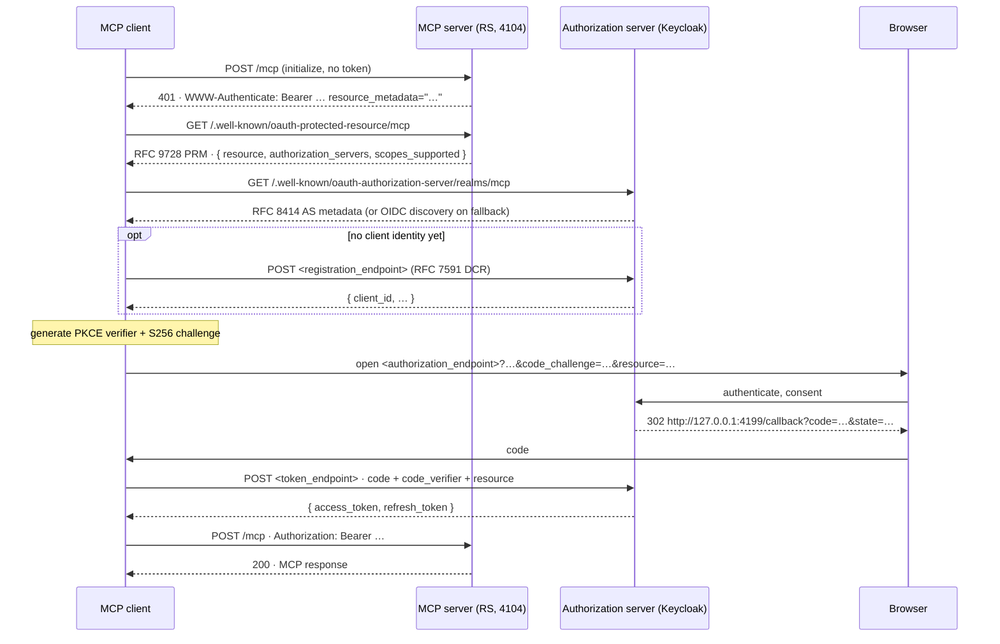

# MCP authorization — the specification behind the examples

The MCP authorization specification is short, but it is a composition of half a dozen other
documents. This page is the map: which RFC does what, in which order a client walks them, and —
because everything here runs on **`@modelcontextprotocol/sdk` 1.30.0** — where that build
implements the spec, where it goes beyond it and where the two disagree.

Scope: the authorization specification as of revisions **2025-06-18** and **2025-11-25**. The SDK's
`LATEST_PROTOCOL_VERSION` is `2025-11-25`, and its authorization code implements the 2025-11-25
rules unconditionally — nothing in `client/auth.js` branches on the negotiated protocol version.

Mechanical library facts (import paths, error classes, header parsing, rate limits, session
handling) are **not** repeated here; they live in [sdk-notes](sdk-notes.md), which was written by
reading `node_modules/@modelcontextprotocol/sdk/dist/esm/**`. This page explains the *protocol*;
that page explains the *library*.

## 1. Three roles, and why the AS is not the MCP server

| Role | Who plays it here | Responsibility |
|---|---|---|
| **MCP client** | `examples/*/client.ts`, `src/shared/client/oauth-cli.ts` | an OAuth 2.1 client: discovers where to authorize, obtains a token, sends it on every request |
| **Authorization server (AS)** | Keycloak (04–07, 09–11), the MCP process itself (03), a facade over Keycloak (06) | interacts with the user, issues access tokens for use *at the MCP server* |
| **MCP server / resource server (RS)** | `examples/*/server.ts` | validates tokens, enforces scope, and tells clients where the AS is |

The spec is explicit that the AS is out of scope: *"The implementation details of the authorization
server are beyond the scope of this specification. It may be hosted with the resource server or a
separate entity."* Only the RS side is normative — an MCP server **MUST** implement RFC 9728
Protected Resource Metadata, **MUST** validate that a token was issued for it, and **MUST** answer
401 / 403 / 400 appropriately.

Splitting the roles is what makes the pattern work in practice. The MCP server never sees a
password, never stores a credential it could leak, and never has to implement consent, MFA or
account recovery — those belong to an identity provider the operator already runs. In return the
token carries an audience, so a token stolen from one server cannot be replayed at another, and a
single revocation at the IdP cuts off every resource at once.

Where the examples sit on that axis:

* [04 — Keycloak resource server](04-keycloak-resource-server.md) is the canonical shape: external
  AS, MCP server is a pure RS. Its Python twin is [11](11-python-mcp-keycloak.md).
* [03 — embedded AS](03-oauth-embedded-as.md) collapses AS and RS into one process. The spec allows
  it ("may be hosted with the resource server"); it means you own the whole OAuth attack surface.
* [06 — OAuth proxy](06-oauth-proxy-keycloak.md) puts a facade in front of a real AS. Transitional:
  useful when clients cannot be pointed at the IdP directly, and subject to the confused-deputy
  consent rule (§9).
* [09 — auth gateway](09-auth-gateway.md) moves the RS role out of the MCP process into
  infrastructure — the MCP server then trusts a signed assertion instead of a token.
* [01](01-api-key.md), [02](02-jwt-local.md) and [08](08-mtls.md) have no AS at all, which is
  exactly why they are labelled OUTSIDE-SPEC: a third-party MCP client cannot bootstrap itself
  against them.

## 2. The discovery sequence

Everything hangs off one 401. A conformant client needs no configuration beyond the MCP URL.



### Step 1 — the challenge

`requireBearerAuth` builds the header in a fixed order: `error`, `error_description`, then `scope`
(only when the middleware was given `requiredScopes`), then `resource_metadata` (only when it was
given `resourceMetadataUrl`).

```http
HTTP/1.1 401 Unauthorized
WWW-Authenticate: Bearer error="invalid_token", error_description="Missing Authorization header", resource_metadata="http://192.168.78.87:4104/.well-known/oauth-protected-resource/mcp"
Content-Type: application/json

{"error":"invalid_token","error_description":"Missing Authorization header"}
```

The client reads exactly three parameters out of that header — `resource_metadata`, `scope` and
`error` — with a regex, and ignores the rest. It also requires the header to start with `Bearer`
followed by a space and at least one more character.

Since 2025-11-25 the header is no longer the only route: a server **MUST** implement *either* the
`WWW-Authenticate` route *or* the well-known URI, and clients **MUST** support both. The SDK client
does: it uses the URL from the header when present, otherwise probes
`/.well-known/oauth-protected-resource<path>` and then the root variant.

### Step 2 — RFC 9728 Protected Resource Metadata

```http
GET /.well-known/oauth-protected-resource/mcp HTTP/1.1
MCP-Protocol-Version: 2025-11-25
Accept: application/json
```

```json
{
  "resource": "http://192.168.78.87:4104/mcp",
  "authorization_servers": ["http://192.168.78.87:8180/realms/mcp"],
  "scopes_supported": ["mcp:tools", "mcp:admin"],
  "resource_name": "04-keycloak-resource-server",
  "bearer_methods_supported": ["header"]
}
```

Three rules that cost real debugging time:

* **The path is path-aware.** For a resource at `…/mcp` the document lives at
  `/.well-known/oauth-protected-resource/mcp`, not at the root. `discoverMetadataWithFallback`
  tries the path-aware URL first and falls back to the root only on a 404.
* **`resource` must be byte-identical to the URL the client dials.** `selectResourceURL` throws
  `Protected resource … does not match expected …` when the origin differs or the connect path is
  not a sub-path of `resource`. This is why every URL in this repository is built once from
  `PUBLIC_HOST` (`publicUrl()` in `src/shared/env.ts`, see [lan-testing](lan-testing.md)).
* **No trailing slash.** `http://host:4104/mcp/` makes the PRM advertise a `resource` with the
  slash, which the client then sends as `resource=` and your `aud` check must match exactly.

`src/shared/prm.ts` serves this document and nothing else. The SDK's `mcpAuthMetadataRouter` would
also mirror the *authorization-server* document at `<rs-origin>/.well-known/oauth-authorization-server`,
which RFC 8414 reserves for the issuer's origin — see §9.

### Step 3 — RFC 8414 metadata, with the OpenID Connect fallback

The client takes `authorization_servers[0]` and probes it. The order is fixed
(`buildDiscoveryUrls`) and matches the 2025-11-25 spec text exactly. For an **issuer with a path**
such as `http://192.168.78.87:8180/realms/mcp`:

| # | URL | Type |
|---|---|---|
| 1 | `http://192.168.78.87:8180/.well-known/oauth-authorization-server/realms/mcp` | RFC 8414 path insertion |
| 2 | `http://192.168.78.87:8180/.well-known/openid-configuration/realms/mcp` | OIDC path insertion |
| 3 | `http://192.168.78.87:8180/realms/mcp/.well-known/openid-configuration` | OIDC Discovery 1.0 path append |

For an issuer **without** a path only `/.well-known/oauth-authorization-server` and
`/.well-known/openid-configuration` are tried. Any 4xx moves to the next candidate; a 5xx throws;
running out of candidates returns `undefined`, after which the client guesses `${issuer}/authorize`,
`${issuer}/token` and `${issuer}/register`.

**Verified today against the running Keycloak 26.7.2**: probe 1 answers `200` and probe 3 answers
`200`; probe 2 is a `404`. So the SDK client resolves the realm on its **first** attempt, with no
404 in between.

The two document types are parsed with different schemas. The OIDC branch uses a *strict* schema
that drops `revocation_endpoint` and `introspection_endpoint`; when you need those (examples 07 and
10 do) fetch the discovery document yourself and parse it with the loose `OAuthMetadataSchema` —
which is what `discoverKeycloak()` in `src/shared/keycloak.ts` does.

### Step 4 — obtaining a client identity

The 2025-11-25 revision reorders this step. Clients supporting all options **SHOULD** try, in order:
pre-registered credentials, then Client ID Metadata Documents (§5), then Dynamic Client
Registration, then ask the user. DCR was demoted from **SHOULD** (2025-06-18) to **MAY** —
"included for backwards compatibility with earlier versions of the MCP authorization spec".

The SDK implements that order, with one gap: it registers dynamically only when
`provider.clientInformation()` is `undefined` **and** `provider.saveClientInformation` exists
(otherwise `auth()` throws `OAuth client information must be saveable for dynamic registration`).
`CliOAuthProvider` persists the registration under `.mcp-auth/`, so one client is created per
machine rather than per run.

```http
POST /realms/mcp/clients-registrations/openid-connect HTTP/1.1
Content-Type: application/json

{"client_name":"mcp-auth-demo cli","redirect_uris":["http://127.0.0.1:4199/callback"],
 "grant_types":["authorization_code","refresh_token"],"response_types":["code"],
 "token_endpoint_auth_method":"none","scope":"mcp:tools mcp:admin"}
```

The registration body carries the **resolved** scope from §3 — the same string that will be sent to
`/authorize`. Keycloak's anonymous DCR policy on this realm rejects `openid` in that scope, which
is why `CliOAuthProvider` never puts it there.

### Step 5 — PKCE, resource indicator, token

`startAuthorization` always generates a fresh PKCE pair and always uses `S256`; there is no `plain`
code path. It then builds the authorization URL with `response_type=code`, `client_id`,
`code_challenge`, `code_challenge_method=S256`, `redirect_uri`, `state` (when the provider supplies
one), `scope`, and `resource` when one was selected. `offline_access` anywhere in the scope adds
`prompt=consent`.

```
GET /realms/mcp/protocol/openid-connect/auth
    ?response_type=code
    &client_id=mcp-cli
    &code_challenge=E9Melhoa2OwvFrEMTJguCHaoeK1t8URWbuGJSstw-cM
    &code_challenge_method=S256
    &redirect_uri=http%3A%2F%2F127.0.0.1%3A4199%2Fcallback
    &state=…
    &scope=mcp%3Atools+mcp%3Aadmin
    &resource=http%3A%2F%2F192.168.78.87%3A4104%2Fmcp
```

The token request repeats `resource` (`executeTokenRequest` sets it on every grant it drives) and
carries the `code_verifier`. The retry then goes back to `/mcp` with `Authorization: Bearer …`, and
from there every single request — POST, GET on the notification stream, DELETE — carries the token;
the spec is explicit that authorization is per HTTP request, not per session.

**RFC 8707 in practice.** Keycloak accepts `resource=` and ignores it: the token's `aud` stays
`mcp-server` (verified; `docs/design.md` §2). That is why example 04 validates a *logical* audience
and example 02 shows the strict URL-audience form. Making an AS honour `resource` is
[patterns](patterns.md#strict-rfc-8707-resource-indicators-at-the-authorization-server).

## 3. SEP-835 — scope selection, and the trap this repository hit

`SEP-835` is the proposal number cited in the SDK source; in the 2025-11-25 spec it is the *Scope
Selection Strategy* section. One line of `client/auth.js` decides everything:

```js
const resolvedScope = scope || resourceMetadata?.scopes_supported?.join(' ') || provider.clientMetadata.scope;
```

1. `scope` from the 401's `WWW-Authenticate` header wins.
2. Otherwise **all** of the PRM's `scopes_supported`, space-joined.
3. Otherwise the client's own configured `clientMetadata.scope`.

The same resolved string is used for **both** dynamic registration and the authorization request —
so a badly chosen challenge scope does not just narrow one request, it narrows the client record
that is persisted for every future run. (Step 3 is the SDK going beyond the spec, which says to omit
`scope` entirely when `scopes_supported` is undefined.)

**The consequence.** `requireBearerAuth({ requiredScopes })` writes its list into the `scope=`
parameter of *both* the 401 and the 403 challenge. Put `requiredScopes: ['mcp:tools']` there and
every client is pinned to `mcp:tools` for ever: bob holds the `mcp-admin` role, the PRM advertises
`mcp:admin`, and he still cannot obtain it through the browser flow, because rule 1 beat rule 2.

| Wiring | 401 carries | Client requests | Result |
|---|---|---|---|
| `requireBearerAuth({ verifier, requiredScopes: ['mcp:tools'], resourceMetadataUrl })` | `scope="mcp:tools"` | `mcp:tools` | least privilege, but `admin_only` is unreachable for everyone |
| `createKeycloakVerifier({ requiredScopes: ['mcp:tools'] })` + `requireBearerAuth({ verifier, resourceMetadataUrl })`, PRM `scopes_supported: ['mcp:tools','mcp:admin']` | no `scope` | `mcp:tools mcp:admin` | bob gets `mcp:admin`; alice's token contains it too, but `keycloakEffectiveScopes()` drops it (no role) |

**The rule for this repository: required scopes belong on the verifier, not on the middleware.**
The verifier still returns 403 `insufficient_scope` for a token without `mcp:tools`; what changes is
that the challenge no longer dictates what clients may ask for. Examples 04–07 and 09–11 are wired
the second way; see the effective-scopes contract in
[`src/shared/README.md`](../src/shared/README.md) and the note at the top of
`examples/04-keycloak-resource-server/server.ts`.

Two footnotes. Non-interactive grants ignore all of this: `fetchToken()` passes
`provider.clientMetadata.scope` to `prepareTokenRequest`, so a `client_credentials` client
([05](05-keycloak-client-credentials.md)) never sees the challenge or the PRM scopes. And a 403 with
`error="insufficient_scope"` triggers exactly one re-authorization per distinct header value
(`_lastUpscopingHeader`); a repeat of the same header throws
`StreamableHTTPError(403, 'Server returned 403 after trying upscoping')`. That is the client half of
the spec's step-up flow — the server half is docs-only here, see
[patterns](patterns.md#runtime-step-up-authorization).

## 4. Protocol version negotiation

Two different mechanisms, easily confused:

* **`initialize`** carries `protocolVersion` in the JSON-RPC params. The client sends
  `2025-11-25`; the server answers with the version it picked. `Client.connect()` fails with
  *"Server's protocol version is not supported"* if the answer is outside
  `['2025-11-25','2025-06-18','2025-03-26','2024-11-05','2024-10-07']`.
* **The `mcp-protocol-version` HTTP header** is sent on *subsequent* requests, carrying the
  negotiated value. It is optional; when it is present but not in the supported list the server
  answers `400` with JSON-RPC `-32000` (`validateProtocolVersion` in
  `server/webStandardStreamableHttp.js`). When it is absent the server assumes
  `DEFAULT_NEGOTIATED_PROTOCOL_VERSION` = `2025-03-26`.

Discovery requests are separate again: every metadata `GET` the client makes carries
`MCP-Protocol-Version: 2025-11-25` and `Accept: application/json`, and retries once without any
headers if the fetch fails with a `TypeError` (the browser's shape of a CORS failure).

## 5. SEP-991 — Client ID Metadata Documents

CIMD replaces "register to get a `client_id`" with "*be* a `client_id`": the client publishes a JSON
document at an HTTPS URL and uses that URL as its identifier. The AS fetches it, checks that the
document's `client_id` equals the URL, validates `redirect_uris` against it, and shows `client_name`
on the consent screen. It removes the per-server registration round trip and the pile of dead client
records that anonymous DCR leaves behind.

The SDK implements the **client** half only:

```js
const supportsUrlBasedClientId = metadata?.client_id_metadata_document_supported === true;
const shouldUseUrlBasedClientId = supportsUrlBasedClientId && provider.clientMetadataUrl;
```

`clientMetadataUrl` must satisfy `isHttpsUrl` — `https:` scheme **and** a non-root path — or
`auth()` throws `InvalidClientMetadataError` before any network call. Nothing in the SDK's server
side resolves a URL-shaped `client_id`; `mcpAuthRouter`'s AS never advertises
`client_id_metadata_document_supported`.

This demo therefore cannot show CIMD end to end, for two independent reasons, both verified:

* the whole demo runs on plain HTTP over a LAN (`http://192.168.78.87:…`), and the client refuses a
  non-HTTPS `clientMetadataUrl` — there is no dev override;
* the Keycloak in `keycloak/` (26.7.2) reports feature `CIMD` as `EXPERIMENTAL, enabled=false`, and
  its discovery document has no `client_id_metadata_document_supported` field.

The design sketch and what enabling it would take are in
[patterns](patterns.md#client-id-metadata-documents-sep-991-vs-dcr).

## 6. What the SDK implements

**Server side** (`@modelcontextprotocol/sdk/server/auth/…`)

| Capability | Entry point | Used by |
|---|---|---|
| Bearer middleware, 401/403 challenges, scope check, expiry check | `requireBearerAuth` | every example except [08](08-mtls.md) |
| PRM document | `metadataHandler` + `getOAuthProtectedResourceMetadataUrl` (via `src/shared/prm.ts`) | 04, 05, 07, 09, 10, 11 |
| Full AS: `/authorize`, `/token`, `/register`, `/revoke`, RFC 8414 metadata, PRM | `mcpAuthRouter` + an `OAuthServerProvider` | [03](03-oauth-embedded-as.md) |
| AS facade over an upstream IdP | `ProxyOAuthServerProvider` | [06](06-oauth-proxy-keycloak.md) |
| Authorization-code grant with mandatory PKCE S256, refresh grant, DCR, RFC 7009 revocation, per-endpoint rate limits | the handlers under `server/auth/handlers/` | 03 |

**Client side** (`@modelcontextprotocol/sdk/client/…`)

| Capability | Entry point | Used by |
|---|---|---|
| The whole discovery → DCR → PKCE → token → retry dance, plus refresh and one-shot 403 upscoping | `auth()`, driven automatically by `StreamableHTTPClientTransport` | 03, 04, 06, 07, 09, 10, 11 via `connectWithOAuth()` |
| `client_credentials` and `private_key_jwt` providers | `client/auth-extensions.js` | [05](05-keycloak-client-credentials.md) |
| CIMD (URL-based `client_id`) | `provider.clientMetadataUrl` | none — see §5 |

## 7. What the SDK does not implement

| Missing piece | Consequence | Where it is hand-rolled |
|---|---|---|
| `client_credentials` on the embedded AS | `/token` answers `400 unsupported_grant_type`; the source comment says *"Additional auth methods will not be added on the server side of the SDK"* | M2M needs a real AS — [05](05-keycloak-client-credentials.md) against Keycloak |
| HTTP Basic client authentication at `/token` | the embedded AS reads `client_id`/`client_secret` from the form body only, and advertises `['client_secret_post','none']`; third-party clients that insist on Basic get `invalid_client` | nothing; documented in [03](03-oauth-embedded-as.md) |
| A token introspection endpoint or client (RFC 7662) | `introspection_endpoint` exists in the metadata *schema* only | `introspect()` in `src/shared/keycloak.ts`, used by [07](07-token-introspection.md) |
| Token exchange (RFC 8693) | no grant, no helper | `exchangeToken()` in `src/shared/keycloak.ts`, used by [10](10-token-exchange-downstream.md) |
| DPoP (RFC 9449) | `dpop_signing_alg_values_supported` / `dpop_bound_access_tokens_required` are parsed as metadata fields; no proof is ever created or checked | nothing — [patterns](patterns.md#sender-constrained-tokens) |
| Mutual TLS (RFC 8705 or as a transport) | Node's global `fetch` has no certificate option | [08](08-mtls.md) uses `undici`'s `Agent` and sets `req.auth` from the peer certificate |
| Device authorization grant (RFC 8628) | no `device_code` anywhere in the package | nothing — [patterns](patterns.md#device-authorization-grant-rfc-8628) |
| Audience / issuer validation in the bearer middleware | `requireBearerAuth` checks scopes and expiry, nothing else; `AuthInfo.resource` is informational | every verifier: `createJwtVerifier()` in `src/shared/jwt.ts` pins `iss` and `aud` |

## 8. Where this build and the spec disagree

Stated plainly, because each one changes what you must write yourself.

| Topic | Specification | SDK 1.30.0 |
|---|---|---|
| `resource` parameter | clients **MUST** send it "regardless of whether authorization servers support it" | `selectResourceURL` returns `undefined` when no PRM was found, and then no `resource` is sent at all. Reachable in this repo: 01, 02 and 08 publish no PRM |
| PKCE capability check | client **MUST** verify `code_challenge_methods_supported` is present and **MUST** refuse to proceed if it is absent | `startAuthorization` throws only when the field is *present and lacks* `S256`; an AS that omits the field is accepted |
| Scope fallback | omit `scope` when `scopes_supported` is undefined | falls back to `clientMetadata.scope` (harmless, but it means a client's own default can silently win) |
| Registration | 2025-11-25 makes CIMD a **SHOULD** and DCR a **MAY** | CIMD is client-side only; the SDK's own AS supports DCR and cannot accept a URL-shaped `client_id` |
| AS metadata location | RFC 8414 puts the document on the **issuer's** origin | `mcpAuthMetadataRouter` unconditionally also serves it at `<resource-server-origin>/.well-known/oauth-authorization-server`. This repository avoids the mirror by using `src/shared/prm.ts` on pure resource servers; 03 and 06 use `mcpAuthRouter` legitimately, because there the MCP origin *is* the issuer |
| Step-up retries | "no more than a few times" | exactly one retry per distinct `WWW-Authenticate` value, then `StreamableHTTPError` 403 |
| Error mapping | invalid or expired tokens **MUST** get a 401 | true only if your verifier throws `InvalidTokenError`; any other exception becomes a **500 without** `WWW-Authenticate`, and the client will not start discovery. `src/shared/jwt.ts` uses `ServerError` deliberately for "our JWKS is down" and `InvalidTokenError` for everything about the token |
| Transport security | all AS endpoints **MUST** be HTTPS; redirect URIs **MUST** be localhost or HTTPS | enforced by `checkIssuerUrl`, which this demo disables with `MCP_DANGEROUSLY_ALLOW_INSECURE_ISSUER_URL=1` so a LAN IP can be an issuer. Demo only — see [lan-testing](lan-testing.md) |

## 9. Security requirements that are not about discovery

Three normative rules that the examples exist to demonstrate:

* **Audience binding.** An MCP server **MUST** reject tokens that do not name it in the audience.
  Example 04 pins `aud` to `mcp-server`; example 02 pins it to the exact MCP URL; example 10 proves
  the isolation in both directions — an MCP token is rejected by the downstream API and an exchanged
  token is rejected at `/mcp`.
* **No token passthrough.** *"The MCP server MUST NOT pass through the token it received from the
  MCP client."* Example 10's `downstream_profile` exchanges the token (RFC 8693) rather than
  forwarding it; `DEMO_PASSTHROUGH=1` registers the anti-pattern so you can watch the downstream
  reject it.
* **Confused deputy.** *"MCP proxy servers using static client IDs MUST obtain user consent for each
  dynamically registered client before forwarding to third-party authorization servers."* This is
  the rule that constrains example 06 and every token-issuing proxy; see
  [patterns](patterns.md#token-issuing-proxies-and-the-confused-deputy-rule).

## 10. Document → example map

| Document | What it contributes | Demonstrated by |
|---|---|---|
| OAuth 2.1 (`draft-ietf-oauth-v2-1-13`) | authorization-code + PKCE, refresh rotation, no implicit, no password grant | [03](03-oauth-embedded-as.md), [04](04-keycloak-resource-server.md), [06](06-oauth-proxy-keycloak.md), [11](11-python-mcp-keycloak.md); `mcp-test`'s password grant exists for headless tests only |
| RFC 6750 | `Authorization: Bearer`, `WWW-Authenticate`, `insufficient_scope` | every example; [01](01-api-key.md) uses the syntax and nothing else |
| RFC 9728 (PRM) | where the AS is | [04](04-keycloak-resource-server.md), [05](05-keycloak-client-credentials.md), [07](07-token-introspection.md), [09](09-auth-gateway.md), [10](10-token-exchange-downstream.md), [11](11-python-mcp-keycloak.md) via `src/shared/prm.ts`; [03](03-oauth-embedded-as.md)/[06](06-oauth-proxy-keycloak.md) via `mcpAuthRouter`; deliberately absent in 01, 02, 08 |
| RFC 8414 + OpenID Connect Discovery 1.0 | AS endpoints and capabilities | served by 03 and 06, consumed from Keycloak by 04, 05, 07, 09, 10, 11 |
| RFC 7591 (DCR) | a client_id with no prior relationship | [03](03-oauth-embedded-as.md) (SDK's own `/register`), [04](04-keycloak-resource-server.md) and [11](11-python-mcp-keycloak.md) (Keycloak anonymous DCR), [06](06-oauth-proxy-keycloak.md) (proxied) |
| RFC 7636 (PKCE S256) | authorization-code injection defence | 03 (verified in-process by the SDK AS), 04/06/11 (verified by Keycloak) |
| RFC 8707 (resource indicators) | audience binding at issuance | sent by the client whenever a PRM exists; honoured only by 02's strict URL audience — Keycloak ignores it ([patterns](patterns.md#strict-rfc-8707-resource-indicators-at-the-authorization-server)) |
| RFC 7519 / RFC 9068 (JWT access tokens) | offline validation | [02](02-jwt-local.md), [04](04-keycloak-resource-server.md), [05](05-keycloak-client-credentials.md), [09](09-auth-gateway.md), [10](10-token-exchange-downstream.md), [11](11-python-mcp-keycloak.md) |
| RFC 7662 (introspection) | revocation visible immediately | [07](07-token-introspection.md) |
| RFC 7009 (revocation) | ending a token's life | 03 (`/revoke` on the embedded AS), 07 (Keycloak) |
| RFC 8693 (token exchange) | acting on behalf of the user downstream | [10](10-token-exchange-downstream.md) |
| RFC 7523 (`private_key_jwt`) | client authentication without a shared secret | [05](05-keycloak-client-credentials.md), `--auth private-key-jwt` |
| RFC 8252 (native apps) | loopback redirect URIs | `CliOAuthProvider` in every OAuth example |
| SEP-835 (Scope Selection Strategy) | which scopes a client asks for | 04, 06, 07 — and §3 above |
| SEP-991 (Client ID Metadata Documents) | client identity without registration | none — [patterns](patterns.md#client-id-metadata-documents-sep-991-vs-dcr) |
| RFC 9449 (DPoP), RFC 8705 (mTLS-bound tokens), RFC 8628 (device grant) | sender constraint, browserless login | none — [patterns](patterns.md) |

## Where to go next

* [sdk-notes](sdk-notes.md) — the SDK behaviours that break implementations, with the exact source
  locations.
* [patterns](patterns.md) — everything the spec allows that this repository documents but does not
  run.
* [glossary](glossary.md) — one paragraph per term used above.
* [04 — Keycloak resource server](04-keycloak-resource-server.md) — the same sequence, captured from
  a live run.
* [`src/shared/README.md`](../src/shared/README.md) — the effective-scopes contract and the shared
  verifier API; [`keycloak/README.md`](../keycloak/README.md) — the realm the traces above come from.
